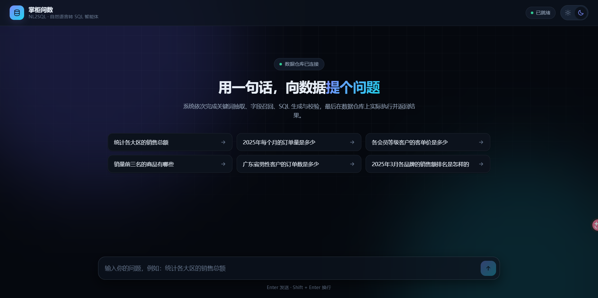
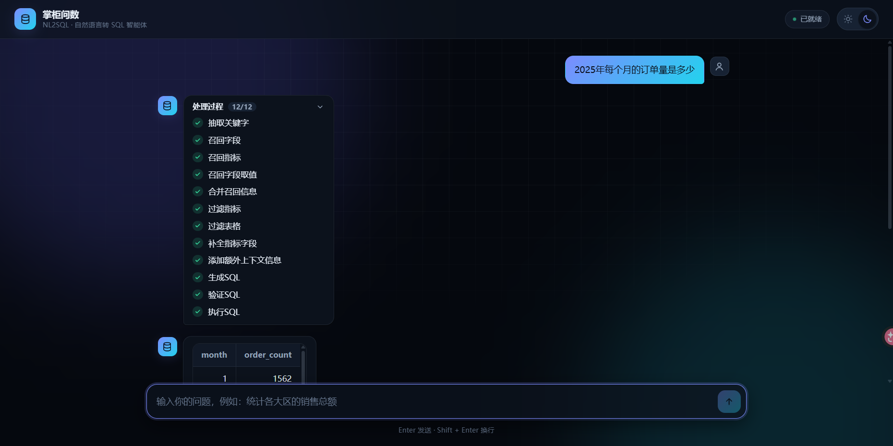

#  NL2SQL Agent

基于 **LangGraph** 的元数据增强 Text-to-SQL 问数系统。用自然语言提问，系统自动完成
「关键词抽取 → 字段/指标/取值三路召回 → 过滤降噪 → 字段补全 → SQL 生成/校验/纠错 → 执行」，
以 SSE 流式返回处理过程与查询结果。

## 界面

<table>
<tr>
<td width="50%">

**空态：直接给可点的示例问题**



</td>
<td width="50%">

**查询中：逐步展示 12 个处理阶段，结果以表格返回**



</td>
</tr>
</table>

界面支持明暗双主题（跟随系统或手动切换），处理过程以时间轴逐步点亮，
每一步的成败都能看到——链路卡在哪一环一目了然。

## 核心设计

| 设计 | 为什么这么做 |
| --- | --- |
| **元数据三路召回** | 字段与指标走 Qdrant 向量检索（每字段 name/description/alias 三条向量），字段取值走 Elasticsearch 全文倒排。向量解决「语义匹配」，ES 解决「枚举值精确命中」 |
| **确定性规则补偿语义盲区** | 主外键、时间维表字段（year/quarter/month）语义极弱，向量几乎召不回来（实测 `dim_date.year` 漏召回率 **96.7%**），用规则强制保留，避免 SQL 退化成对日期键做算术运算（`server/agent/time_utils.py`） |
| **相对阈值降噪** | 字段召回不用绝对相似度阈值——正确项与噪音项分数高度交错，改用「保留 ≥ 本次最高分 × ratio」，参数见 `conf/app_config.yaml` 的 `recall` 段 |
| **上下文给全，模型才不猜** | 把数据真实日期范围注入 prompt。否则用户问「1月份」而系统当前是 2026 年时，模型会补成 `year = 2026`（数据只到 2025）——**它不是幻觉，是拿到了一份不完整的前提** |
| **评测承认不确定性** | LLM 在 `temperature=0` 下也无法逐字复现，报告里显式声明「单次差异 1~3 条属噪声」，并加确定性前置校验补裁判盲区 |

## 目录结构

```
NL2SQLAgent/
├── main.py                     FastAPI 应用入口（uvicorn 启动）
├── pyproject.toml              依赖与 pytest 配置（uv 管理）
├── conf/
│   ├── app_config.yaml         本地真实配置（含密码，**不入库**）
│   ├── app_config.example.yaml 配置模板（入库）
│   └── meta_config.yaml        元知识声明式配置（表/字段/指标定义）
├── prompts/                    提示词模板（与代码解耦，可独立调优）
│
├── server/                     后端服务（分层）
│   ├── api/                    接口层：FastAPI 依赖注入、路由、请求/响应 Schema
│   ├── services/               服务层：组装上下文并驱动 LangGraph
│   ├── agent/                  Agent 层：图编排、状态、LLM、13 个处理节点
│   │   ├── graph.py            流水线定义（13 个节点）
│   │   ├── state.py            DataAgentState（节点间的数据总线）
│   │   ├── time_utils.py       时间语义的确定性规则（召回的补偿手段）
│   │   └── nodes/              各处理节点
│   ├── repositories/           数据访问层：Meta/DW MySQL、Qdrant、ES
│   ├── models/                 SQLAlchemy ORM 模型
│   ├── entities/               领域实体（纯 dataclass，与存储解耦）
│   ├── clients/                中间件客户端管理器（懒连接单例）
│   ├── prompt/  conf/  core/   提示词加载 / 配置 / 基础设施（日志、上下文、lifespan）
│   └── ...
├── meta_builder/               元知识构建（离线任务，独立于服务进程）
├── frontend/                   前端（Vue 3 + Vite，聊天式问数界面）
├── deploy/                     部署：docker-compose 与中间件初始化
├── tests/                      测试：unit（147 例，离线）+ integration（需中间件）
├── eval/                       评测：评测集、流水线、结果（`archive/` 存历史产物）
├── scripts/                    运维脚本（服务体检、元知识重建、评测集校验、冒烟）
└── docs/
    ├── assets/                 README 配图
    ├── tutorial/               01~08 中文教程 + 基础设施详解
    ├── reports/                09 评测报告 · 10 双裁判对比 · 11 稳定性修复与评测集重建
    └── architecture-*.mmd|png  8 张架构图（包依赖/类图/流水线/状态流转/DI 链/元知识构建/两阶段召回/Embedding）
```

## 快速开始

### 1. 配置

```bash
cp conf/app_config.example.yaml conf/app_config.yaml
# 编辑 conf/app_config.yaml：MySQL 密码、各中间件地址、LLM Key
```

`conf/app_config.yaml` 含明文密码，已在 `.gitignore` 中**不会提交**。
LLM Key 也可留空、改用环境变量注入（`DEEPSEEK_API_KEY`）。

### 2. 启动中间件

```bash
cd deploy && docker compose up -d
```

拉起 MySQL（meta + dw，含初始化脚本）、Elasticsearch（含 IK 分词）、Kibana、Qdrant、Embedding 服务。
详见 `deploy/README.md`。

### 3. 安装依赖并构建元知识

```bash
uv sync
uv run python -m scripts.check_services                    # 体检：6/6 才算就绪
uv run python -m meta_builder.scripts.build_meta_knowledge -c conf/meta_config.yaml
```

### 4. 启动服务与前端

```bash
uv run python main.py            # 后端 http://localhost:8000
cd frontend && npm install && npm run dev   # 前端 http://localhost:5173
```

前端开发服务器把 `/api` 代理到 `http://localhost:8000`（见 `frontend/vite.config.js`）。

> **改过 `conf/meta_config.yaml` 之后必须重建元知识库**
> （字段描述参与 embedding，不重建则召回仍是旧描述）：
> `uv run python -m scripts.rebuild_meta -c conf/meta_config.yaml`

## 测试

```bash
uv sync --extra dev
uv run pytest tests/unit                                    # 147 例，离线，无需中间件
set RUN_INTEGRATION=1 && uv run pytest tests/integration    # 全链路冒烟，需中间件
```

分层的测试清单与约定见 `tests/README.md`。

## 评测

评测分三层，对应系统的三段流水线——**主指标是确定性的，只在真正需要语义理解的地方才用 LLM 裁判**：

| 层 | 指标 | 判定方式 |
| --- | --- | --- |
| 召回质量 | `linking_precision` / `linking_recall` | 字段 ID 集合比对，无需 LLM |
| SQL 等价性 | `jev_equivalence` | Jev 决策模型（默认）/ ragas 裁判 |
| **执行准确性** | `execution_accuracy` | **真跑库比对结果集**（主指标，不依赖模型） |

```bash
# 全量评测（76 条，约 37 分钟；瓶颈在业务链路而非裁判）
uv run python -m eval.run_ragas_eval

# 不跑系统、只对已有结果换裁判重判（十几秒）
uv run python -m eval.jev_equivalence_judge
```

**评测集由脚本编译产出，不手写**（手写标注是历史上错误的来源）：

```bash
uv run python -m eval.build_dataset      # 编译 76 条，每条真跑一遍，不过不出文件
uv run python -m scripts.validate_dataset # 入库校验：参考 SQL 可执行非空、字段真在 meta 里、查重、时间歧义
```

当前基线：**执行准确率 100%（76/76）**。但这个数字**不能当作能力提升的证据**
（换了评测集不可比、题目自己出的偏向系统能答的、单次运行属噪声，且已饱和到天花板），
理由写在 11 号报告里。

## 文档

| 文档 | 内容 |
| --- | --- |
| [`docs/开发约定.md`](docs/开发约定.md) | **开发约定**：分层依赖、错误处理、事件协议、包级导出、类型标注、代码风格 |
| [`docs/reports/11`](docs/reports/11-稳定性修复与评测集重建.md) | **稳定性修复与评测集重建**（根因分析、能力矩阵、诚实边界） |
| [`docs/reports/10`](docs/reports/10-两个裁判方案对比检测报告.md) | 双裁判对比（Jev vs ragas：判定口径、准确率、延迟、成本、分歧逐条分析） |
| [`docs/reports/09`](docs/reports/09-评测报告.md) | 系统整体评测报告 |
| `docs/tutorial/01~08` | 项目概述、架构、开发环境、基础设施、元数据知识库、问数智能体、API 接口、前后端联调 |
| `docs/tutorial/基础设施/` | 各基础设施的详解（LangGraph / LangChain / FastAPI / Qdrant / ES / OmegaConf …） |
| `docs/Studyknowledges.md` | 开发过程中的知识点问答沉淀 |
| `docs/architecture-*.png` | 8 张架构图 |
| `deploy/README.md` | 中间件编排、数据初始化、扩充演示数据 |
| `tests/README.md` | 测试分层与约定 |
