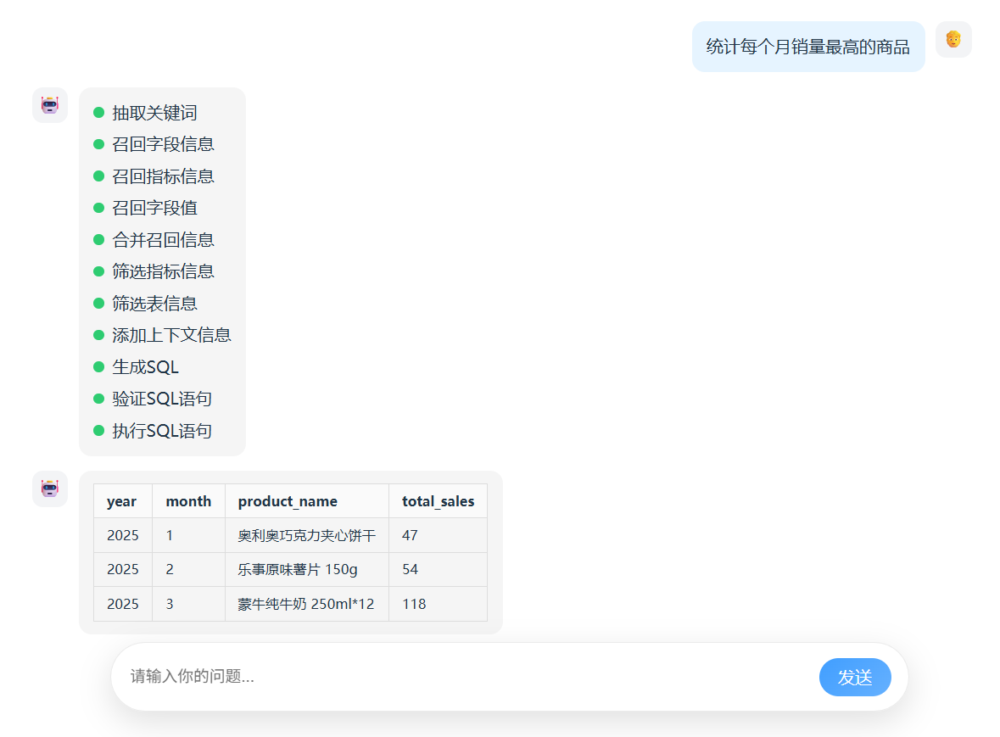
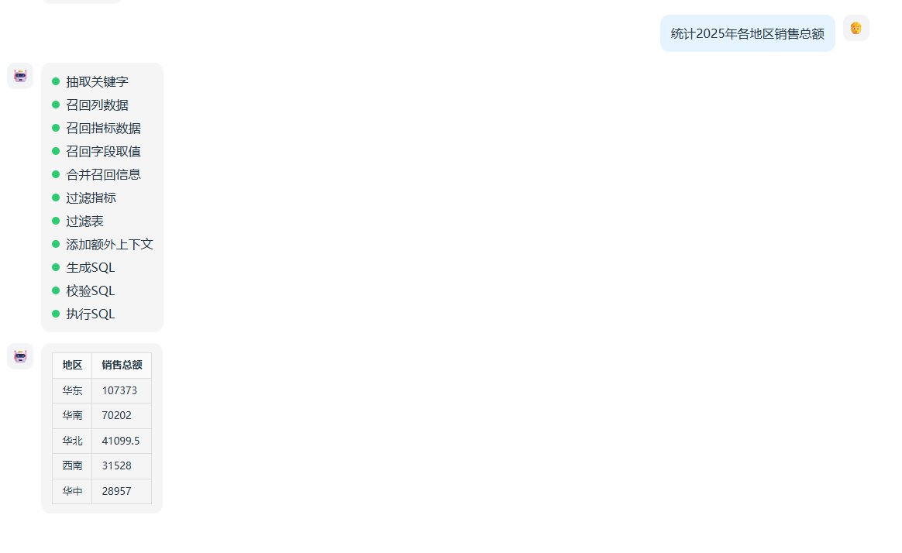
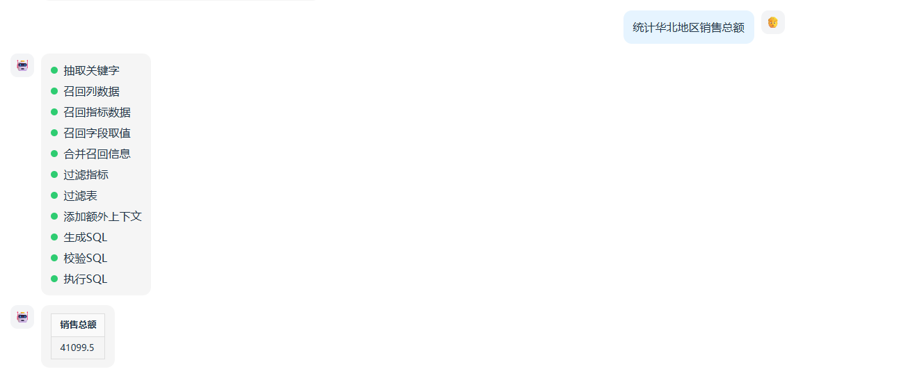

# 尚硅谷大模型项目之掌柜问数

# 1. 项目概述

掌柜问数是一个基于自然语言处理与数据分析技术的智能数据服务系统，面向数据仓库（Data Warehouse）应用场景，旨在帮助用户通过对话方式高效获取数据仓库中的数据洞察。用户无需掌握复杂的查询语法，即可用自然语言提出问题，系统自动完成对数据仓库数据的理解、计算分析与结果可视化，大幅提升数据使用效率，降低数据分析门槛，助力业务决策智能化。

掌柜问数核心实现：**NL2SQL**（自然语言转 SQL）,它是自然语言处理（NLP）的一个细分方向，目标是将用户用自然语言描述的查询需求，自动转换成语法正确、可直接执行的 SQL 语句.

简单理解：掌柜问数本质上就是实现一个RAG的过程,通过用户的问题，进行处理后，将处理后的数据交给大模型进行处理，最终生成sql,执行后返回结果。

生成的sql语句：

~~~sql
SELECT 
    d.year,
    d.month,
    dp.product_name,
    SUM(fo.order_quantity) AS total_sales
FROM fact_order fo
JOIN dim_date d ON fo.date_id = d.date_id
JOIN dim_product dp ON fo.product_id = dp.product_id
GROUP BY d.year, d.month, dp.product_id, dp.product_name
HAVING SUM(fo.order_quantity) = (
    SELECT MAX(monthly_sales)
    FROM (
        SELECT
            d2.year,
            d2.month,
            fo2.product_id,
            SUM(fo2.order_quantity) AS monthly_sales
        FROM fact_order fo2
        JOIN dim_date d2 ON fo2.date_id = d2.date_id
        GROUP BY d2.year, d2.month, fo2.product_id
    ) sub
    WHERE sub.year = d.year AND sub.month = d.month
)
ORDER BY d.year, d.month;
~~~

生成的sql:

~~~sql
SELECT 
    dr.region_name AS 地区,
    SUM(fo.order_amount) AS 销售总额
FROM fact_order fo
JOIN dim_region dr ON fo.region_id = dr.region_id
JOIN dim_date dd ON fo.date_id = dd.date_id
WHERE dd.date_id BETWEEN 20250101 AND 20251231
GROUP BY dr.region_name
ORDER BY 销售总额 DESC;
~~~

生成的sql:

~~~sql
SELECT SUM(fo.order_amount) AS 销售总额
FROM fact_order fo
JOIN dim_region dr ON fo.region_id = dr.region_id
WHERE dr.region_name = '华北';
~~~

