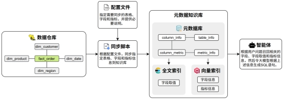
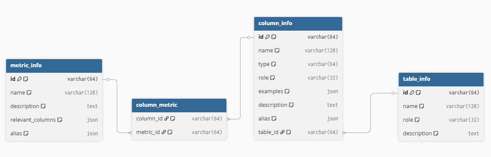
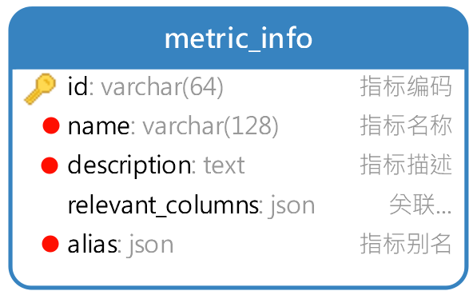
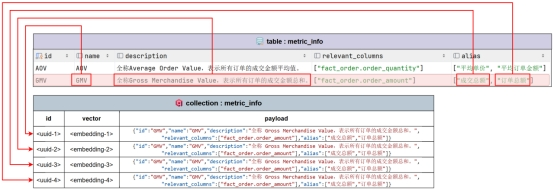
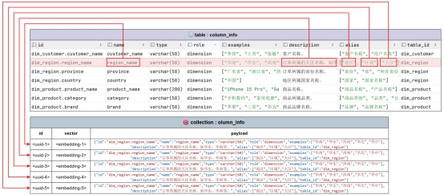
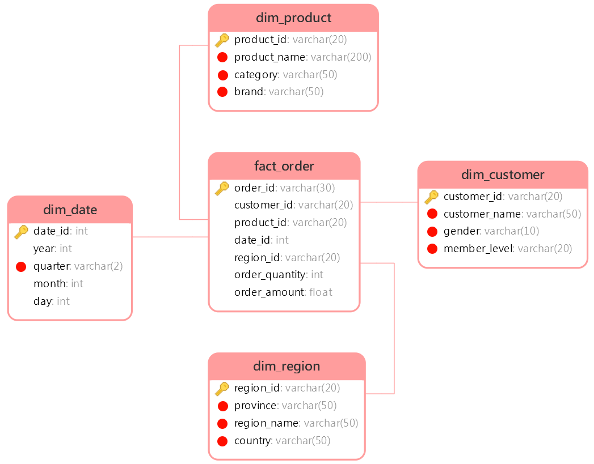
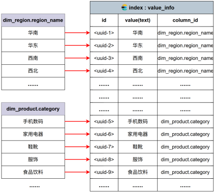

# 2. 项目架构

## 2.1 概述


本项目以数据仓库的元数据为核心，使用 MySQL 存储结构化元数据信息，结合 Qdrant 构建语义向量索引、Elasticsearch 构建全文索引，形成统一的元数据知识库。查询过程中，系统首先根据用户自然语言问题进行多路召回，筛选相关表、字段及指标定义，再将元数据信息与用户问题共同输入大模型生成 SQL，最终完成自动查询与结果返回，确保生成结果的准确性与可控性。

 

## 2.2 元数据知识库

元数据知识库作为数据仓库的语义基础设施，用于集中管理和高效检索表结构、字段定义、字段取值示例及复杂指标说明等元数据信息，支撑后续的智能检索与 SQL 生成。

元数据信息主要来源于两部分：一部分数据仓库自动采集，另一部分由人工进行补充与配置。完整的元数据统一存储于 MySQL 数据库中，并对其中部分关键信息构建向量索引和全文索引，以提升语义召回与关键词召回的效果。

### 2.2.1 元数据库meta

元数据库共包含四张表，具体结构如下图所示：

metric_info:指标描述信息表

column_metric:字段指标关联表

column_info:字段描述信息表 

table_info:表描述信息表

列角色说明：

```
primary_key:主键
foreign_key：外键
measure: 度量，可计算的数值，主要用于做统计，例如：卖了多少钱、买了几件、耗时多少
dimension：维度 分析的“角度”,主要用于来做筛选和分组，例如：按时间看、按区域看、按商品分类看
```



metric_info(指标信息表)

| 字段名             | 类型           | 注释                                                      |
| ------------------ | -------------- | --------------------------------------------------------- |
| `id`               | `varchar(64)`  | **指标编码**（主键，唯一标识一个指标）                    |
| `name`             | `varchar(128)` | **指标名称**（如 “销售总额”）                             |
| `description`      | `text`         | **指标描述**（详细说明指标的业务含义、计算口径）          |
| `relevant_columns` | `json`         | **关联列信息**（JSON 格式，记录该指标计算时依赖的物理列） |
| `alias`            | `json`         | **指标别名**（JSON 格式，记录指标的别名、简称等）         |

column_metric（列 - 指标关联表）

| 字段名      | 类型          | 注释                                        |
| ----------- | ------------- | ------------------------------------------- |
| `column_id` | `varchar(64)` | **列编号**（外键，关联 `column_info.id`）   |
| `metric_id` | `varchar(64)` | **指标编号**（外键，关联 `metric_info.id`） |

column_info（列信息表）

| 字段名        | 类型           | 注释                                                   |
| ------------- | -------------- | ------------------------------------------------------ |
| `id`          | `varchar(64)`  | **列编号**（主键，唯一标识一个物理列）                 |
| `name`        | `varchar(128)` | **列名称**（如 `order_amount`）                        |
| `type`        | `varchar(64)`  | **数据类型**（如 `INT`, `VARCHAR`, `DATETIME`）        |
| `role`        | `varchar(32)`  | **列角色**（如 `primary key`, `dimension`, `measure`） |
| `examples`    | `json`         | **数据示例**（JSON 格式，记录该列的示例值）            |
| `description` | `text`         | **列描述**（详细说明该列的业务含义）                   |
| `alias`       | `json`         | **列别名**（JSON 格式，记录该列的别名）                |
| `table_id`    | `varchar(64)`  | **所属表编号**（外键，关联 `table_info.id`）           |

table_info（表信息表）

| 字段名        | 类型           | 注释                                         |
| ------------- | -------------- | -------------------------------------------- |
| `id`          | `varchar(64)`  | **表编号**（主键，唯一标识一个物理表）       |
| `name`        | `varchar(128)` | **表名称**（如 `fact_sales_order`）          |
| `role`        | `varchar(32)`  | **表类型**（如 `fact` 事实表，`dim` 维度表） |
| `description` | `text`         | **表描述**（详细说明该表的业务含义）         |

构建指令知识库：

~~~shell
python -m app.scripts.build_meta_knowledge -c .\conf\meta_config.yaml 
~~~

### 2.2.2 数据仓库dw

dim_customer: 客户维度表

dim_date: 日期维度表

dim_product: 商品维度表

dim_region: 区域维度表

fact_order: 订单事实表

类型说明：

**（1）以`dim_`开头的是维度表**：用于描述业务的 “维度属性”，比如客户信息、商品信息、时间维度、区域信息，是分析的 “上下文”，在实际使用中维度表主要用于分组和过滤操作

**（2）以`fact_`开头的是事实表**：存储核心业务的 “度量值”（如订单数量、订单金额），并通过外键关联各个维度表，是分析的 “核心数据”	，在实际使用中事实表主要用于聚合操作

特点：**订单分析的星型模型**：fact_order（事实表）是中心，关联 4 张 dim_维度表，是数据仓库中最经典的建模方式。


`dim_date`（日期维度表）

| 字段名    | 类型         | 注释                                      |
| --------- | ------------ | ----------------------------------------- |
| `date_id` | `int`        | **日期 ID**（主键，唯一标识一条日期记录） |
| `year`    | `int`        | **年份**（如 2025）                       |
| `quarter` | `varchar(2)` | **季度**（如 Q1、Q2）                     |
| `month`   | `int`        | **月份**（1-12）                          |
| `day`     | `int`        | **日期**（1-31）                          |

`dim_region`（地区维度表）

| 字段名        | 类型          | 注释                                      |
| ------------- | ------------- | ----------------------------------------- |
| `region_id`   | `varchar(20)` | **地区 ID**（主键，唯一标识一条地区记录） |
| `province`    | `varchar(50)` | **省份**                                  |
| `region_name` | `varchar(50)` | **地区名称**                              |
| `country`     | `varchar(50)` | **国家**                                  |

`dim_customer`（客户维度表）

| 字段名          | 类型          | 注释                                  |
| --------------- | ------------- | ------------------------------------- |
| `customer_id`   | `varchar(20)` | **客户 ID**（主键，唯一标识一个客户） |
| `customer_name` | `varchar(50)` | **客户名称**                          |
| `gender`        | `varchar(10)` | **性别**                              |
| `member_level`  | `varchar(20)` | **会员等级**                          |

`dim_product`（商品维度表）

| 字段名         | 类型           | 注释                                  |
| -------------- | -------------- | ------------------------------------- |
| `product_id`   | `varchar(20)`  | **商品 ID**（主键，唯一标识一个商品） |
| `product_name` | `varchar(200)` | **商品名称**                          |
| `category`     | `varchar(50)`  | **商品类别**                          |
| `brand`        | `varchar(50)`  | **品牌**                              |

`fact_order`（订单事实表）

| 字段名           | 类型          | 注释                                                 |
| ---------------- | ------------- | ---------------------------------------------------- |
| `order_id`       | `varchar(30)` | **订单 ID**（主键，唯一标识一条订单记录）            |
| `customer_id`    | `varchar(20)` | **客户 ID**（外键，关联 `dim_customer.customer_id`） |
| `product_id`     | `varchar(20)` | **商品 ID**（外键，关联 `dim_product.product_id`）   |
| `date_id`        | `int`         | **日期 ID**（外键，关联 `dim_date.date_id`）         |
| `region_id`      | `varchar(20)` | **地区 ID**（外键，关联 `dim_region.region_id`）     |
| `order_quantity` | `int`         | **订单数量**（度量，本次订单购买的商品件数）         |
| `order_amount`   | `float`       | **订单金额**（度量，本次订单的总金额）               |

### 2.2.3 向量索引

本项目选用 [Qdrant](https://qdrant.tech/) 作为向量数据库，向量索引主要用于对**指标信息**和**字段信息**进行语义召回。向量索引的构建内容具体如下：

[Qdrant_python_client](https://python-client.qdrant.tech/)

- metric_info  需要建立向量索引的字段如下图所示：



具体示例如下图所示：

 

- column_info 需要建立向量索引的字段如下图所示：

  
  
  具体示例如下图所示：
  
   

### 2.2.4 全文索引

本项目使用 Elasticsearch 作为全文检索引擎，全文索引主要用于对**字段取值**进行检索与匹配，索引内容以各类维度值为主，具体如下：

针对字段取值的索引建立，主要选择维度表的维度角色字段，只有维度字段在召回时，用于过滤匹配



具体示例如下图所示：



## 2.3 问数智能体

本项目的智能体主体基于Langgraph构建，具体结构如下图所示：


后端项目启动（data-agent）：fastapi dev 

前端项目启动（data-agent-frontend）：npm run dev 

