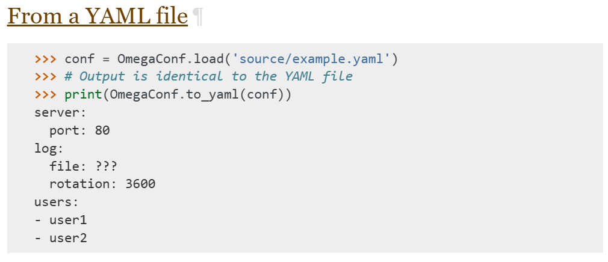

# 4. 基础设施搭建

## 4.1 项目目录结构

```yaml
data-agent 根目录
├── app 代码目录
│   ├── agent 智能体
│   ├── api 接口
│   ├── clients 数据库客户端
│   ├── conf 配置类
│   ├── core 基础设施
│   ├── models 数据库实体类
│   ├── prompt 提示词工具
│   ├── repositories Repo层——负责数据库底层查询
│   ├── scripts 脚本
│   └── services Service层——负责具体的业务逻辑
├── conf 配置文件
├── docker 开发环境
│   ├── elasticsearch
│   ├── embedding
│   └── mysql
├── logs 日志目录
└── prompts 提示词目录
```

## 4.2 配置参数管理

### 4.2.1 配置文件

本项目采用 YAML 文件管理配置参数，配置文件的路径为 `data-agent/conf/app_config.yaml` 。以下是本项目所需的全部参数。

~~~yaml
（1）对象结构
yaml对象结构：

    name:  "张三"
    age: 18
    gender: "男"
    
JSON对象结构：

{
  "name": "张三",
  "age": 18,
  "gender": "男"
}

（2）数组结构
yaml数组结构：

- 张三
- 李四
- 王五


json数组结构：
	["张三","李四","王五"]
	
（3）对象数组结构	
yaml对象数组结构：

- name:  "张三"
  age: 18
  gender: "男"

- name:  "李四"
  age: 20
  gender: "男"

json对象数组结构：
    [
      {
        "name": "张三",
        "age": 18,
        "gender": "男"
      },
      {
        "name": "李四",
        "age": 20,
        "gender": "男"
      }
    ]
~~~

```yaml
logging:
  file:
    enable: true
    level: INFO
    path: logs
    rotation: "10 MB"
    retention: "7 days"
  console:
    enable: true
    level: INFO

db_meta:
  host: localhost
  port: 3306
  user: atguigu
  password: Atguigu.123
  database: meta

db_dw:
  host: localhost
  port: 3306
  user: atguigu
  password: Atguigu.123
  database: dw

qdrant:
  host: localhost
  port: 6333
  embedding_size: 1024

embedding:
  host: localhost
  port: 8081
  model: BAAI/bge-large-zh-v1.5


es:
  host: localhost
  port: 9200
  index_name: data_agent


llm:
  model_name: deepseek-chat
  api_key: <deepseek_api_key>

```

### 4.1.2 加载工具

**[OmegaConf](https://omegaconf.readthedocs.io/en/2.3_branch/index.html))** 是由 Facebook开源的Python 配置管理库，核心定位是为机器学习 / 深度学习项目（也适用于各类 Python 项目）提供灵活、强类型、易扩展的配置解决方案。它解决了传统配置文件（YAML/JSON）在动态配置、类型校验、参数合并等场景下的痛点

本项目使用的yaml配置文件加载工具为[OmegaConf](https://omegaconf.readthedocs.io/en/2.3_branch/index.html)，具体用法参考其官网即可。

入门案例：

步骤一：定义配置文件

创建配置文件/conf/text_config.yaml

~~~yaml
name: zhangsan
age: 18
height: 1.8
~~~

步骤二：读取配置文件

创建加载程序文件/app/conf/text_config.py

参考官网：[From a YAML file](https://omegaconf.readthedocs.io/en/2.3_branch/usage.html#id12)



~~~python
from pathlib import Path

from omegaconf import OmegaConf
# 定义配置路径
config_file = Path(__file__).parents[2] / 'config' / 'text_config.yaml'
# 读取配置数据
conf = OmegaConf.load(config_file)
# 获取配置内容
print(conf['name'])
~~~

步骤三：优化读取方式

定义封装类型，读取配置文件内容封装到对应实体中

参考官网[From structured config](https://omegaconf.readthedocs.io/en/2.3_branch/usage.html#id16)

~~~python
from dataclasses import dataclass
from pathlib import Path
from omegaconf import OmegaConf
# 定义封装实体
@dataclass
class AppConfig:
    name: str
    age: int
    height: float

# 定义配置路径
config_file = Path(__file__).parents[2] / 'conf' / 'text_config.yaml'
# 读取配置数据
content = OmegaConf.load(config_file)
# 创建封装结构
schema = OmegaConf.structured(AppConfig)
# 封装配置内容到配置对象中
app_config: AppConfig = OmegaConf.to_object(OmegaConf.merge(schema, content))
# 获取配置数据
print(app_config.name)

~~~


用于读取配置文件的代码放置在`data-agent/app/conf/app_config.py`文件中，具体内容如下：

```python
from dataclasses import dataclass
from pathlib import Path

from omegaconf import OmegaConf


# 日志配置
@dataclass
class File:
    enable: bool
    level: str
    path: str
    rotation: str
    retention: str


@dataclass
class Console:
    enable: bool
    level: str


@dataclass
class LoggingConfig:
    file: File
    console: Console


# 数据库配置
@dataclass
class DBConfig:
    host: str
    port: int
    user: str
    password: str
    database: str


@dataclass
class QdrantConfig:
    host: str
    port: int
    embedding_size: int


@dataclass
class EmbeddingConfig:
    host: str
    port: int
    model: str


@dataclass
class ESConfig:
    host: str
    port: int
    index_name: str


@dataclass
class LLMConfig:
    model_name: str
    api_key: str


@dataclass
class AppConfig:
    logging: LoggingConfig
    db_meta: DBConfig
    db_dw: DBConfig
    qdrant: QdrantConfig
    embedding: EmbeddingConfig
    es: ESConfig
    llm: LLMConfig


config_file = Path(__file__).parents[2] / 'conf' / 'app_config.yaml'
context = OmegaConf.load(config_file)
schema = OmegaConf.structured(AppConfig)
app_config: AppConfig = OmegaConf.to_object(OmegaConf.merge(schema, context))
```

## 4.3 MySQL库客户端管理

**[SQLAlchemy](https://www.sqlalchemy.org/)** 是 Python 生态中最主流的 ORM（Object Relational Mapper，对象关系映射）框架，也是 Python 官方推荐的数据库操作工具之一。它的核心定位是「数据库交互的抽象层」—— 让开发者用 Python 对象的方式操作数据库，无需直接编写原生 SQL，同时保留对原生 SQL 的灵活支持。

本项目中的MySQL客户端使用**SQLAlchemy**，具体用法参考官方文档。

在`data-agent/app/clients/mysql_client_manager.py`中编写如下代码，用来管理MySQL客户端。

版本一：

https://docs.sqlalchemy.org/en/20/dialects/mysql.html#module-sqlalchemy.dialects.mysql.asyncmy

```python
from typing import Union
from sqlalchemy.ext.asyncio import AsyncEngine, create_async_engine

class MysqlClientManager:
    def __init__(self, db_config: DBConfig):
        self.db_config = db_config
        # self.engine : AsyncEngine=None
        # self.engine: AsyncEngine|None = None
        # self.engine=Optional(AsyncEngine)
        self.engine: Union[AsyncEngine, None] = None

    def _get_url(self):
        return f"mysql+asyncmy://{self.db_config.user}:{self.db_config.password}@{self.db_config.host}:{self.db_config.port}/{self.db_config.database}?charset=utf8mb4"


    def init(self):
        # 创建异步引擎
        self.engine = create_async_engine(
            # 指定数据地址
            self._get_url(),
            # 设置连接池最大空闲连接数
            pool_size=10,
            # 提前检测死连接，自动替换为新连接，避免业务报错。
            pool_pre_ping=True
        )

    async def close(self):
        await self.engine.dispose()

dw_mysql_client_manager = MysqlClientManager(app_config.db_dw)
meta_mysql_client_manager = MysqlClientManager(app_config.db_meta)

if __name__ == '__main__':
    dw_mysql_client_manager.init()

    async def test():
        async with AsyncSession(dw_mysql_client_manager.engine) as session:
            # 执行sql查询
            result = await session.execute(text("select * from fact_order limit 10"))
            # 提取查询结果rows对象结构如：[(),(),()]
            rows = result.fetchall()
            # 提取查询结果封装成字典结构如：[{},{},{}]
            rows = result.mappings().fetchall()
            # 输出返回结果类型
            print(type(rows[0]))
			# 输出首行数据
            print(rows[0])
    asyncio.run(test())
  
```

参数说明：[引擎创建参数](https://docs.sqlalchemy.org/en/20/core/engines.html#sqlalchemy.create_engine)

~~~python
 #链接地址: 创建引擎的连接地址
https://docs.sqlalchemy.org/en/20/dialects/mysql.html#module-sqlalchemy.dialects.mysql.asyncmy
    # 创建异步引擎
        self.engine = create_async_engine(
            # 指定数据地址
            self._get_url(),
            # 设置连接池最大连接数
            pool_size=10,
            # 提前检测死连接，自动替换为新连接，避免业务报错。
            pool_pre_ping=True
        )
pool_size=10：
	pool_size 用于设置数据库连接池的固定大小，也就是连接池中始终保持的 “活跃” 数据库连接数量。
核心作用：连接池会预先创建 10 个数据库连接并维护，当程序需要访问数据库时，直接从池中获取空闲连接，用完后归还，避免频繁创建 / 销毁连接（创建数据库连接是高开销操作）。
10 表示连接池的最大 “常驻” 连接数，程序同时最多能从池中获取 10 个连接，超出的请求会等待（直到超时或有连接归还）。
pool_pre_ping：
	是连接池的 “心跳检测” 开关，开启后会在从连接池获取连接时，先执行一个轻量的 ping 操作（比如 SELECT 1），验证连接是否有效。
核心作用：解决 “失效连接” 问题：MySQL 默认 wait_timeout 8 小时，连接放着太久不用，服务端主动掐断连接，程序连接池还拿着旧失效连接，一执行 SQL 就报错。（如 MySQL server has gone away）。
开启后，每次获取连接前会先检测连接可用性：如果连接失效，会自动丢弃该连接并重新创建一个新连接，保证程序拿到的是可用连接。	
~~~

参数说明: [Session创建参数](https://docs.sqlalchemy.org/en/20/orm/session_api.html#sqlalchemy.orm.Session)

~~~python
# 创建异步数据库会话（自动管理会话的创建与关闭）
async with AsyncSession(dw_mysql_client_manager.engine,autoflush=True,expire_on_commit=False) as session:
    pass

1.：自动刷新
	autoflush（默认值为 True）控制当你执行查询操作时，是否自动将当前会话中未提交的修改（新增 / 修改 / 删除）先同步到数据库（但未真正提交事务）。
可以用一个简单的比喻理解：
你在会话里对数据做的修改，就像在草稿纸上写的内容；
	(1)flush 是把草稿纸内容 “誊抄” 到数据库的临时区域（未最终确认）；
	(2)commit 是最终 “盖章确认”，让修改永久生效；
	(3)autoflush=True 就是：你每次想 “查数据库”（执行查询）时，系统会先自动把草稿纸的内容誊抄好，再查，保证你查到的是最新的内容。


2.autobegin:事务的自动开启
	autobegin（默认值为 True）控制 SQLAlchemy Session 是否自动为首次数据库操作开启事务，无需开发者手动调用 session.begin()。

3.expire_on_commit:    
    expire_on_commit（默认值为 True）控制：当你调用 session.commit() 提交事务后，从数据库查询出来的 ORM 对象（实例）是否会被标记为 “过期（expired）”。
    (1)expire_on_commit=True:
        提交后状态：事务提交后，所有通过该会话查询到的 ORM 对象会被 “过期”—— 对象的属性仍可访问，但首次访问时会自动发起数据库查询，重新加载最新数据；
		核心目的：保证你访问的始终是数据库中的最新数据，避免使用内存中过时的缓存；
	(2)expire_on_commit=False:
    	提交后状态：事务提交后，ORM 对象不会过期，访问属性时直接使用内存中已加载的数据，不会触发额外查询；
		核心优势：提升性能，减少数据库交互；
        
注意：expire_on_commit在异步场景下需要设置为False   
    在异步环境下如果设置为true,表示通过该session获取的对象为过期，再次查询的时候会进行一次io请求，再次查询，但是在异步函数中执行io请求需要添加await关键字，而对查询结果处理操作并不是一个可等待的协程，又无法添加await关键字，所以无法使用True,需要设置为False


 理解案例：
    # 关闭自动过期
    session.expire_on_commit = False  
    # 先获取一个用户
    user = await session.get(User, 1)
    print(user.name)  # 输出：张三
    
    user.name = "李四"
    await session.commit()  

    # 提交后，对象不会刷新
    print(user.name)  
    # 👉 还是内存里的旧数据！可能不是最新的！

    

     # 关闭自动过期
    session.expire_on_commit = True  
    # 先获取一个用户
    user = await session.get(User, 1)
    print(user.name)  # 输出：张三 
    # 1. 修改并提交
    user.name = "李四"
    await session.commit()  

    # 2. 提交后，旧对象已经“过期”
    print(user.name)  
    # 👉 自动重新去数据库查最新值！输出：李四
~~~


优化一：[Sessionmaker](https://docs.sqlalchemy.org/en/20/orm/session_api.html#sqlalchemy.orm.sessionmaker)优化Session的获取

~~~python
async_sessionmaker作用：
	async_sessionmaker 本质是一个会话工厂函数，它接收一组会话配置（如引擎、autoflush、expire_on_commit 等），返回一个可调用的 “会话类”；调用这个类就能创建出配置完全一致的 Session（同步）或 AsyncSession（异步）实例。
	
self.session_factory = async_sessionmaker(
            # 绑定异步引擎
            bind=self.engine,
            # 只有你手动调用 session.flush() 或 session.commit() 时才会把内存中的对象变更同步到数据库；
            autoflush=False,
            # 提交后，ORM 对象的属性仍保留内存中的值，访问时不触发任何数据库 IO
            expire_on_commit=False
        )
~~~

版本二：最终优化版本

~~~python
class MysqlClientManager:
    def __init__(self, db_config: DBConfig):
        self.db_config = db_config
        # self.engine : AsyncEngine=None
        # self.engine: AsyncEngine|None = None
        # self.engine=Optional(AsyncEngine)
        self.engine: Union[AsyncEngine, None] = None
        self.session_factory = None

    def _get_url(self):
        return f"mysql+asyncmy://{self.db_config.user}:{self.db_config.password}@{self.db_config.host}:{self.db_config.port}/{self.db_config.database}?charset=utf8mb4"


    def init(self):
        # 创建异步引擎
        self.engine = create_async_engine(
            # 指定数据地址
            self._get_url(),
            # 设置连接池最大空闲连接数
            pool_size=10,
            # 提前检测死连接，自动替换为新连接，避免业务报错。
            pool_pre_ping=True
        )
        self.session_factory = async_sessionmaker(
            # 绑定异步引擎
            bind=self.engine,
            # 只有你手动调用 session.flush() 或 session.commit() 时，才会把内存中的对象变更同步到数据库；
            autoflush=False,
            # 提交后，ORM 对象的属性仍保留内存中的值，访问时不触发任何数据库 IO
            expire_on_commit=False
        )

    async def close(self):
        await self.engine.dispose()

dw_mysql_client_manager = MysqlClientManager(app_config.db_dw)
meta_mysql_client_manager = MysqlClientManager(app_config.db_meta)

if __name__ == '__main__':
    dw_mysql_client_manager.init()

    async def test():
        async with meta_mysql_client_manager.session_factory() as session:
            # 执行sql查询
            result = await session.execute(text("select * from fact_order limit 10"))
            # 提取查询结果rows对象
            rows = result.fetchall()
            # 提取查询结果封装成字段结构
            rows = result.mappings().fetchall()
            # 输出返回结果类型
            print(type(rows[0]))
			# 输出首行数据
            print(rows[0])
    asyncio.run(test())
  
~~~


SqlAichemy的[实体类](https://docs.sqlalchemy.org/en/20/orm/quickstart.html)创建：

**DeclarativeBase**是SQLAlchemy 2.0 官方推荐的唯一基类,是实现 SQLAlchemy ORM 的「基类」，所有数据库模型都必须继承它,

- ​	 统一管理所有表结构

- ​	 统一连接、元数据管理

- ​	 提供 ORM 映射能力

- ​	 SQLAlchemy 2.0 标准写法


- `data-agent/app/models/base.py`

  ```python
  from sqlalchemy.orm import DeclarativeBase
  
  class Base(DeclarativeBase):
      pass
  
  ```

- `data-agent/app/models/table_info_mysql.py`

  ```python
  from sqlalchemy import String, Text
  from sqlalchemy.orm import Mapped, mapped_column
  
  from app.models.base import Base
  
  
  class TableInfoMySQL(Base):
      __tablename__ = "table_info"
  
      id: Mapped[str] = mapped_column(
          String(64),
          primary_key=True,
          comment="表编号"
      )
      name: Mapped[str | None] = mapped_column(
          String(128),
          comment="表名称"
      )
      role: Mapped[str | None] = mapped_column(
          String(32),
          comment="表类型(fact/dim)"
      )
      description: Mapped[str | None] = mapped_column(
          Text,
          comment="表描述"
      )
  ```

- `data-agent/app/models/column_info_mysql.py`

  ```python
  from sqlalchemy import String, Text
  from sqlalchemy.types import JSON
  from sqlalchemy.orm import Mapped, mapped_column
  
  from app.models.mysql.base import Base
  
  
  class ColumnInfoMySQL(Base):
      __tablename__ = "column_info"
  
      id: Mapped[str] = mapped_column(
          String(64),
          primary_key=True,
          comment="列编号"
      )
      name: Mapped[str | None] = mapped_column(
          String(128),
          comment="列名称"
      )
      type: Mapped[str | None] = mapped_column(
          String(64),
          comment="数据类型"
      )
      role: Mapped[str | None] = mapped_column(
          String(32),
          comment="列类型(primary_key,foreign_key,measure,dimension)"
      )
      examples: Mapped[dict | list | None] = mapped_column(
          JSON,
          comment="数据示例"
      )
      description: Mapped[str | None] = mapped_column(
          Text,
          comment="列描述"
      )
      alias: Mapped[dict | list | None] = mapped_column(
          JSON,
          comment="列别名"
      )
      table_id: Mapped[str | None] = mapped_column(
          String(64),
          comment="所属表编号"
      )
  
  ```

- `data-agent/app/models/metric_info_mysql.py`

  ```python
  from sqlalchemy import String, Text
  from sqlalchemy.types import JSON
  from sqlalchemy.orm import Mapped, mapped_column
  
  from app.models.mysql.base import Base
  
  
  class MetricInfoMySQL(Base):
      __tablename__ = "metric_info"
  
      id: Mapped[str] = mapped_column(
          String(64),
          primary_key=True,
          comment="指标编码"
      )
      name: Mapped[str | None] = mapped_column(
          String(128),
          comment="指标名称"
      )
      description: Mapped[str | None] = mapped_column(
          Text,
          comment="指标描述"
      )
      relevant_columns: Mapped[dict | list | None] = mapped_column(
          JSON,
          comment="关联字段"
      )
      alias: Mapped[dict | list | None] = mapped_column(
          JSON,
          comment="指标别名"
      )
  
  ```

- `data-agent/app/models/column_metric_mysql.py`

  ```python
  from sqlalchemy import String
  from sqlalchemy.orm import Mapped, mapped_column
  
  from app.models.mysql.base import Base
  
  
  class ColumnMetricMySQL(Base):
      __tablename__ = "column_metric"
  
      column_id: Mapped[str] = mapped_column(
          String(64),
          primary_key=True,
          comment="列编号"
      )
      metric_id: Mapped[str] = mapped_column(
          String(64),
          primary_key=True,
          comment="指标编号"
      )
  ```

## 4.4 Qdrant客户端管理

Qdrant 是一款**开源、高性能、云原生的向量数据库**，专门用于**高维向量存储 + 相似度检索**，是现在 AI 应用（RAG、推荐、搜索）的标配存储组件。

Qdrant 的作用（核心用途）

1. 存储向量

   保存大模型 /embedding 模型生成的高维向量。

2. 快速相似度检索

   给定一个向量，快速找出最相似的 Top-K 向量。

3. 支持过滤检索

   向量检索 + 元数据（Payload）条件过滤同时使用。

4. 支撑 AI 应用

   - RAG 知识库检索
   - 语义搜索、智能问答
   - 图片 / 音视频多模态检索
   - 推荐系统、用户匹配、去重

本项目中的Qdrant客户端使用[qdrant-client](https://python-client.qdrant.tech/)，具体用法参考官方文档。

在`data-agent/app/clients/qdrant_client_manager.py`中编写如下代码，用来管理Qdrant客户端。

```python
import asyncio
import random
from typing import Optional
from qdrant_client import AsyncQdrantClient, models
from conf import QdrantConfig, app_config


class QdrantClientManager:
    """Qdrant向量数据库异步客户端管理器：封装客户端的初始化、关闭逻辑"""

    def __init__(self, qdrant_config: QdrantConfig):
        """
        初始化Qdrant客户端管理器
        :param qdrant_config: Qdrant配置对象，包含host/port等连接信息
        """
        # 保存Qdrant连接配置
        self.qdrant_config = qdrant_config
        # 定义异步Qdrant客户端对象，初始为None（init方法中初始化）
        self.client: Optional[AsyncQdrantClient] = None

    def _get_url(self):
        """
        拼接Qdrant服务的连接URL
        :return: 符合Qdrant客户端要求的http连接地址
        """
        return f"http://{self.qdrant_config.host}:{self.qdrant_config.port}"

    def init(self):
        """初始化异步Qdrant客户端（创建客户端实例）"""
        self.client = AsyncQdrantClient(self._get_url())

    async def close(self):
        """异步关闭Qdrant客户端，释放连接资源"""
        await self.client.close()


# 实例化Qdrant客户端管理器（传入全局配置中的Qdrant配置）
qdrant_client_manager = QdrantClientManager(app_config.qdrant)

if __name__ == '__main__':
    # 初始化Qdrant异步客户端
    qdrant_client_manager.init()


    async def test():
        """测试Qdrant异步客户端核心功能：创建集合、插入向量、相似度检索"""
        # 获取初始化后的Qdrant异步客户端实例
        client = qdrant_client_manager.client
        # 1. 检查集合是否存在，不存在则创建
        if not await client.collection_exists("my_collection"):
            await client.create_collection(
                collection_name="my_collection",  # 集合名称（类似数据库表名）
                # 向量字段配置：10维向量，使用余弦相似度计算
                vectors_config=models.VectorParams(size=10, distance=models.Distance.COSINE),
            )

        # 2. 批量插入100个10维随机向量到集合中
        await client.upsert(
            collection_name="my_collection",
            # 列表推导式生成100个PointStruct对象（包含ID和随机向量）
            points=[
                models.PointStruct(
                    id=i,  # 向量唯一标识ID
                    vector=[random.random() for _ in range(10)]  # 生成10维随机向量
                )
                for i in range(100)
            ],
        )

        # 3. 向量相似度检索：查找最相似的10个向量
        res = await client.query_points(
            collection_name="my_collection",  # 检索的集合名称
            query=[random.random() for _ in range(10)],  # 10维随机查询向量（type: ignore忽略类型提示）
            limit=10,  # 返回最相似的前10个向量
            score_threshold=0.5  # 相似度得分阈值：只返回得分≥0.5的结果
        )
        # 打印检索结果中的向量点信息（包含ID、向量、得分等）
        print(res.points)


    # 运行异步测试函数（asyncio.run是执行异步函数的标准方式）
    asyncio.run(test())

```

注意：查询向量对应的条件不是query_vector，修改为query

`参数说明`:

~~~
# 设置向量数据库向量存储规则
vectors_config=models.VectorParams(size=10, distance=models.Distance.COSINE),
参数一：size=10 表示存储10个维度向量
    简单理解就是：你要存的每个向量是 10 个数字组成的数组
    一般跟着模型设置值，BGE-large → 1024 维，属于高精度模型
 
参数二：distance=models.Distance.COSINE 用余弦相似度做距离计算方式
	特点“它不看向量长度，只看方向，方向越接近，两个向量就越相似
	最适合文本、图像、语义、特征、推荐、RAG。

~~~


客户端地址：[UI | Qdrant](http://localhost:6333/dashboard#/collections)


## 4.5 ES客户端管理

Elasticsearch（简称 ES）是一个**开源、分布式、RESTful 风格的搜索引擎**，基于 Lucene 构建，主打**全文检索、结构化检索、日志分析、数据统计**。

本项目中的ES客户端使用[elasticsearch](https://www.elastic.co/docs/reference/elasticsearch/clients/python)，具体用法参考官方文档。

在`data-agent/app/clients/es_client_manager.py`中编写如下代码，用来管理ES客户端。

```python
import asyncio
from typing import Optional

from elasticsearch import AsyncElasticsearch

from conf import ESConfig, app_config


class ESClientManager:
    """Elasticsearch异步客户端管理器：封装ES客户端的初始化、连接、关闭逻辑"""

    def __init__(self, es_config: ESConfig):
        """
        初始化ES客户端管理器
        :param es_config: ES配置对象，包含host（主机地址）、port（端口号）等核心连接参数
        """
        # 保存ES服务的连接配置信息
        self.es_config = es_config
        # 定义异步ES客户端对象，初始值为None（通过init方法初始化）
        self.client: Optional[AsyncElasticsearch] = None

    def _get_url(self):
        """
        拼接ES服务的连接URL
        :return: 符合ES客户端要求的http格式连接地址（如：http://127.0.0.1:9200）
        """
        return f"http://{self.es_config.host}:{self.es_config.port}"

    def init(self):
        """初始化异步Elasticsearch客户端实例（创建连接）"""
        # 创建异步ES客户端，hosts参数接收列表形式的连接地址
        self.client = AsyncElasticsearch(hosts=[self._get_url()])

    async def close(self):
        """异步关闭ES客户端连接，释放资源（需在程序退出前调用）"""
        await self.client.close()


# 实例化ES客户端管理器，传入全局配置中的ES连接配置
es_client_manager = ESClientManager(app_config.es)

if __name__ == '__main__':
    es_client_manager.init()


    async def test():
        client = es_client_manager.client

        # 创建索引
        # 参考：https://www.elastic.co/guide/en/elasticsearch/reference/8.19/getting-started.html#getting-started-explicit-mapping
        await client.indices.create(
            index="my-books",
            mappings={
                "dynamic": False,
                "properties": {
                    "name": {
                        "type": "text"
                    },
                    "author": {
                        "type": "text"
                    },
                    "release_date": {
                        "type": "date",
                        "format": "yyyy-MM-dd"
                    },
                    "page_count": {
                        "type": "integer"
                    }
                }
            },
        )

        # 插入数据
        # 参考：https://www.elastic.co/guide/en/elasticsearch/reference/8.19/getting-started.html#getting-started-add-multiple-documents
        await client.bulk(
            operations=[
                {
                    "index": {
                        "_index": "my-books"
                    }
                },
                {
                    "name": "Revelation Space",
                    "author": "Alastair Reynolds",
                    "release_date": "2000-03-15",
                    "page_count": 585
                },
                {
                    "index": {
                        "_index": "my-books"
                    }
                },
                {
                    "name": "1984",
                    "author": "George Orwell",
                    "release_date": "1985-06-01",
                    "page_count": 328
                },
                {
                    "index": {
                        "_index": "my-books"
                    }
                },
                {
                    "name": "Fahrenheit 451",
                    "author": "Ray Bradbury",
                    "release_date": "1953-10-15",
                    "page_count": 227
                },
                {
                    "index": {
                        "_index": "my-books"
                    }
                },
                {
                    "name": "Brave New World",
                    "author": "Aldous Huxley",
                    "release_date": "1932-06-01",
                    "page_count": 268
                },
                {
                    "index": {
                        "_index": "my-books"
                    }
                },
                {
                    "name": "The Handmaids Tale",
                    "author": "Margaret Atwood",
                    "release_date": "1985-06-01",
                    "page_count": 311
                }
            ],
        )

        # 搜索
        # 参考：https://www.elastic.co/guide/en/elasticsearch/reference/8.19/getting-started.html#getting-started-match-query
        resp = await client.search(
            index="my-books",
            query={
                "match": {
                    "name": "brave"
                }
            },
        )
        print(resp)
        await es_client_manager.close()


    asyncio.run(test())
```

## 4.6 Embedding客户端管理

Hugging Face 文本嵌入推理（Text Embeddings Inference，简称 TEI）是一套用于部署和提供开源文本嵌入与序列分类模型服务的工具包。TEI 可为当下最主流的各类模型实现高性能的特征提取。bedding Inference客户端使用HuggingFaceEndpointEmbeddings，具体用法参考[官方文档](https://docs.langchain.com/oss/python/integrations/text_embedding/text_embeddings_inference)。向量模型服务创建时使用的是bge-large-zh-v1.5模型

**bge-large-zh-v1.5** 是底层 AI 向量模型

**TEI** 是专门用来把这个模型包装成「在线向量接口服务」的部署工具

**HuggingFaceEndpointEmbeddings** 是 LangChain 里的客户端，用来远程调用 TEI 跑起来的向量服务

在`data-agent/app/clients/embedding_client_manager.py`中编写如下代码，用来管理Text Embedding Inference客户端。

TEI和bge的关系：

BGE 是嵌入向量模型，TEI 是跑模型的服务化引擎；你通过 TEI 调用 BGE 做向量化

```python

from typing import Optional
from langchain_huggingface import HuggingFaceEndpointEmbeddings
from conf import EmbeddingConfig, app_config


class EmbeddedClientManager:
    """
    嵌入式向量嵌入客户端管理器类
    用于管理 HuggingFaceEndpointEmbeddings 客户端的初始化和配置
    """

    def __init__(self, config: EmbeddingConfig):
        """
        初始化嵌入式客户端管理器
        
        Args:
            config (EmbeddingConfig): 嵌入服务的配置对象，包含 host、port 等关键配置
        """
        # 保存嵌入服务配置
        self.config = config
        # 初始化嵌入客户端对象，初始值为 None，后续通过 init 方法初始化
        self.client: Optional[HuggingFaceEndpointEmbeddings] = None

    def _get_url(self):
        """
        私有方法：根据配置拼接嵌入服务的完整 URL
        
        Returns:
            str: 拼接后的嵌入式服务地址（http://host:port 格式）
        """
        return f"http://{self.config.host}:{self.config.port}"

    def init(self):
        """
        初始化 HuggingFaceEndpointEmbeddings 客户端
        将拼接好的服务 URL 作为模型地址传入客户端
        """
        self.client = HuggingFaceEndpointEmbeddings(model=self._get_url())


# 创建 EmbeddedClientManager 实例（全局变量），传入应用配置中的嵌入服务配置
embedding_client_manager = EmbeddedClientManager(app_config.embedding)

# 主程序入口：测试嵌入式客户端功能
if __name__ == '__main__':
    # 创建 EmbeddedClientManager 实例
    client = EmbeddedClientManager(app_config.embedding)
    # 初始化嵌入客户端
    client.init()
    # 对文本 "hello world" 进行向量嵌入
    query = client.client.embed_query("hello world")
    # 打印嵌入向量的长度
    print(len(query))
    # 打印嵌入向量的具体值
    print(query)

```


## 4.7 日志管理

Loguru 是一个致力于为 Python 带来「愉悦式日志体验」的库。

你是否也曾懒得配置日志器（logger），转而用 print () 来代替？…… 我反正这么做过。但日志功能对于任何应用程序而言都是不可或缺的核心环节，它能极大简化调试过程。使用 Loguru，你再也没有理由从项目一开始就不用日志功能 —— 只需简单写下 `from loguru import logger` 即可上手。

此外，该库还旨在通过新增一系列实用功能来解决标准日志器的痛点，让 Python 日志使用体验不再「痛苦」。在应用程序中使用日志本应是一种自然而然的习惯，而 Loguru 正试图让这件事既顺手又强大。

本项目使用[loguru](https://loguru.readthedocs.io/en/stable/#readme)管理日志，具体用法参考官网。

在`data-agent/app/core/context.py`中编码如下，实现异步任务上下文变量定义

**ContextVar = 上下文变量**

`作用：专门用来在 异步代码 / 多请求并发 场景下，安全地保存每个请求自己的独立变量，不会互相污染`。

~~~python
import asyncio
from contextvars import ContextVar
from app.core.log import logger

# 定义上下文变量request_id_ctx_var，用于在异步/多请求场景下存储和获取当前请求的唯一标识request_id
# 参数1："request_id" - 上下文变量的名称，用于标识该变量的用途
# 参数2：default=1 - 默认值，当未显式设置request_id时，获取到的值为1
request_id_ctx_var=ContextVar("request_id",default=1)


~~~

在`data-agent/app/core/log.py`中编写如下代码，统一管理日志。

```python
import asyncio
import sys
from pathlib import Path

from loguru import logger

from conf import app_config
from app.core.context import request_id_ctx_var

# 配置日志格式
log_format = (
    "<green>{time:YYYY-MM-DD HH:mm:ss.SSS}</green> | "  # 绿色显示日志时间（精确到毫秒）
    "<level>{level: <8}</level> | "  # 按级别颜色显示日志级别（左对齐，占8个字符）
    "<magenta>request_id - {extra[request_id]}</magenta> | "  # 品红色显示request_id（从日志extra中获取）
    "<cyan>{name}</cyan>:<cyan>{function}</cyan>:<cyan>{line}</cyan> - "  # 青色显示日志所在文件、函数、行号
    "<level>{message}</level>"  # 按级别颜色显示日志正文
)


def inject_request_id(record):
    """
    Loguru 日志补丁函数：为日志记录对象注入 request_id（请求唯一标识）
    保证每条日志都能关联到对应的请求，便于问题排查和请求链路追踪
    
    Args:
        record: Loguru 的日志记录对象，包含日志的所有上下文信息（如时间、级别、extra 等）
    """
    try:
        # 尝试从上下文变量中获取当前请求的 request_id
        # 上下文变量适配异步/多请求场景，可保证不同请求的 request_id 互不干扰
        request_id = request_id_ctx_var.get()
    except Exception as e:
        # 若获取失败（如上下文变量未初始化、无有效值等异常），生成 UUID4 作为兜底的唯一标识
        # 避免因 request_id 获取失败导致日志记录异常
        request_id = uuid.uuid4()
    # 将 request_id 存入日志记录的 extra 字段，供日志格式中 {extra[request_id]} 调用
    record["extra"]["request_id"] = request_id


# 移除Loguru默认的控制台输出（避免重复输出日志）
logger.remove()

# 给日志打补丁，使其在输出每条日志前执行inject_request_id函数，注入request_id
logger = logger.patch(inject_request_id)

# 如果配置中开启了控制台日志输出
if app_config.logging.console.enable:
    # 添加控制台日志输出器
    logger.add(sink=sys.stdout, level=app_config.logging.console.level, format=log_format)

# 如果配置中开启了文件日志输出
if app_config.logging.file.enable:
    # 解析日志文件存储路径
    path = Path(app_config.logging.file.path)
    # 递归创建日志目录（如果不存在），已存在则不报错
    path.mkdir(parents=True, exist_ok=True)
    # 添加文件日志输出器
    logger.add(
        sink=path / "app.log",  # 日志文件完整路径
        level=app_config.logging.file.level,  # 文件日志输出级别
        format=log_format,  # 使用自定义的日志格式
        rotation=app_config.logging.file.rotation,  # 日志文件分割规则（如按大小/时间）
        retention=app_config.logging.file.retention,  # 日志文件保留时长
        encoding="utf-8"  # 日志文件编码格式
    )
if __name__ == '__main__':
    async def graph(request: str):
        # 获取ID值
        id = request_id_ctx_var.get()
        # 输出结果
        logger.info(id)


    async def test1():
        # 接收到请求
        request_id_ctx_var.set("111111111")

        # 模拟处理
        await asyncio.sleep(1)
        await graph("request-1")


    async def test2():
        # 接收到请求
        request_id_ctx_var.set("2222222222")

        # 模拟处理
        await asyncio.sleep(1)
        await graph("request-2")


    async def main():
        await asyncio.gather(test1(), test2())


    asyncio.run(main())
```

配置说明：https://loguru.readthedocs.io/en/stable/api.html

~~~python
1.日志级别配置
    logger.trace("这是 TRACE 级别的调试信息")  # 不会输出到控制台（控制台是 INFO），但会输出到文件
    logger.debug("这是 DEBUG 级别的调试信息")    # 同上
    logger.info("服务启动成功")                 # 控制台+文件都输出
    logger.success("数据同步完成")              # Loguru 独有级别
    logger.warning("内存使用率超过 80%")
    logger.error("接口调用失败：超时")
    logger.critical("数据库连接中断，服务停止")
2.移除和添加配置
	移除：logger.remove()
	添加：logger.add()
logger.add(sink=sys.stdout, level=app_config.logging.console.level, format=log_format) 
	（1）sink=sys.stdout 将日志输出到标准输出（也就是控制台）
	    sink=“app.log”:日志会输出到指定文件
	（2）level=app_config.logging.console.level 指定日志输出的级别，值是从配置文件中读取的
    （3）format=log_format：自定义日志的输出格式，决定日志最终显示的样式

        log_format = (
            "<green>{time:YYYY-MM-DD HH:mm:ss.SSS}</green> | "
            "<level>{level: <8}</level> | "
            "<magenta>request_id - {extra[request_id]}</magenta> | "
            "<cyan>{name}</cyan>:<cyan>{function}</cyan>:<cyan>{line}</cyan> - "
            "<level>{message}</level>"
        )
		格式说明：
        {time:YYYY-MM-DD HH:mm:ss.SSS}：日志产生的时间，精确到毫秒；
        {level: <8}：日志级别，左对齐且占 8 个字符宽度；
        {extra[request_id]}：从日志的 extra 字段中获取注入的 request_id；
        {name}/{function}/{line}：分别表示日志所在的文件名、函数名、行号；
        {message}：日志的正文内容；
	（4）rotation: 定义日志文件的自动分割规则，避免单个日志文件过大或时间跨度太长，方便日志管理和归档。
	（5）retention定义日志文件的自动清理规则，指定日志文件的保留时长 / 数量，避免日志文件无限堆积占用磁盘空间。

~~~

注意：实现时注意循环导入问题

