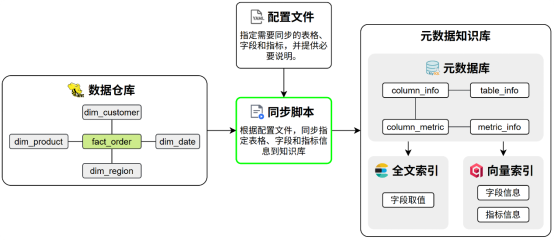

# 5. 元数据知识库

## 5.1 需求说明

本章旨在开发一个用于构建元数据知识库的脚本。该脚本以一个 YAML 配置文件作为输入参数，配置文件中定义了需要同步至元数据知识库的表格信息与指标信息。脚本功能包括：

-  根据配置内容，将指定的表及指标信息同步至 Meta 数据库；

-  为字段信息和指标信息构建向量索引；

-  为字段取值建立全文索引。



## 5.2 代码组织规划

构建元数据知识库模块的核心代码采用分层设计，具体组织结构如下：

```bash
data-agent/
├── conf/
│   └── meta_config.yaml # 配置文件，用于指定待同步的表格和指标
└── app/
    ├── conf/
    │   └── meta_config.py # 用于定义meta_config.yaml的参数结构
    ├── scripts/
    │   └── build_meta_knowledge.py # 构建元数据知识库的入口脚本，负责解析命令行参数
    ├── services/
    │   └── meta_knowledge_service.py # 负责实现构建元数据知识库的核心逻辑
    ├── models/
    │   ├── table_info.py # 用于定义表格信息的业务实体类
    │   ├── column_info.py # 用于定义字段信息的业务实体类
    │   ├── metric_info.py # 用于定义指标信息的业务实体类
    │   ├── column_metric.py # 用于定义字段指标关系的业务实体类
    │   └── value_info.py # 用于定义字段取值的业务实体类
    └── repositories/
        ├── mysql/
        │   ├── meta/
        │   │   ├── meta_mysql_repository.py # 负责实现meta数据库的读写操作
        │   │   └── mappers/
        │   │       ├── table_info_mapper.py # table_info orm实体和业务实体的类型转换
        │   │       ├── column_info_mapper.py # column_info orm实体和业务实体的类型转换
        │   │       ├── metric_info_mapper.py # metric_info orm实体和业务实体的类型转换
        │   │       └── column_metric_mapper.py # column_metric orm实体和业务实体的类型转换
        │   ├── dw/
        │   │   └── dw_mysql_repository.py # 负责实现dw数据库的读写操作
        ├── qdrant/
        │   ├── column_qdrant_repository.py # 负责实现qdrant中column相关集合的读写操作
        │   └── metric_qdrant_repository.py # 负责实现qdrant中metric相关集合的读写操作
        └── es/
            └── value_qdrant_repository.py # 用于定义es中value索引的实体类
```

## 5.3 具体实现

### 5.3.0 脚本文件

执行脚本文件说明：创建 `\app\scripts\build_meta_knowledge.py` 知识库构建脚本入口

~~~python
from app.core.log import logger
def build():
    """
    构建元知识库函数
    用于执行构建元知识相关的业务逻辑，例如加载配置、初始化数据等
    """
    # 打印INFO级别的日志，记录当前正在执行的操作
    logger.info("Building meta knowledge...")


# 判断当前脚本是否作为主程序运行
if __name__ == '__main__':
    # 调用build函数，执行元知识构建逻辑
    build()
    
   
~~~

执行脚本：

​	命令终端：python .\app\scripts\build_meta_knowledge.py 

异常信息：

~~~
Traceback (most recent call last):
  File "D:\workspace\data-agent\app\scripts\build_meta_knowledge.py", line 4, in <module>
    from app.core.log import logger
ModuleNotFoundError: No module named 'app'
~~~

**错误核心**：Python 解释器在执行脚本时，无法找到名为 `app` 的模块，导致导入失败

原因解析：

​				项目根目录（`D:\workspace\data-agent`）没有被添加到 Python 的模块搜索路径 `sys.path` 中

查看路径

sys.path：就是 Python 找模块 / 文件的 “搜索路径列表”

~~~python
import sys

print(sys.path)
from app.core.log import logger

def build():
    """
    构建元知识库函数
    用于执行构建元知识相关的业务逻辑，例如加载配置、初始化数据等
    """
    # 打印INFO级别的日志，记录当前正在执行的操作
    logger.info("Building meta knowledge...")


# 判断当前脚本是否作为主程序运行
if __name__ == '__main__':
    # 调用build函数，执行元知识构建逻辑
    build()
~~~

`sys.path` 是 Python 内置模块 `sys` 中的一个**列表（list）**，里面存储的是 Python 解释器在导入模块时，会依次搜索的**目录路径**。

简单来说：当你执行 `import app` 时，Python 会遍历 `sys.path` 里的每一个路径，检查该路径下是否有 `app` 模块（文件夹 /`.py` 文件），找到则导入，找不到就报 `ModuleNotFoundError`。

内容包含一下路径：

~~~json
[
    # 1. 脚本所在目录（优先级最高）
    "D:\\workspace\\data-agent\\app\\scripts",  
    # 2. Python 环境的 site-packages 目录
    "C:\\Python310\\Lib\\site-packages",
    # 3. Python 标准库目录
    "C:\\Python310\\Lib",
    # 4. 其他（如 PYTHONPATH 或虚拟环境路径）
    "D:\\workspace\\data-agent\\venv\\Lib\\site-packages"
]
~~~

`sys.path` 里没有项目根目录 `D:\\workspace\\data-agent`，所以 Python 找不到 `data-agent/` 下的 `app` 模块。

解决方式一： 设置pythonPath环境变量

~~~shell
# 设置pythonpath （项目的绝对路径）
$env:PYTHONPATH = 'D:\workspace\data-agent'
# 执行脚本
python .\app\scripts\build_meta_knowledge.py

~~~

解决方式二：使用模块运行方式（推荐）

~~~
python -m app.scripts.build_meta_knowledge
~~~

以模块运行的方式，在运行时，将(终端)所在路径加入到pythonpath中，所以模块运行需要再项目根据中执行以上命令。

### 5.3.1 配置文件

#### 5.3.1.1 结构说明

配置文件采用yaml格式，用于指定待同步的表格和指标信息，其结构要求如下

```yaml
tables: # 表格信息
    - name: <table_name> # 真实表名
      role: dim | fact # 表角色
      description: <table_description> # 表的业务含义说明
      columns:
          - name: <column_name> # 真实字段名
            role: primary_key | foreign_key | dimension | measure # 字段角色 
            description: <column_description> # 字段的业务含义
            alias: [<alias1>, <alias2>] # 字段同义词
            sync: true | false # 该字段取值是否需要同步到ES建立全文索引

metrics: # 指标信息
    - name: <metric_name> # 指标名称，如 GMV、AOV
      description: <metric_description> # 指标的业务含义与计算口径说明
      relevant_columns: [<table_name.column_name>] # 指标相关字段
      alias: [<alias1>, <alias2>] # 指标同义词
```

#### 5.3.1.2 具体配置

当前的数据仓库模拟环境（dw库）中共有 5 张表和 2 个指标需要同步到元数据知识库，具体配置如下。

**说明：**该配置文件应由脚本调用方提供，所以该文件在项目中的路径不做要求，现暂将其置于`data-agent/conf/meta_config.yaml`中。

```yaml
tables:
  - name: dim_region
    role: dim
    description: 地区维度表，用于描述订单发生的地理区域信息。
    columns:
      - name: region_id
        role: primary_key
        description: 地区唯一标识。
        alias: [ 地区ID, 区域ID ]
        sync: false

      - name: province
        role: dimension
        description: 订单所属的省份名称。
        alias: [ 省份, 省, 所在省份 ]
        sync: true

      - name: region_name
        role: dimension
        description: 订单所属的大区名称，如华东、华南等。
        alias: [ 地区, 区域, 大区 ]
        sync: true

      - name: country
        role: dimension
        description: 地区所属国家名称。
        alias: [ 国家, 国家名称 ]
        sync: true


  - name: dim_customer
    role: dim
    description: 客户维度表，描述下单客户的基本属性。
    columns:
      - name: customer_id
        role: primary_key
        description: 客户唯一标识。
        alias: [ 客户ID, 用户ID ]
        sync: false

      - name: customer_name
        role: dimension
        description: 客户名称。
        alias: [ 客户名称, 用户名称 ]
        sync: true

      - name: gender
        role: dimension
        description: 客户性别。
        alias: [ 性别 ]
        sync: true

      - name: member_level
        role: dimension
        description: 客户会员等级。
        alias: [ 会员等级, 用户等级 ]
        sync: true


  - name: dim_product
    role: dim
    description: 商品维度表，描述商品的基本属性信息。
    columns:
      - name: product_id
        role: primary_key
        description: 商品唯一标识。
        alias: [ 商品ID, 产品ID ]
        sync: false

      - name: product_name
        role: dimension
        description: 商品名称。
        alias: [ 商品名称, 产品名称 ]
        sync: true

      - name: category
        role: dimension
        description: 商品所属品类。
        alias: [ 商品类别, 品类, 分类 ]
        sync: true

      - name: brand
        role: dimension
        description: 商品品牌名称。
        alias: [ 品牌, 品牌名称 ]
        sync: true


  - name: dim_date
    role: dim
    description: 时间维度表，用于多时间粒度分析。
    columns:
      - name: date_id
        role: primary_key
        description: 日期唯一标识，格式 yyyyMMdd。
        alias: [ 日期ID, 日期 ]
        sync: false

      - name: year
        role: dimension
        description: 年份。
        alias: [ 年, 年份 ]
        sync: false

      - name: quarter
        role: dimension
        description: 季度。
        alias: [ 季度 ]
        sync: true

      - name: month
        role: dimension
        description: 月份。
        alias: [ 月, 月份 ]
        sync: false

      - name: day
        role: dimension
        description: 日。
        alias: [ 日, 天 ]
        sync: false

  - name: fact_order
    role: fact
    description: 订单事实表，记录订单数量和金额等核心指标。
    columns:
      - name: order_id
        role: primary_key
        description: 订单唯一标识。
        alias: [ 订单ID ]
        sync: false

      - name: customer_id
        role: foreign_key
        description: 关联客户维度的外键。
        alias: [ 客户ID, 用户ID ]
        sync: false

      - name: product_id
        role: foreign_key
        description: 关联商品维度的外键。
        alias: [ 商品ID, 产品ID ]
        sync: false

      - name: date_id
        role: foreign_key
        description: 关联时间维度的外键。
        alias: [ 日期, 下单日期 ]
        sync: false

      - name: region_id
        role: foreign_key
        description: 关联地区维度的外键。
        alias: [ 地区ID, 区域ID ]
        sync: false

      - name: order_quantity
        role: measure
        description: 订单中商品的购买数量。
        alias: [ 销量, 购买数量, 件数 ]
        sync: false

      - name: order_amount
        role: measure
        description: 订单金额。
        alias: [ 销售额, 订单金额, 收入 ]
        sync: false


metrics:
  - name: GMV
    description: 全称Gross Merchandise Value，表示所有订单的成交金额总和。
    relevant_columns:
      - fact_order.order_amount
    alias: [ 成交总额, 订单总额 ]
  - name: AOV
    description: 全称Average Order Value，表示所有订单的成交金额平均值。
    relevant_columns:
      - fact_order.order_quantity
    alias: [ 平均单价, 平均订单金额 ]

```

### 5.1.3 结构定义

在`data-agent/app/conf/meta_config.py`中编写如下内容，用于定义上述配置参数的结构。

```python
from dataclasses import dataclass
from typing import Optional


@dataclass
class ColumnConfig:
    name: str
    role: str
    description: str
    alias: list[str]
    sync: bool


@dataclass
class TableConfig:
    name: str
    role: str
    description: str
    columns: list[ColumnConfig]


@dataclass
class MetricConfig:
    name: str
    description: str
    relevant_columns: list[str]
    alias: list[str]


@dataclass
class MetaConfig:
    tables: Optional[list[TableConfig]] = None
    metrics: Optional[list[MetricConfig]] = None

```

### 5.3.2 入口脚本

入口脚本（`data-agent/app/scripts/build_meta_knowledge.py`）主要负责解析调用者传入的配置文件路径。具体内容如下：

脚本文件执行，配置文件的加载方式：动态传递配置文件位置，解析获取文件路径

~~~shell
python -m app.scripts.build_meta_knowledge -c .\conf\meta_config.yaml
~~~

[argparse](https://docs.python.org/zh-cn/3.13/library/argparse.html)模块让编写用户对命令行接口的参数处理变得容易。 程序定义它需要哪些参数，`argparse` 将会知道如何从 [`sys.argv`](https://docs.python.org/zh-cn/3.13/library/sys.html#sys.argv) 解析它们。 `argparse` 模块还能自动生成帮助和用法消息文本。 该模块还会在用户向程序传入无效参数时发出错误提示。

简单理解：argparse是python内置的一个模块，专门用于解析命令行选项、参数和子命令解析器。

演示：sys.argv输出Python 脚本的命令行参数

~~~python
if __name__ == '__main__':
    logger.info(argv)
    build()
~~~

脚本执行：python -m app.scripts.build_meta_knowledge -c .\conf\meta_config.yaml

输出内容:传递给python脚本的参数

~~~python
['E:\\python_workspace\\java0903\\data-agent\\app\\scripts\\build_meta_knowledge.py', '-c', '.\\conf\\meta_config.yaml']
~~~

如果要获取传递的配置文件的路径可以使用：

~~~python
if __name__ == '__main__':
    logger.info(argv[2])
    build()
~~~

注意：这种方式获取需要固定位置实现，有位置要求

优化：选择使用基于argv实现的[argparse](https://docs.python.org/zh-cn/3.13/library/argparse.html)模块获取

~~~python
if __name__ == '__main__':
    # 创建一个命令行参数解析器对象
    parser = ArgumentParser(
        prog='ProgramName',          # 程序名称，在帮助信息中显示
        description='What the program does',  # 程序的简短描述
        epilog='Text at the bottom of help'   # 帮助信息底部的附加文本
    )

    # 添加一个位置参数（必须传入的参数），名为 filename
    parser.add_argument('filename')  
    # 添加一个可选参数，支持短选项 -c 和长选项 --count
    parser.add_argument('-c', '--count')
    # 添加一个可选参数，支持短选项 -v 和长选项 --verbose
    # action='store_true' 表示该参数是一个开关，出现时设为 True，不出现则为 False
    parser.add_argument(
        '-v', '--verbose',
        action='store_true'  # on/off flag
    )
    # 解析命令行传入的所有参数，并将结果存入 args 对象
    args = parser.parse_args()
    # 打印解析后的所有参数，用于调试或确认
    print(args)
    # 调用主业务函数 build()
    build()
~~~

执行脚本

~~~python
# (1)查看脚本帮助信息
python -m app.scripts.build_meta_knowledge -h

# (2)传参测试
python -m app.scripts.build_meta_knowledge -c 10 -v meta.yaml
# 输出结果
Namespace(filename='meta.yaml', count='10', verbose=True)

~~~

获取filename参数即可

~~~python
if __name__ == '__main__':
    parser = ArgumentParser(
        prog='ProgramName',
        description='What the program does',
        epilog='Text at the bottom of help')

    parser.add_argument('filename')  # positional argument
    parser.add_argument('-c', '--count')  # option that takes a value
    parser.add_argument('-v', '--verbose',
                        action='store_true')  # on/off flag

    args = parser.parse_args()

    print(args.filename)
    build()
~~~

执行脚本：

~~~shell
python -m app.scripts.build_meta_knowledge -c 10 -v meta.yaml
结果：
meta.yaml
~~~

最终优化：

需求：根据脚本执行指令设计加载实现

~~~shell
python -m app.scripts.build_meta_knowledge -c .\conf\meta_config.yaml
~~~

优化实现：

~~~python
# 从 pathlib 库导入 Path 类，用于处理文件路径
from pathlib import Path
# 从 app.core.log 模块导入 logger 对象，用于日志记录
from app.core.log import logger

# 定义 build 函数，接收一个 Path 类型的参数 config_path，表示配置文件路径
def build(config_path: Path):
    # 打印日志，提示正在构建元知识
    logger.info("Building meta knowledge...")

# 当脚本被直接运行时执行以下代码
if __name__ == '__main__':
    # 创建一个命令行参数解析器对象
    parser = ArgumentParser()
    # 添加一个可选参数，支持短选项 -c 和长选项 --conf
    # 该选项用于接收配置文件的路径
    parser.add_argument('-c', '--conf')  
    # 解析命令行传入的所有参数，并将结果存入 args 对象
    args = parser.parse_args()
    # 将命令行参数中获取的配置文件路径字符串，转换为 Path 对象
    config_path = Path(args.conf)
    # 调用 build 函数，传入解析后的配置文件路径
    build(config_path)
~~~

脚本具体执行业务如下：

```python
import asyncio
from argparse import ArgumentParser
from pathlib import Path

from app.clients.embedding_client_manager import embedding_client_manager
from app.clients.es_client_manager import es_client_manager
from app.clients.mysql_client_manager import meta_mysql_client_manager, dw_mysql_client_manager
from app.clients.qdrant_client_manager import qdrant_client_manager
from app.repository.qdrant.column_qdrant_repository import ColumnQdrantRepository
from app.repository.mysql.dw_mysql_repository import DwMysqlRepository
from app.repository.mysql.meta_mysql_repository import MetaMysqlRepository
from app.repository.es.value_es_repository import ValueEsRepository
from app.repository.qdrant.metric_qdrant_repository import MetricQdrantRepository
from app.service.meta_knowledge_service import MetaKnowledgeService


async def build(config_path:Path):
    # 初始化engine和session工厂
    meta_mysql_client_manager.init()
    dw_mysql_client_manager.init()
    qdrant_client_manager.init()
    embedding_client_manager.init()
    es_client_manager.init()
    # 创建session
    async with meta_mysql_client_manager.session_factory() as meta_session,dw_mysql_client_manager.session_factory() as dw_session:
        # 创建meta_repository
        meta_mysql_repository = MetaMysqlRepository(meta_session)
        # 创建dw_repository
        dw_mysql_repository = DwMysqlRepository(dw_session)
        # 创建qdrant客户端对象
        column_qdrant_repository = ColumnQdrantRepository(qdrant_client_manager.client)
        # 创建embedding客户端对象
        embedding_client=embedding_client_manager.client
        # 创建ValueEsRepository对象
        value_es_repository=ValueEsRepository(es_client_manager.client)
        # 创建MetricQdrantRepository客户端
        metric_qd_repository = MetricQdrantRepository(qdrant_client_manager.client)
        # 创建service对象
        meta_knowledge_service=MetaKnowledgeService(
            meta_mysql_repository=meta_mysql_repository,
            dw_mysql_repository=dw_mysql_repository,
            column_qdrant_repository=column_qdrant_repository,
            embedding_client=embedding_client,
            value_es_repository=value_es_repository,
            metric_qdrant_repository=metric_qd_repository
        )
        # 构建知识库
        await meta_knowledge_service.build(config_path)

    # 关闭客户端资源
    await meta_mysql_client_manager.close()
    await dw_mysql_client_manager.close()
    await qdrant_client_manager.close()
    await es_client_manager.close()


if __name__ == '__main__':

    # 创建argparse解析器
    parser = ArgumentParser()

    # 设置解析器参数
    parser.add_argument('-c', '--conf')  # 接受一个值的选项
    args = parser.parse_args()
    config_path=Path(args.conf)
    asyncio.run(build(config_path))
```

### 5.3.3 核心业务逻辑

核心业务逻辑位于`data-agent/app/services/meta_knowledge_service.py`中，具体内容如下：

主要实现思路
~~~python
async def build(self, config_path: Path):
    pass
    # 1.加载配置文件

    # 2.处理表信息
    # 2.1 保存表信息到meta数据库
    # 2.2 为字段信息建立向量索引
    # 2.3 为字段取值建立全文索引

    # 3.处理指标信息
    # 3.1 保存指标信息到meta数据库
    # 3.2 为指标信息建立向量索引
~~~


业务逻辑实现：

```python
import uuid
from pathlib import Path

from langchain_huggingface import HuggingFaceEndpointEmbeddings
from omegaconf import OmegaConf

from conf import MetaConfig
from app.core.log import logger
from app.models.es.value_info_es import ValueInfoEs
from app.models.mysql.column_info_mysql import ColumnInfoMySQL
from app.models.mysql.column_metric_mysql import ColumnMetricMySQL
from app.models.mysql.metric_info_mysql import MetricInfoMySQL
from app.models.mysql.table_info_mysql import TableInfoMySQL
from app.models.qdrant.column_info_qdrant import ColumnInfoQdrant
from app.models.qdrant.metric_info_qdrant import MetricInfoQdrant
from app.repository.es.value_es_repository import ValueEsRepository
from app.repository.mysql.dw_mysql_repository import DWMysqlRepository
from app.repository.mysql.meta_mysql_repository import MetaMysqlRepository
from app.repository.qdrant.column_qdrant_repository import ColumnQdrantRepository
from app.repository.qdrant.metric_qdrant_repository import MetricQdrantRepository


class MetaKnowledgeService:
    def __init__(self,
                 meta_mysql_repository: MetaMysqlRepository,
                 dw_mysql_repository: DWMysqlRepository,
                 column_qdrant_repository: ColumnQdrantRepository,
                 embedding_client: HuggingFaceEndpointEmbeddings,
                 value_es_repository: ValueEsRepository,
                 metric_qdrant_repository: MetricQdrantRepository):
        self.meta_mysql_repository = meta_mysql_repository
        self.dw_mysql_repository = dw_mysql_repository
        self.column_qdrant_repository = column_qdrant_repository
        self.embedding_client = embedding_client
        self.value_es_repository = value_es_repository
        self.metric_qdrant_repository = metric_qdrant_repository

    async def build(self, config_file: Path):
        # 1.加载配置文件，构建配置对象
        # 根据文件路径加载配置文件内容
        context = OmegaConf.load(config_file)
        # 构建配置内容封装结构
        schema = OmegaConf.structured(MetaConfig)
        # 合并结构和内容后转换成对象
        meta_config: MetaConfig = OmegaConf.to_object(OmegaConf.merge(schema, context))
        logger.info("加载配置文件完成")
        # 判断配置中是否存在表的配置信息
        if meta_config.tables:
            # 2.处理表信息，
            # 2.1添加表信息到meta数据库
            column_infos: list[ColumnInfoMySQL] = await self._save_table_info_to_meta_db(meta_config)
            logger.info("保存表信息到meta数据库")
            # 2.2为列信息构建向量索引qdrant
            await self._save_column_info_to_qdrant(column_infos)
            logger.info("为列信息添加向量索引")
            # 2.3为列值信息构建全文索引
            await self._save_value_info_to_es(column_infos, meta_config)
            logger.info("为值信息添加全文索引")

        # 判断配置中是否存在指标的配置信息
        if meta_config.metrics:
            # 3.处理指标信息
            # 3.1 保存指标到meta数据库
            metric_infos: list[MetricInfoMySQL] = await self._save_metric_info_to_meta_db(meta_config)
            logger.info("保存指标信息到meta数据库")
            # 3.2为指标信息构建向量索引
            await self._save_metric_info_to_qdrant(metric_infos)
            logger.info("为指标信息添加向量索引")

    async def _save_table_info_to_meta_db(self, meta_config: MetaConfig) -> list[ColumnInfoMySQL]:
        # 定义列表收集表信息
        table_infos: list[TableInfoMySQL] = []
        # 定义列表收集列信息
        column_infos: list[ColumnInfoMySQL] = []
        for table in meta_config.tables:
            # 查询当前表列的类型
            column_types: dict[str, str] = await self.dw_mysql_repository.get_column_types(table.name)
            # 构建表信息对象
            table_info = TableInfoMySQL(
                id=table.name,
                name=table.name,
                role=table.role,
                description=table.description
            )
            table_infos.append(table_info)
            # 遍历当前表的列数据
            for column in table.columns:
                # 查询指定列的examples
                column_values: list[str] = await self.dw_mysql_repository.get_column_values(table.name, column.name)

                # 构建列对象信息
                column_info = ColumnInfoMySQL(
                    id=f"{table.name}.{column.name}",
                    name=column.name,
                    type=column_types[column.name],
                    role=column.role,
                    examples=column_values,
                    description=column.description,
                    alias=column.alias,
                    table_id=table.name

                )
                column_infos.append(column_info)

        # 2.1保存表信息到table_info
        async with self.meta_mysql_repository.session.begin():
            await self.meta_mysql_repository.save_table_infos(table_infos)
            # 2.2保存列信息到column_info
            await self.meta_mysql_repository.save_column_infos(column_infos)
        return column_infos

    def _convert_column_info_from_mysql_to_qdrant(self, column_info: ColumnInfoMySQL):
        return ColumnInfoQdrant(
            id=column_info.id,
            name=column_info.name,
            type=column_info.type,
            role=column_info.role,
            examples=column_info.examples,
            description=column_info.description,
            alias=column_info.alias,
            table_id=column_info.table_id
        )

    async def _save_column_info_to_qdrant(self, column_infos: list[ColumnInfoMySQL]):
        # 确保列信息存储向量数据库集合存在
        await self.column_qdrant_repository.ensure_collection()
        # 构建列数据的保存点
        points: list[dict] = []
        # 遍历列集合数据，获取需要向量存储的字段
        for column_info in column_infos:
            # name
            points.append({
                "id": uuid.uuid4(),
                "embedding_text": column_info.name,
                "payload": self._convert_column_info_from_mysql_to_qdrant(column_info)
            })
            # description
            points.append({
                "id": uuid.uuid4(),
                "embedding_text": column_info.description,
                "payload": self._convert_column_info_from_mysql_to_qdrant(column_info)
            })
            # alias
            for alia in column_info.alias:
                points.append({
                    "id": uuid.uuid4(),
                    "embedding_text": alia,
                    "payload": self._convert_column_info_from_mysql_to_qdrant(column_info)
                })

        # 获取所有points中的向量文本
        embeddings_text = [point["embedding_text"] for point in points]
        # 定义向量列表，收集向量数据 list[list[fload]]
        embeddings = []
        # 批次进行向量转化
        batch_size = 20
        # 循环总的向量文本，获取批次
        for i in range(0, len(embeddings_text), batch_size):
            # 获取批次数据
            batch_embedding_texts = embeddings_text[i:i + batch_size]
            # 转换向量文本为向量数据
            batch_embeddings = await self.embedding_client.aembed_documents(batch_embedding_texts)
        # list[list[fload]]
        embeddings.extend(batch_embeddings)

    # 收集id列表
    ids = [point["id"] for point in points]
    # 收集payload列表
    payloads = [point["payload"] for point in points]
    # 保存向量数据到qdrant中
    await self.column_qdrant_repository.upsert_embedding(ids, embeddings, payloads)


async def _save_value_info_to_es(self, column_infos: list[ColumnInfoMySQL], meta_config: MetaConfig):
    # 确保值存储的索引存在
    await self.value_es_repository.ensure_index()
    # 定义字典{“表名.列名”:true}
    column2sync: dict[str, bool] = {}
    # 查询需要进行全文索引的列
    for table in meta_config.tables:
        # 循环当前表对应列
        for column in table.columns:
            column2sync[f"{table.name}.{column.name}"] = column.sync
    # 接收所有值对象，用于进行全文检索存储
    value_infos: list[ValueInfoEs] = []
    # 根据需要全文索引的列，查询对应的值列表
    for column_info in column_infos:
        # 获取当前列是否进行全文索引的结果
        sync = column2sync[column_info.id]
        # 判断结果
        if sync:
            # 根据列查询对应的值列表
            values: list[str] = await self.dw_mysql_repository.get_column_values(column_info.table_id,
                                                                                 column_info.name, 10000)
            # 构建值实体数据
            current_column_values = [ValueInfoEs(
                id=f"{column_info.id}.{value}",  # 表名.列表.值
                value=value,
                type=column_info.type,
                column_id=column_info.id,
                column_name=column_info.name,
                table_id=column_info.table_id,
                table_name=column_info.table_id

            ) for value in values]
            value_infos.extend(current_column_values)

    # 保存值数据到es
    await self.value_es_repository.upsert_values(value_infos)


async def _save_metric_info_to_meta_db(self, meta_config: MetaConfig):
    # 封装数据位MetricInfoMysql
    metric_infos: list[MetricInfoMySQL] = []
    column_metric_infos: list[ColumnMetricMySQL] = []
    # 遍历封装处理
    for metric in meta_config.metrics:
        metric_info = MetricInfoMySQL(
            id=metric.name,
            name=metric.name,
            description=metric.description,
            relevant_columns=metric.relevant_columns,
            alias=metric.alias
        )
        metric_infos.append(metric_info)
        # 处理列指标关联信息
        for relevant_column in metric.relevant_columns:
            relevant_column_info = ColumnMetricMySQL(
                column_id=relevant_column,
                metric_id=metric.name
            )
            column_metric_infos.append(relevant_column_info)
    async with self.meta_mysql_repository.session.begin():
        # 保存指标信息到metric_info
        await self.meta_mysql_repository.save_metric_infos(metric_infos)
        #  保存列指标信息到column_metric
        await self.meta_mysql_repository.save_column_metric_infos(column_metric_infos)
    return metric_infos


def _convert_metric_info_from_mysql_to_qdrant(self, metric_info: MetricInfoMySQL):
    return MetricInfoQdrant(
        id=metric_info.id,
        name=metric_info.name,
        description=metric_info.description,
        relevant_columns=metric_info.relevant_columns,
        alias=metric_info.alias
    )


async def _save_metric_info_to_qdrant(self, metric_infos: list[MetricInfoMySQL]):
    # 确保指标信息存储的集合存在
    await self.metric_qdrant_repository.ensure_collection()

    # 接收points数据
    points: list[dict] = []
    # 构建指标points数据结构
    for metric_info in metric_infos:
        # name
        points.append({
            "id": uuid.uuid4(),
            "embedding_text": metric_info.name,
            "payload": self._convert_metric_info_from_mysql_to_qdrant(metric_info)
        })
        # description
        points.append({
            "id": uuid.uuid4(),
            "embedding_text": metric_info.description,
            "payload": self._convert_metric_info_from_mysql_to_qdrant(metric_info)
        })
        # alias
        for alia in metric_info.alias:
            points.append({
                "id": uuid.uuid4(),
                "embedding_text": alia,
                "payload": self._convert_metric_info_from_mysql_to_qdrant(metric_info)
            })

    # 获取所有向量文本
    embedding_texts = [point["embedding_text"] for point in points]
    # 定义批次
    batch_size = 10
    # 定义接收向量数据列表
    embeddings = []
    # 循环获取批次
    for i in range(0, len(embedding_texts), batch_size):
        # 获取批次向量文本
        batch_embedding_texts = embedding_texts[i:i + batch_size]
        # 批次向量转换
        batch_embeddings = await self.embedding_client.aembed_documents(batch_embedding_texts)
        # 接收数据
        embeddings.extend(batch_embeddings)
    # 获取ids
    ids = [point["id"] for point in points]
    # 获取payloads
    payloads = [point["payload"] for point in points]
    # 保存指标信息到qdrant
    await self.metric_qdrant_repository.upsert_embeddings(ids, embeddings, payloads)
```

知识点总结：

知识点一：查询表中字段类型type和examples

~~~
# 查询表中字段信息type
show columns from fact_order;

# 查询字段类型examples
# 提取每个字段的值，去重后，获取部分作为例子即可
select distinct product_id from fact_order limit 10;

~~~

知识点二：向量转换测试

参考地址：https://huggingface.co/docs/text-embeddings-inference/quick_tour

~~~shell

使用方式一：curl方式
# 可以在Git Bash Here的终端使用，前提是必须安装了curl组件
curl 127.0.0.1:8081/embed \
    -X POST \
    -d '{"inputs":"What is Deep Learning?"}' \
    -H 'Content-Type: application/json'
结果为:转换的向量数据

使用方式二：langchain整合embedding客户端
参考地址：https://docs.langchain.com/oss/python/integrations/text_embedding/text_embeddings_inference

# 导入模块
from langchain_huggingface.embeddings import HuggingFaceEndpointEmbeddings
# 创建客户端对象
embeddings = HuggingFaceEndpointEmbeddings(model="http://localhost:8081")

# 向量转化
# 定义待生成嵌入向量的文本
text = "What is deep learning?"
# 生成文本的嵌入向量
query_result = embeddings.embed_query(text)
# 取向量前3个元素预览
query_result[:3]

结果展示：[0.018113142, 0.00302585, -0.049911194]
# 定义操作客户端对象 EmbeddedClientManager

# 创建Qdrant向量数据库集合的维度
参考：https://huggingface.co/BAAI/bge-large-zh/blob/main/config.json

vectors_config=VectorParams(
	size=app_config.qdrant.embedding_size, # 维度
	distance=Distance.COSINE) # 余弦相似度
# 配置
qdrant:
  host: localhost
  port: 6333
  embedding_size: 1024
~~~

知识点三： ES操作数据

参考地址：https://www.elastic.co/guide/en/elasticsearch/reference/8.19/getting-started.html#getting-started-add-multiple-documents

~~~python
# 1.批量添加格式
resp = client.bulk(
    operations=[
        {
            "index": {
                "_index": "books"
            }
        },
        {
            "name": "Revelation Space",
            "author": "Alastair Reynolds",
            "release_date": "2000-03-15",
            "page_count": 585
        },
        {
            "index": {
                "_index": "books"
            }
        },
        {
            "name": "1984",
            "author": "George Orwell",
            "release_date": "1985-06-01",
            "page_count": 328
        }
    ],
)
print(resp)

# 2.定义对应操作对象，使用TypedDict类型
     TypedDict 是 Python 标准库 typing（3.8+）/typing_extensions 中提供的类型注解工具，核心作用是给字典（dict）添加明确的键值对类型约束，让字典的结构更清晰、可维护，同时能被类型检查工具（如 PyCharm、mypy）识别。
作用：
     普通字典的类型注解（dict）只能指定「键的类型」和「值的类型」，无法约束「具体有哪些键」「每个键对应的值类型」—— 这在复杂业务场景（比如你接触的向量配置、接口返回数据）中会导致代码可读性差、易出错。

例如：操作使用TypedDict定义的类型对象
class ValueInfoES(TypedDict):
    id: str          	  # 字段值的唯一标识ID
    value: str       	  # 字段的具体值
    type: str        	  # 字段值的数据类型
    column_id: str   	  # 所属字段（列）的唯一标识ID
    column_name: str 	  # 所属字段（列）的名称
    table_id: str    	  # 所属表的唯一标识ID
    table_name: str  	  # 所属表的名称
    
例如：操作Qdrant操作的类型对象
class ColumnInfoQdrant(TypedDict):
    id: int               # 字段唯一标识ID
    name: str             # 字段名称
    type: str             # 字段数据类型
    role: str             # 字段业务角色
    examples: list        # 字段值示例
    description: str      # 字段业务描述
    alias: list           # 字段别名
    table_id: str         # 所属表的唯一标识（关联表元数据）
    
# 3.判断索引是否存在，并判断索引库
参考：https://www.elastic.co/guide/en/elasticsearch/reference/8.19/getting-started.html#getting-started-explicit-mapping

resp = client.indices.create(
    index="my-explicit-mappings-books",
    mappings={
        "dynamic": False,
        "properties": {
            "name": {
                "type": "text"
            },
            "author": {
                "type": "text"
            },
            "release_date": {
                "type": "date",
                "format": "yyyy-MM-dd"
            },
            "page_count": {
                "type": "integer"
            }
        }
    },
)
print(resp)

# 映射结构定义
    es_index_mappings = {
        "dynamic": False,
        "properties": {
            "id": {"type": "keyword"},
            "value": {"type": "text", "analyzer": "ik_max_word", "search_analyzer": "ik_max_word"},
            "type": {"type": "keyword"},
            "column_id": {"type": "keyword"},
            "column_name": {"type": "keyword"},
            "table_id": {"type": "keyword"},
            "table_name": {"type": "keyword"},
        }
    }

配置："dynamic": False,
	作用是禁用 “动态映射”，即当写入文档时，如果包含配置中未定义的字段（比如新增 create_time 字段），ES 不会自动为该字段创建映射，也不会索引这个字段，避免因脏数据导致索引字段膨胀，保证索引结构可控。
    
业务说明：
  适合建立全文索引是维度表中的可分词字段，事实表中基本都是核心业务的度量值，没有全文索引的意义不用考虑，维度表哪些字段适合简历索引，可以参考mete_config.yml中的配置
    sync: false：表示该字段不适合建立索引
    sync: true：表示该字段适合建立索引
    例如：
  - name: dim_customer
    role: dim
    description: 客户维度表，描述下单客户的基本属性。
    columns:
      - name: customer_id
        role: primary_key
        description: 客户唯一标识。
        alias: [ 客户ID, 用户ID ]
        sync: false

      - name: customer_name
        role: dimension
        description: 客户名称。
        alias: [ 客户名称, 用户名称 ]
        sync: true

      - name: gender
        role: dimension
        description: 客户性别。
        alias: [ 性别 ]
        sync: true

      - name: member_level
        role: dimension
        description: 客户会员等级。
        alias: [ 会员等级, 用户等级 ]
        sync: true
        
 注意：es中添加索引数据时，需要使用位置参数传递，否则异常
 例如：
    判断索引中的index位置参数
    self.client.indices.exists(index=self.es_index_name):
    保存索引时的body位置参数    
    await self.client.bulk(operations=options)     
        
    
~~~


### 5.3.4 数据读写操作

#### 5.3.4.1 业务实体类路径

业务实体类用于统一封装不同存储系统中的数据结构（如 Meta 数据库、Elasticsearch、Qdrant），作为应用上层组件进行读写操作时的标准参数类型和返回值类型。本项目定义的业务实体有：ValueInfoEs、ColumnInfoQdrant、MetricInfoQdrant具体代码如下： 

- ValueInfoEs（data-agent\app\models\es\value_info_es.py）

  ```python
  class ValueInfoEs(TypedDict):
      id:str
      value:str
      type:str
      column_id:str
      column_name:str
      table_id:str
      table_name:str
  ```
  
- ColumnInfoQdrant（data-agent\app\models\qdrant\column_info_qdrant.py）

  ```python
  from typing import TypedDict
  
  class ColumnInfoQdrant(TypedDict):
      id: str
      name: str
      type: str
      role: str
      examples: list
      description: str
      alias: list
      table_id: str
  
  ```
  
- MetricInfoQdrant（data-agent\app\models\qdrant\metric_info_qdrant.py）

  ```python
  from typing import TypedDict
  
  
  class MetricInfoQdrant(TypedDict):
      id:str
      name:str
      description:str
      relevant_columns: list
      alias:list
  
  ```

#### 5.3.4.2 meta_mysql_repository

meta_mysql_repository用于实现meta数据库的读写操作，具体代码如下：

**2）**读写操作

在`data-agent/app/repositories/mysql/meta/meta_mysql_repository.py`中编写如下代码：

```python
from sqlalchemy.ext.asyncio.session import AsyncSession
from sqlalchemy.sql.expression import text,select
from app.models.mysql.column_info_mysql import ColumnInfoMySQL
from app.models.mysql.column_metric_mysql import ColumnMetricMySQL
from app.models.mysql.metric_info_mysql import MetricInfoMySQL
from app.models.mysql.table_info_mysql import TableInfoMySQL


class MetaMysqlRepository:
    def __init__(self, session: AsyncSession):
        self.session = session

    async def save_table_infos(self, table_infos: list[TableInfoMySQL]):
        self.session.add_all(table_infos)

    async def save_column_infos(self, column_infos: list[ColumnInfoMySQL]):
        self.session.add_all(column_infos)

    async def save_metric_infos(self, metric_infos:list[MetricInfoMySQL]):
        self.session.add_all(metric_infos)

    async def save_column_metric_infos(self, column_metric_infos:list[ColumnMetricMySQL]):
        self.session.add_all(column_metric_infos)

    async def get_column_info_by_id(self, relevant_column:str)->ColumnInfoMySQL:
        """
        查询根据当前字段的id查询meta库中的column_info
        :param relevant_column:
        :return:
        """
        return await self.session.get(ColumnInfoMySQL,relevant_column)

    async def get_key_column_by_table_id(self, table_id:str)->list[ColumnInfoMySQL]:
        """
        根据表的id查询当前表的主键和外键
        :param table_id:
        :return:
        """
        # 定义sql
        sql ="""
            select *
            from column_info
            where table_id= :table_id
            and role in ('primary_key','foreign_key')
        
        """
        # 定义返回结构的类型结构
        query =select(ColumnInfoMySQL).from_statement(text(sql))
        # 执行语句
        result = await self.session.execute(query,{"table_id":table_id})
        # 处理结构
        return result.scalars().fetchall()

    async def get_table_info_by_id(self, table_id:str)->TableInfoMySQL:
        """
        根据表id查询表信息
        :param table_id:
        :return:
        """

        #查询返回结果
        return await self.session.get(TableInfoMySQL,table_id)


```

#### 5.3.4.3 dw_mysql_repository

dw_mysql_repository用于实现模拟数据仓库（dw库）的读写操作。

在`data-agent/app/repositories/mysql/dw/dw_mysql_repository.py`中编写如下代码：

```python
from sqlalchemy.ext.asyncio.session import AsyncSession
from sqlalchemy.sql.expression import text


class DWMysqlRepository:
    def __init__(self, session: AsyncSession):
        self.session = session

    async def get_column_types(self, table_name: str) -> dict[str, str]:
        # 定义sql
        sql = f"show columns  from {table_name}"
        # 执行sql
        result = await self.session.execute(text(sql))
        # 解析结果[(),()]
        return {row.Field: row.Type for row in result.fetchall()}

    async def get_column_values(self, table_name: str, column_name: str, limit: int = 10) -> list[str]:
        # 定义sql
        sql = f"select distinct  {column_name} from {table_name} limit {limit}"
        # 执行sql
        result = await self.session.execute(text(sql))
        # 解析结果
        return result.scalars().fetchall();

    


```

#### 5.3.4.4 column_qdrant_repository

column_qdrant_repository用于实现qdrant中的column_info集合的读写操作。

在`data-agent/app/repositories/qdrant/column_qdrant_repository.py`中编写如下代码：

```python
from qdrant_client import AsyncQdrantClient
from qdrant_client.http.models import VectorParams, Distance, PointStruct

from conf import app_config
from app.models.qdrant.column_info_qdrant import ColumnInfoQdrant


class ColumnQdrantRepository:
    collection_name = "data-agent-column"

    def __init__(self, client: AsyncQdrantClient):
        self.client = client

    async def ensure_collection(self):
        """
        确保保存列向量的集合存在
        :return:
        """
        if not await self.client.collection_exists(self.collection_name):
            await self.client.create_collection(
                collection_name=self.collection_name,
                # 参数一：向量维度 参数二：相似度算法
                vectors_config=VectorParams(size=app_config.qdrant.embedding_size, distance=Distance.COSINE),
            )

    async def upsert_embedding(self, ids: list[str], embeddings: list[list[float]], payloads: list[ColumnInfoQdrant]):
        """
        保存列信息向量数据到qdrant
        :param ids:
        :param embeddings:
        :param payloads:
        :return:
        """
        # 合并[(id,embedding,payload),(id,embedding,payload),(id,embedding,payload)]
        zipped = list(zip(ids, embeddings, payloads))
        # 构建PointStruct [PointStruct(id,embedding,payload),PointStruct(id,embedding,payload),PointStruct(id,embedding,payload)]
        points = [PointStruct(
            id=id,
            vector=embeddings,
            payload=payload
        ) for id, embeddings, payload in zipped]

        # 保存向量数据到qdrant
        await self.client.upsert(
            collection_name=self.collection_name,
            points=points
        )


```

#### 5.3.4.5 metric_qdrant_repository

metric_qdrant_repository用于实现qdrant中的metric_info集合的读写操作。

在`data-agent/app/repositories/qdrant/metric_qdrant_repository.py`中编写如下代码：

```python
from qdrant_client import AsyncQdrantClient
from qdrant_client.http.models import VectorParams, Distance, PointStruct

from conf import app_config
from app.models.qdrant.metric_info_qdrant import MetricInfoQdrant


class MetricQdrantRepository:
    collection_name = "data-agent-metric"

    def __init__(self, client: AsyncQdrantClient):
        self.client = client

    async def ensure_collection(self):
        """
        确保指标信息存储的集合存在
        :return:
        """
        if not await self.client.collection_exists(self.collection_name):
            await self.client.create_collection(
                collection_name=self.collection_name,
                vectors_config=VectorParams(size=app_config.qdrant.embedding_size, distance=Distance.COSINE)
            )

    async def upsert_embeddings(self, ids: list[str], embeddings: list[list[float]], payloads: list[MetricInfoQdrant],
                                batch_size=5):
        """
        保存指标信息到qdrant
        :param ids:
        :param embeddings:
        :param payloads:
        :return:
        """
        # 整合集合数据
        zipped = list(zip(ids, embeddings, payloads))
        # 循环遍历批次处理
        for i in range(0, len(zipped), batch_size):
            # 获取批量的point数据
            batch = zipped[i:i + batch_size]
            # 构建points,其中点对象PointStruct
            points = [PointStruct(
                id=id,
                vector=embedding,
                payload=payload,

            ) for id, embedding, payload in batch]
            # 批量存储指标
            await self.client.upsert(
                collection_name=self.collection_name,
                points=points
            )


```

#### 5.3.4.6 value_es_repository

value_es_repository用于实现es中的value_info index的读写操作。

在`data-agent/app/repositories/es/value_es_repository.py`中编写如下代码：

```python
from elasticsearch import AsyncElasticsearch

from app.models.es.value_info_es import ValueInfoEs


class ValueEsRepository:
    es_index_name = "data_agent_values"
    es_index_mappings = {
        "dynamic": False,
        "properties": {
            "id": {"type": "keyword"},
            "value": {"type": "text", "analyzer": "ik_max_word", "search_analyzer": "ik_max_word"},
            "type": {"type": "keyword"},
            "column_id": {"type": "keyword"},
            "column_name": {"type": "keyword"},
            "table_id": {"type": "keyword"},
            "table_name": {"type": "keyword"},
        }
    }

    def __init__(self, client: AsyncElasticsearch):
        self.client = client

    async def ensure_index(self):
        """
        确保保存值数据的索引存在
        :return:
        """
        # 判断值存储的索引是否存在
        if not await self.client.indices.exists(index=self.es_index_name):
            # 索引不存在，创建索引
            await self.client.indices.create(
                index=self.es_index_name,
                mappings=self.es_index_mappings
            )

    async def upsert_values(self, value_infos:list[ValueInfoEs],batch_size:int=20):
        """
        为值数据添加全文索引
        :param value_infos:
        :return:
          {
            "index": {
                "_index": "books"
            }
        },
        {
            "name": "Revelation Space",
            "author": "Alastair Reynolds",
            "release_date": "2000-03-15",
            "page_count": 585
        },
        """
        # 循环遍历批量获取处理
        for i in range(0, len(value_infos), batch_size):
            # 定义集合，组成operations
            operations = []
            # 获取批次value数据
            batch_value_infos=value_infos[i:i+batch_size]
            # 构建operations
            for batch_value_info in batch_value_infos:
                # 追加索引指定
                operations.append({"index":{"_index": self.es_index_name}})
                # 追加文档值
                operations.append(batch_value_info)
            await self.client.bulk(
                operations=operations
            )

  
```

## 5.4 测试

在终端执行如下命令执行build脚本

```bash
(data-agent) PS D:\workspace\data-agent> python -m app.scripts.build_meta_knowledge -c .\conf\meta_config.yaml    
```

执行完毕后，可查看meta数据库、es和qdrant中是否有数据写入。

