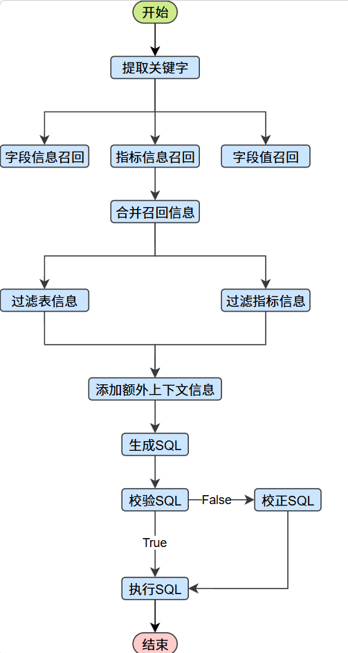
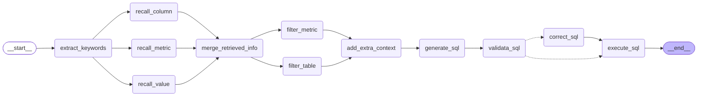

# 6. 问数智能体

## 6.1 需求说明

本章旨在实现问数智能体的工作流，工作流的编排以及各节点的职责。另外，为保证将来前端有一个较好的用户体验，工作流需要实时的输出执行进度和查询结果。

## 6.2代码组织规划

问数智能体的核心代码主要位于 data-agent/app/agent 目录下。

在智能体执行过程中，部分节点需要访问元数据或向量/检索系统以获取辅助信息，相关的查询与访问逻辑统一封装在 data-agent/app/repositories 目录中，供各个 Agent 节点按需调用。

除代码逻辑外，智能体运行还高度依赖提示词（Prompt）。所有提示词均集中管理在data-agent/prompts目录下。具体组织规划如下：

```bash
data-agent/
├─ app/
│  ├─ agent/
│  │  ├─ graph.py # 负责定义langgraph图
│  │  ├─ state.py # 负责定义langgraph状态
│  │  ├─ context.py # 负责定义langgraph运行上下文
│  │  ├─ llm.py # 负责定义llm
│  │  └─ nodes/
│  │     ├─ extract_keywords.py # 负责定义关键词抽取的节点
│  │     ├─ recall_column.py # 负责定义召回字段信息的节点
│  │     ├─ recall_metric.py # 负责定义召回指标信息的节点
│  │     ├─ recall_value.py  # 负责定义召回字段取值的节点
│  │     ├─ merge_retrieved_info.py # 负责定义合并召回信息的节点
│  │     ├─ filter_metric.py # 负责定义过滤指标信息的节点
│  │     ├─ filter_table.py # 负责定义过滤表格信息的节点
│  │     ├─ add_extra_context.py # 负责定义添加额外上下文信息的节点
│  │     ├─ generate_sql.py # 负责定义生成SQL的节点
│  │     ├─ validate_sql.py # 负责定义校验SQL的节点
│  │     ├─ correct_sql.py # 负责定义校正SQL的节点
│  │     └─ execute_sql.py # 负责定义执行SQL的节点
│  │
│  └─ repositories/
│     ├─ mysql/
│     │  ├─ meta/
│     │  │  ├─ meta_mysql_repository.py
│     │  │  └─ models/
│     │  │     ├─ table_info_mysql.py
│     │  │     ├─ column_info_mysql.py
│     │  │     ├─ metric_info_mysql.py
│     │  │     └─ column_metric_mysql.py
│     │  └─ dw/
│     │     └─ dw_mysql_repository.py
│     │
│     ├─ qdrant/
│     │  ├─ column_qdrant_repository.py
│     │  └─ metric_qdrant_repository.py
│     │
│     └─ es/
│        └─ value_qdrant_repository.py
│
├─ prompts/
│  ├─ extend_keywords_for_column_recall.prompt # 为召回字段信息扩展关键词 的提示词
│  ├─ extend_keywords_for_metric_recall.prompt # 为召回指标信息扩展关键词 的提示词
│  ├─ extend_keywords_for_value_recall.prompt # 为召回字段取值扩展关键词 的提示词 
│  ├─ filter_metric_info.prompt # 过滤指标信息 的提示词
│  ├─ filter_table_info.prompt # 过滤表格信息 的提示词
│  ├─ generate_sql.prompt # 生成SQL 的提示词
│  └─ correct_sql.prompt # 校正SQL 的提示词
│
└─ prompt/
   └─ prompt_loader.py
```

#### 6.2.1节点参数

智能体的结构构建以[langgraph](https://docs.langchain.com/oss/python/langgraph/graph-api#nodes)为基础框架，完成结构清晰的项目构建.

**面试题：为什么选择langgraph作为基础框架？**

`NL2SQL 不是 “一次调用 LLM 生成 SQL”，而是一套包含理解→检索→生成→校验→安全→执行→反思→修复→多轮交互的完整工作流；LangGraph 用 “状态机 + 图 + 循环 + 分支 + 人在环 + 可观测”，正好把这套复杂流程变成可控、可靠、可生产的智能体。`

**节点**

在 LangGraph 中，节点是 Python 函数（可以是同步函数也可以是异步函数），它们接受以下参数：

1. `state`–图的[状态](https://docs.langchain.com/oss/python/langgraph/graph-api#state)
2. `config`–[`RunnableConfig`](https://reference.langchain.com/python/langchain-core/runnables/config/RunnableConfig)包含配置信息（例如）`thread_id`和跟踪信息（例如）的对象`tags`
3. `runtime`– 一个`Runtime`包含[运行时`context`](https://docs.langchain.com/oss/python/langgraph/graph-api#runtime-context)和其他信息的对象，`store`例如`stream_writer`

（1）Runtime中的重要参数:

如下展示的是源码中的重要参数：

~~~python
@dataclass(**_DC_KWARGS)
class Runtime(Generic[ContextT]):
    
    context: ContextT = field(default=None)  # type: ignore[assignment]
    """图执行的静态上下文（如`user_id`、`db_conn`等）。
    也可理解为「执行依赖项」（run dependencies）。"""
    
    store: BaseStore | None = field(default=None)
    """图执行的存储组件，用于实现持久化和状态记忆。"""
    
    stream_writer: StreamWriter = field(default=_no_op_stream_writer)
    """用于写入自定义数据流的函数/组件。"""
~~~

参数：context: ContextT = field(default=None) 

特点：可以由用户自己决定其中参数任何内容，主要应用存储运行graph所需的静态上下文，作用和state相互对应。

state在graph的运行过程中实时更新，存储的是一些会时常改变的内容，也就是graph在运行过程中需要的数据

context在graph的运行过程中存储静态上下文，存储的是一些不会改变的内容，也就是graph在运行中需要的依赖

在应用层面两者简单理解：`state` 是 “流动的上下文”，`context` 是 “固定的依赖”


（2）**[Runtime](https://docs.langchain.com/oss/python/langgraph/graph-api#runtime-context)**的应用

When creating a graph, you can specify a context_schema for runtime context passed to nodes. This is useful for passing information to nodes that is not part of the graph state. For example, you might want to pass dependencies such as model name or a database connection.

在创建图（Graph）时，你可以为传递给节点的运行时上下文指定一个 context_schema（上下文模式）。 这一机制可用于向节点传递那些不属于图状态（graph state）的信息。 例如，你可能需要传递一些依赖项，比如模型名称（model name）或数据库连接（database connection）等。

`Runtime的定义`

~~~PYTHON
from dataclasses import dataclass

# 定义上下文数据类
@dataclass
class ContextSchema:
    # LLM 模型名称
    llm_provider: str = "openai"

# 定义图状态类，并指定上下文模式为 ContextSchema
graph = StateGraph(State, context_schema=ContextSchema)
~~~

`Runtime参数的传递`

​    向已定义好的图（Graph）传入**动态业务数据**和**静态执行依赖**，触发图从入口节点开始按预设逻辑执行，最终返回完整的图执行结果

~~~python
# invoke调用整个图的运行 
graph.invoke(inputs, context={"llm_provider": "anthropic"})

注意：后面我们使用graph.stream ,invoke 是「一次性返回完整结果」，stream 是「流式返回中间 / 增量结果」
~~~

注意：llm_provider必须和定义时一致。

`Runtime节点中应用`

在图的各个节点中，都可以声明runtime: Runtime[ContextSchema]后，获取其中存储的依赖信息。

~~~python
from langgraph.runtime import Runtime

def node_a(state: State, runtime: Runtime[ContextSchema]):
    llm = get_llm(runtime.context.llm_provider)
~~~


基本结构如下：

~~~bash
data-agent/
├─ app/
    ├─ agent/
         ├─ graph.py # 负责定义langgraph图
         ├─ state.py # 负责定义langgraph状态
         ├─ context.py # 负责定义langgraph运行上下文
         ├─ llm.py # 负责定义llm
         └─ nodes/
            ├─ extract_keywords.py # 负责定义关键词抽取的节点
            ├─ recall_column.py # 负责定义召回字段信息的节点
            ├─ recall_metric.py # 负责定义召回指标信息的节点
            ├─ recall_value.py  # 负责定义召回字段取值的节点
            ├─ merge_retrieved_info.py # 负责定义合并召回信息的节点
            ├─ filter_metric.py # 负责定义过滤指标信息的节点
            ├─ filter_table.py # 负责定义过滤表格信息的节点
            ├─ add_extra_context.py # 负责定义添加额外上下文信息的节点
            ├─ generate_sql.py # 负责定义生成SQL的节点
            ├─ validate_sql.py # 负责定义校验SQL的节点
            ├─ correct_sql.py # 负责定义校正SQL的节点
            └─ execute_sql.py # 负责定义执行SQL的节点
~~~

#### 6.2.2 Graph上下结构定义

定义RuntimeContext模块

创建`data-agent/app/agent/context.py`

~~~python
class DataAgentContext(TypedDict):
    pass


~~~

定义[state](https://docs.langchain.com/oss/python/langgraph/graph-api#state)模块

`data-agent/app/agent/state.py`

~~~python
class DataAgentState(TypedDict):
    pass
~~~

#### 6.2.23Graph节点结构定义

参考：https://docs.langchain.com/oss/python/langgraph/graph-api#nodes


定义extract_keywords.py模块

​		负责定义关键词抽取的节点

定义`data-agent/app/agent/node/extract_keywords.py`模块

~~~python
from langgraph.runtime import Runtime
from app.agent.context import DataAgentContext
from app.agent.state import DataAgentState
from app.core.log import logger


async def extract_keywords(state:DataAgentState,runtime:Runtime[DataAgentContext]):
		pass
~~~

定义recall_column.py模块

​		负责定义召回字段信息的节点

定义`data-agent/app/agent/node/recall_column.py`模块

~~~python
from langgraph.runtime import Runtime
from app.agent.context import DataAgentContext
from app.agent.state import DataAgentState
from app.core.log import logger


async def recall_column(state:DataAgentState,runtime:Runtime[DataAgentContext]):
		pass
~~~


定义recall_metric.py模块

​		负责定义召回指标信息的节点

定义`data-agent/app/agent/node/recall_metric.py`模块

~~~python
from langgraph.runtime import Runtime
from app.agent.context import DataAgentContext
from app.agent.state import DataAgentState
from app.core.log import logger


async def recall_metric(state:DataAgentState,runtime:Runtime[DataAgentContext]):
		pass
~~~

定义recall_value.py模块

​		负责定义召回取值信息的节点

定义`data-agent/app/agent/node/recall_value.py`模块

~~~python
from langgraph.runtime import Runtime
from app.agent.context import DataAgentContext
from app.agent.state import DataAgentState
from app.core.log import logger


async def recall_value(state:DataAgentState,runtime:Runtime[DataAgentContext]):
		pass
~~~

定义merge_retrieved_info.py模块

​		负责定义合并召回信息的节点

定义`data-agent/app/agent/node/merge_retrieved_info.py`模块

~~~python
from langgraph.runtime import Runtime
from app.agent.context import DataAgentContext
from app.agent.state import DataAgentState
from app.core.log import logger


async def merge_retrieved_info(state:DataAgentState,runtime:Runtime[DataAgentContext]):
		pass
~~~

定义filter_metric.py模块

​		负责定义过滤指标信息的节点

定义`data-agent/app/agent/node/filter_metric.py`模块

~~~python
from langgraph.runtime import Runtime
from app.agent.context import DataAgentContext
from app.agent.state import DataAgentState
from app.core.log import logger


async def filter_metric(state:DataAgentState,runtime:Runtime[DataAgentContext]):
		pass
~~~

定义filter_table.py模块

​		负责定义过滤表信息的节点

定义`data-agent/app/agent/node/filter_table.py`模块

~~~python
from langgraph.runtime import Runtime
from app.agent.context import DataAgentContext
from app.agent.state import DataAgentState
from app.core.log import logger


async def filter_table(state:DataAgentState,runtime:Runtime[DataAgentContext]):
		pass
~~~

定义add_extra_context.py模块

​		负责定义添加额外上下文信息的节点

定义`data-agent/app/agent/node/add_extra_context.py`模块

~~~python
from langgraph.runtime import Runtime
from app.agent.context import DataAgentContext
from app.agent.state import DataAgentState
from app.core.log import logger


async def add_extra_context(state:DataAgentState,runtime:Runtime[DataAgentContext]):
		pass
~~~


定义generate_sql.py模块

​		负责定义生成sql的节点

定义`data-agent/app/agent/node/generate_sql.py`模块

~~~python
from langgraph.runtime import Runtime
from app.agent.context import DataAgentContext
from app.agent.state import DataAgentState
from app.core.log import logger


async def generate_sql(state:DataAgentState,runtime:Runtime[DataAgentContext]):
		pass
~~~


定义validate_sql.py.py模块

​		负责校验生成sql的节点

定义`data-agent/app/agent/node/validate_sql.py.py`模块

~~~python
from langgraph.runtime import Runtime
from app.agent.context import DataAgentContext
from app.agent.state import DataAgentState
from app.core.log import logger


async def validate_sql.py(state:DataAgentState,runtime:Runtime[DataAgentContext]):
		pass
~~~


定义correct_sql.py模块

​		负责定义校正sql信息的节点

定义`data-agent/app/agent/node/correct_sql.py`模块

~~~python
from langgraph.runtime import Runtime
from app.agent.context import DataAgentContext
from app.agent.state import DataAgentState
from app.core.log import logger


async def correct_sql(state:DataAgentState,runtime:Runtime[DataAgentContext]):
		pass
~~~


定义execute_sql.py模块

​		负责定义执行sql信息的节点

定义`data-agent/app/agent/node/execute_sql.py`模块

~~~python
from langgraph.runtime import Runtime
from app.agent.context import DataAgentContext
from app.agent.state import DataAgentState
from app.core.log import logger


async def execute_sql(state:DataAgentState,runtime:Runtime[DataAgentContext]):
		pass
~~~

#### 6.2.3Graph结构图形组装

创建`data-agent/app/agent/graph.py`

参考：




**重点说明一：条件分支流转**

​    `add_conditional_edges(start,condition,conditional_edge_mapping)` 是 LangGraph 中构建 “条件分支流转” 的核心函数，

参数start：类型为`str`从哪一个节点开始判断分支

参数condition：类型为`Callable[[State], str]`条件判断函数（入参是图的 State，返回值是目标节点名称

参数conditional_edge_mapping：类型为`dict[str, str]`分支映射表：key = condition 函数的返回值，value = 目标节点名称

~~~mermaid
graph LR;
	__start__([<p>__start__</p>]):::first
	add_extra_context(add_extra_context)
	correct_sql(correct_sql)
	execute_sql(execute_sql)
	extract_keywords(extract_keywords)
	filter_metric(filter_metric)
	filter_table(filter_table)
	generate_sql(generate_sql)
	merge_retrieved_info(merge_retrieved_info)
	recall_column(recall_column)
	recall_metric(recall_metric)
	recall_value(recall_value)
	validate_sql(validate_sql)
	__end__([<p>__end__</p>]):::last
	__start__ --> extract_keywords;
	add_extra_context --> generate_sql;
	correct_sql --> execute_sql;
	extract_keywords --> recall_column;
	extract_keywords --> recall_metric;
	extract_keywords --> recall_value;
	filter_metric --> add_extra_context;
	filter_table --> add_extra_context;
	generate_sql --> validate_sql;
	merge_retrieved_info --> filter_metric;
	merge_retrieved_info --> filter_table;
	recall_column --> merge_retrieved_info;
	recall_metric --> merge_retrieved_info;
	recall_value --> merge_retrieved_info;
	validate_sql -.-> correct_sql;
	validate_sql -.-> execute_sql;
	execute_sql --> __end__;
	classDef default fill:#f2f0ff,line-height:1.2
	classDef first fill-opacity:0
	classDef last fill:#bfb6fc
~~~


例如：

~~~python
#方式一：命名函数的形式
# 1. 第一步：把 lambda 逻辑提取为独立的命名函数
def decide_next_node(state):
    """
    根据 state 中的 error 状态决定下一个节点
    :param state: 状态字典，包含 "error" 键
    :return: 下一个节点名称（"execute_sql" 或 "correct_sql"）
    """
    # 核心逻辑：无错误则执行SQL，有错误则修正SQL
    if state["error"] is None:
        return "execute_sql"
    else:
        return "correct_sql"

# 2. 第二步：在 add_conditional_edges 中调用这个命名函数
graph_builder.add_conditional_edges(
    "validata_sql",  # 起始节点
    decide_next_node,  # 替换原来的 lambda 表达式，直接传函数名
    {"execute_sql": "execute_sql", "correct_sql": "correct_sql"}  # 节点映射关系
)

# 方式二：匿名函数的形式
graph_builder.add_conditional_edges(
    "validata_sql",
    lambda state:"execute_sql" if state["error"] is None else "correct_sql",		       		{"execute_sql":"execute_sql","correct_sql":"correct_sql"})

~~~

开发判断分支： "validata_sql",

条件判断函数：lambda state:"execute_sql" if state["error"] is None else "correct_sql",

结果映射的分支：{"execute_sql":"execute_sql","correct_sql":"correct_sql"})

简单理解就是：在validata_sql节点开始判断分支，如果validata_sql出后，结果state中error变量还是默认值None，说明sql没有异常，判断函数返回execute_sql，执行分支execute_sql节点，如果结果state中error变量有异常，判断函数返回correct_sql，执行correct_sql节点。


具体实现：

（1）异常参数定义：

~~~python
class DataAgentState(TypedDict):
    error: str  # 错误信息，根据state中是否存在错误信息，可以进行流程执行
~~~

（2）节点异常实现：

~~~python
   try:
        # 执行验证sql
        # 模拟异常测试流程
        i=1/0 
        # 无异常 None
        logger.info(f"sql验证正确：{sql}")
        return {"error":None}
    except Exception as e:
        logger.info(f"sql验证失败：{sql}")
        return {"error":str(e)}
~~~


**重点说明二：查看图构建的形状**

查看图构建的形状 draw_mermaid-->文本画图的方式

```python
print(graph.get_graph().draw_mermaid())
```

生成图如下：



[LangGraph图的构建](https://reference.langchain.com/python/langgraph)

~~~python
# 构建图
graph_builder=StateGraph(state_schema=DataAgentState,context_schema=DataAgentContext)

# 添加节点
graph_builder.add_node("extract_keywords",extract_keywords)
graph_builder.add_node("recall_column",recall_column)
graph_builder.add_node("recall_value",recall_value)
graph_builder.add_node("recall_metric",recall_metric)
graph_builder.add_node("merge_retrieved_info",merge_retrieved_info)
graph_builder.add_node("filter_table",filter_table)
graph_builder.add_node("filter_metric",filter_metric)
graph_builder.add_node("add_extra_context",add_extra_context)
graph_builder.add_node("generate_sql",generate_sql)
graph_builder.add_node("validata_sql",validate_sql)
graph_builder.add_node("correct_sql",correct_sql)
graph_builder.add_node("execute_sql",execute_sql)

# 添加关系
graph_builder.add_edge(START,"extract_keywords")
graph_builder.add_edge("extract_keywords","recall_column")
graph_builder.add_edge("extract_keywords","recall_value")
graph_builder.add_edge("extract_keywords","recall_metric")
graph_builder.add_edge("recall_column","merge_retrieved_info")
graph_builder.add_edge("recall_value","merge_retrieved_info")
graph_builder.add_edge("recall_metric","merge_retrieved_info")
graph_builder.add_edge("merge_retrieved_info","filter_table")
graph_builder.add_edge("merge_retrieved_info","filter_metric")
graph_builder.add_edge("filter_table","add_extra_context")
graph_builder.add_edge("filter_metric","add_extra_context")
graph_builder.add_edge("add_extra_context","generate_sql")
graph_builder.add_edge("generate_sql","validata_sql")
# 添加带条件的边
graph_builder.add_conditional_edges("validata_sql",lambda state:"execute_sql" if state["error"] is None else "correct_sql",{"execute_sql":"execute_sql","correct_sql":"correct_sql"})

graph_builder.add_edge("correct_sql","execute_sql")
graph_builder.add_edge("execute_sql",END)


# 编译图--获取全局graph对象
graph=graph_builder.compile()
# 查看图构建的形状 draw_mermaid-->文本画图的方式
# print(graph.get_graph().draw_mermaid())

~~~

~~~mermaid

graph TD;
	__start__([<p>__start__</p>]):::first
	extract_keywords(extract_keywords)
	recall_column(recall_column)
	recall_metric(recall_metric)
	recall_value(recall_value)
	merge_retrieved_info(merge_retrieved_info)
	filter_metric(filter_metric)
	filter_table(filter_table)
	add_extra_context(add_extra_context)
	generate_sql(generate_sql)
	validate_sql(validate_sql)
	correct_sql(correct_sql)
	execute_sql(execute_sql)
	__end__([<p>__end__</p>]):::last
	__start__ --> extract_keywords;
	add_extra_context --> generate_sql;
	correct_sql --> execute_sql;
	extract_keywords --> recall_column;
	extract_keywords --> recall_metric;
	extract_keywords --> recall_value;
	filter_metric --> add_extra_context;
	filter_table --> add_extra_context;
	generate_sql --> validate_sql;
	merge_retrieved_info --> filter_metric;
	merge_retrieved_info --> filter_table;
	recall_column --> merge_retrieved_info;
	recall_metric --> merge_retrieved_info;
	recall_value --> merge_retrieved_info;
	validate_sql -.-> correct_sql;
	validate_sql -.-> execute_sql;
	execute_sql --> __end__;
	classDef default fill:#f2f0ff,line-height:1.2
	classDef first fill-opacity:0
	classDef last fill:#bfb6fc
~~~


#### 6.2.4Graph流式调用输出

复杂的图构建过程中，存在很多耗时的阶段，在用户提问后，会出现阻塞等待的情况，为提高前端的用户体验，图最终选择流式调用，实现实时流式输出，LangGraph 实现了一个流处理系统，以呈现实时更新。流处理对于提升基于大语言模型（LLM）的应用程序的响应能力至关重要。通过逐步显示输出，即使在完整响应准备好之前，流处理也能显著改善用户体验（UX），尤其是在应对大语言模型的延迟时。

工作流的流式输出可参考[langgraph](https://docs.langchain.com/oss/python/langgraph/streaming)官网

LangGraph 流式输出支持以下能力：

- 流式输出图状态：以 “更新模式” 和 “值模式” 获取状态更新与状态值。
- 流式输出子图结果：同时输出父图与嵌套子图的执行结果。
- 流式输出大模型 Token：捕获来自节点、子图或工具内部的 Token 流。
- 流式输出自定义数据：直接从工具函数发送自定义更新或进度信号。
- 支持多种流式模式：可选择值模式（完整状态）、更新模式（状态增量）、消息模式（LLM Token + 元数据）、自定义模式（任意用户数据）或调试模式（详细追踪）。

流式输出的[基本使用](https://docs.langchain.com/oss/python/langgraph/streaming#basic-usage-example)

~~~python
for chunk in graph.stream(inputs, stream_mode="custom"):
    print(chunk)
~~~

参数一：作为图执行的初始状态，是流式输出的 “数据源基础”，state中定义用于输出的某个参数

参数二：流式输出的模式指定，可以如下选择

~~~
values :在图的每一步之后流式传输状态的完整值。
updates: 在图的每一步之后流式传输状态更新
custom:  从您的图节点内部流式传输自定义数据
messages: 从任何调用语言模型（LLM）的图节点中流式传输模型数据
~~~


项目中流式输出的最终实现：

掌柜问数流式输出选择：[流式输出自定义数据](https://docs.langchain.com/oss/python/langgraph/streaming#stream-custom-data)

~~~python
# 调用图流式输出
async for chunk in graph.astream(input=state,context=context,stream_mode="custom"):
      print(chunk)
~~~

节点中输出内容：获取流式输出器

~~~python
 	
 	#方式一：在没有使用runtime时，选择全局的get_stream_writer()函数
 		writer = get_stream_writer()
 	    writer({"stage": "抽取关键字"})
 	#方式二：在节点中使用runtime时，可以获取runtime内部属性的方式
   		writer = runtime.stream_writer
         writer({"stage": "抽取关键字"})
~~~

最终各节点实现：

~~~python
writer = runtime.stream_writer
writer({"stage": "抽取关键字"})
writer = runtime.stream_writer
writer({"stage": "召回字段信息"})
writer = runtime.stream_writer
writer({"stage": "召回指标信息"})
writer = runtime.stream_writer
writer({"stage": "召回字段值信息"})
writer = runtime.stream_writer
writer({"stage": "合并召回信息"})
writer = runtime.stream_writer
writer({"stage": "过滤指标信息"})
writer = runtime.stream_writer
writer({"stage": "过滤表信息"})
writer = runtime.stream_writer
writer({"stage": "添加额外上下文"})
writer = runtime.stream_writer
writer({"stage": "生成sql语句"})
writer = runtime.stream_writer
writer({"stage": "验证sql语句"})
writer = runtime.stream_writer
writer({"stage": "校正sql语句"})
writer = runtime.stream_writer
writer({"stage": "执行sql语句"})
~~~

执行图异步函数实现：

~~~python
# 测试流式调用
if __name__ == '__main__':
    async def test():
        # 创建上下文对象
        context= DataAgentContext( )
        # 创建状态对象
        state = DataAgentState()
        # 调用图流式输出
        async for chunk in graph.astream(input=state,context=context,stream_mode="custom"):
            print(chunk)
    # 调用测试函数
    asyncio.run(test())
~~~


## 6.3 具体实现

### 6.3.1 prompts

#### 6.3.1.1 提示词

提示词可从课程资料获取，此处不再展示。

#### 6.1.1.2 提示词加载

在`data-agent/app/prompt/prompt_loader.py`中编写如下代码，用于加载提示词：

```python
from pathlib import Path
def loader_prompt(name:str)->str:
    # 根据指定的名称拼接提示词所在的路径
    prompt_path=Path(__file__).parents[2]/"prompts"/f"{name}.prompt"
    # 可以使用Path中的函数直接读取即可
    return prompt_path.read_text(encoding="utf-8")

```

### 6.3.2 llm

在`data-agent/app/agent/llm.py`中编写如下代码，用于定义llm：

[langchain](https://docs.langchain.com/oss/python/langchain/models#initialize-a-model)模型初始化实现

```python
from langchain.chat_models import init_chat_model
from conf import app_config

# 构建langchain模型对象
llm = init_chat_model(
    model=app_config.llm.model_name,
    api_key=app_config.llm.api_key,
    temperature=0)
if __name__ == '__main__':
    for chunk in llm.stream("who are you?"):
        print(chunk.text, end="")

```

### 6.3.3 state

在`data-agent/app/agent/state.py`中编写如下代码，用于定义智能体状态：

```python
from typing import TypedDict
from app.models.es.value_info_es import ValueInfoES
from app.models.qdrant.colun_info_qdrant import ColumnInfoQdrant
from app.models.qdrant.metric_info_qdrant import MetricInfoQdrant
from app.repository.mysql.meta_mysql_repository import MetaMysqlRepository


class ColumnInfoState(TypedDict):
    name: str
    type: str
    role: str
    examples: list
    description: str
    alias: list[str]


class TableInfoStata(TypedDict):
    name: str
    role: str
    description: str
    columns: list[ColumnInfoState]


class MetricInfoStata(TypedDict):
    name: str
    description: str
    relevant_columns: list[str]
    alias: list[str]


class DateInfoStata(TypedDict):
    date: str
    weekday: str
    quarter: str


class DBInfoStata(TypedDict):
    dialect: str
    version: str


class DataAgentState(TypedDict):
    query: str  # 用户的查询
    keywords: list[str]  # 提取关键字列表
    retrieved_columns: list[ColumnInfoQdrant]  # 召回列信息列表
    retrieved_values: list[ValueInfoES]  # 召回值信息列表
    retrieved_metrics: list[MetricInfoQdrant]  # 召回指标信息列表
    table_infos: list[TableInfoStata]  # 封装表信息列表
    metric_infos: list[MetricInfoStata]  # 封装指标信息列表
    date_info: DateInfoStata  # 时间信息
    db_info: DBInfoStata  # 数据库环境信息
    sql: str
    error: str  # 错误信息，根据state中是否存在错误信息，可以进行流程执行

```

### 6.3.4 context

在`data-agent/app/agent/context.py`中编写如下代码，用于定义智能体运行时所需的上下文依赖：

```python
from typing import TypedDict
from langchain_huggingface import HuggingFaceEndpointEmbeddings
from app.repository.es.value_es_repository import ValueEsRepository
from app.repository.mysql.dw_mysql_repository import DwMysqlRepository
from app.repository.mysql.meta_mysql_repository import MetaMysqlRepository
from app.repository.qdrant.column_qdrant_repository import ColumnQdrantRepository
from app.repository.qdrant.metric_qdrant_repository import MetricQdrantRepository


class DataAgentContext(TypedDict):
    embedding_client:HuggingFaceEndpointEmbeddings # 向量服务器客户端
    column_qdrant_repository:ColumnQdrantRepository #字段向量库
    value_es_repository:ValueEsRepository # 字段值索引库
    metric_qdrant_repository:MetricQdrantRepository # 指标向量库
    meta_mysql_repository: MetaMysqlRepository #元数据库
    dw_mysql_repository: DwMysqlRepository  # 数据仓库

```

### 6.3.5 nodes

#### 6.3.5.1 extract_keywords

本节点主要实现关键字提取，就是根据用户提供的问题，使用jieba提取问题所属的关键字，供后续节点召回与问题相关的字段，指标，列值使用

分词工具：[jieba](https://github.com/fxsjy/jieba)

选择基于 [TF-IDF 算法](https://github.com/fxsjy/jieba?tab=readme-ov-file#%E5%9F%BA%E4%BA%8E-tf-idf-%E7%AE%97%E6%B3%95%E7%9A%84%E5%85%B3%E9%94%AE%E8%AF%8D%E6%8A%BD%E5%8F%96)的关键词抽取方式

基于经典的**TF-IDF（词频 - 逆文档频率）** 算法：

- TF（词频）：衡量词在当前文本中出现的频率，频率越高越可能是关键词；
- IDF（逆文档频率）：衡量词在整个语料库中的稀缺性，越稀缺（仅在少数文本出现）的词，区分度越高，权重越大。
- 实现逻辑：

~~~
TF逻辑：如果一个词在文章中反复出现，它很可能与文章的主题高度相关。
IDF逻辑：如果一个词在所有文档中都频繁出现（如“的”、“是”、“the”），那么它对于区分特定文档的价值就很低。IDF 会调低这类常见词的权重，提升稀有词的权重。
~~~

jieba 对该算法做了中文适配：结合中文分词特性，先对文本分词，再计算每个词的 TF-IDF 权重，最终按权重排序抽取关键词。

**适用场景**

​		jieba TF-IDF 关键词抽取的核心是结合词频和语料稀缺性，适配中文分词，支持词性过滤，轻量高效但缺乏语义理解；

​		能快速提取通用文本的核心关键词，满足中小规模、通用场景的业务需求，结合兜底逻辑可适配短文本（如用户查询）场景。

**使用方式**：

jieba.analyse.extract_tags(sentence, topK=20, withWeight=False, allowPOS=())

- sentence 为待提取的文本
- topK 为返回几个 TF/IDF 权重最大的关键词，默认值为 20
- withWeight 为是否一并返回关键词权重值，默认值为 False
- allowPOS 仅包括指定词性的词，默认值为空，即不筛选

**参数指定词性**：allowPOS 

paddle模式词性和专名类别标签集合如下表，其中词性标签 24 个（小写字母）专名类别标签 4 个（大写字母）。

| 标签 | 含义     | 标签 | 含义     | 标签 | 含义     | 标签 | 含义     |
| ---- | -------- | ---- | -------- | ---- | -------- | ---- | -------- |
| n    | 普通名词 | f    | 方位名词 | s    | 处所名词 | t    | 时间     |
| nr   | 人名     | ns   | 地名     | nt   | 机构名   | nw   | 作品名   |
| nz   | 其他专名 | v    | 普通动词 | vd   | 动副词   | vn   | 名动词   |
| a    | 形容词   | ad   | 副形词   | an   | 名形词   | d    | 副词     |
| m    | 数量词   | q    | 量词     | r    | 代词     | p    | 介词     |
| c    | 连词     | u    | 助词     | xc   | 其他虚词 | w    | 标点符号 |
| PER  | 人名     | LOC  | 地名     | ORG  | 机构名   | TIME | 时间     |

~~~python
       # 定义返回指定词性的元组
        allow_pos = (
            "n",  # 名词: 数据、服务器、表格
            "nr",  # 人名: 张三、李四
            "ns",  # 地名: 北京、上海
            "nt",  # 机构团体名: 政府、学校、某公司
            "nz",  # 其他专有名词: Unicode、哈希算法、诺贝尔奖
            "v",  # 动词: 运行、开发
            "vn",  # 名动词: 工作、研究
            "a",  # 形容词: 美丽、快速
            "an",  # 名形词: 难度、合法性、复杂度
            "eng",  # 英文
            "i",  # 成语
            "l",  # 常用固定短语
         )
         # 使用jieba从用户的查询信息中提取关键，基于TF-IDF算法实现   
         keywords:list[str]=jieba.analyse.extract_tags(query,allowPOS=allow_pos)     
~~~


在`data-agent/app/agent/nodes/extract_keywords.py`中编写如下代码：

```python

import jieba.analyse
from langgraph.runtime import Runtime
from app.agent.context import DataAgentContext
from app.agent.state import DataAgentState
from app.core.log import logger


async def extract_keywords(state:DataAgentState,runtime:Runtime[DataAgentContext]):
    # 获取流式输出器
    writer = runtime.stream_writer
    # 输出进度状态信息
    # writer("抽取关键字")
    writer({"stage": "抽取关键字"})
    try:
        # 获取用户查询问题
        query = state["query"]
        # 定义返回指定词性的元组
        allow_pos = (
            "n",  # 名词: 数据、服务器、表格
            "nr",  # 人名: 张三、李四
            "ns",  # 地名: 北京、上海
            "nt",  # 机构团体名: 政府、学校、某公司
            "nz",  # 其他专有名词: Unicode、哈希算法、诺贝尔奖
            "v",  # 动词: 运行、开发
            "vn",  # 名动词: 工作、研究
            "a",  # 形容词: 美丽、快速
            "an",  # 名形词: 难度、合法性、复杂度
            "eng",  # 英文
            "i",  # 成语
            "l",  # 常用固定短语
        )

        # 使用jieba从用户的查询信息中提取关键，基于TF-IDF算法实现
        keywords:list[str]=jieba.analyse.extract_tags(query,allowPOS=allow_pos)

        # 避免在使用jieba进行题词后，对关键信息出现丢失请求，将查询query添加到keywords中
        # 同样也要避免出现提取关键字后和原问题重复的情况，需要进行去重
        keywords=list(set(keywords+[query]))
        logger.info(f"抽取关键字：{keywords}")
        # 获取用户查询的关键字列表后，返回进行下一步处理即可
        return {"keywords":keywords}
    
    except Exception as e:
        logger.error(f"抽取关键字异常：{str(e)}")
        raise

```

`data-agent/app/agent/state.py`

增加属性query,用于接收用户提交的问题

~~~python
class DataAgentState(TypedDict):
    query: str  # 用户的查询
    keywords: list[str]  # 提取关键字列表
~~~

`data-agent/app/agent/graph.py`

Graph的状态对象中添加问题query

~~~python
# 创建状态对象
state = DataAgentState(query="统计2025年各地区销售总额")
~~~


#### 6.3.5.2 recall_column

本节点的主要任务召回列信息,根据上个阶段抽取的关键字列表，实现列信息在Qdrant中的查询召回

主要思路：

​        1.使用[LLM](https://docs.langchain.com/oss/python/langchain/models#initialize-a-model)扩展关键词

​				大模型能识别同义词、近义词、行业术语变体，避免因表述不同导致的信息遗漏：

​        2.使用扩展后的关键词召回字段信息

​		

在`data-agent/app/agent/nodes/recall_column.py`中编写如下代码：

```python
import asyncio

from langchain_core.output_parsers import JsonOutputParser
from langchain_core.prompts import PromptTemplate
from langgraph.runtime import Runtime

from app.agent.context import DataAgentContext
from app.agent.llm import llm
from app.agent.state import DataAgentState
from app.core.log import logger
from app.models.qdrant.colun_info_qdrant import ColumnInfoQdrant
from app.prompt.prompt_loader import loader_prompt


async def recall_column(state:DataAgentState,runtime:Runtime[DataAgentContext]):
    # 获取流式输出器
    writer = runtime.stream_writer
    # 输出进度状态信息
    # writer("召回列数据")
    writer({"stage": "召回列数据"})
    try:
        # 获取状态中用户查询信息
        query =state['query']
        # 获取状态中提取的关键字列表
        keywords =state['keywords']

        # 获取向量服务客户端对象
        embedding_client=runtime.context["embedding_client"]
        # 获取字段向量库
        column_qdrant_repository=runtime.context["column_qdrant_repository"]


        # 1.使用llm扩展关键字
        # 1.1 构建提示词对象
        prompt =PromptTemplate(template=loader_prompt("extend_keywords_for_column_recall"),input_variables=["query"])
        # 1.2 构建结果转换器
        output_parser=JsonOutputParser()
        # 1.3 构建chain执行链
        chain = prompt | llm | output_parser
        # 1.4 执行chain链对接大模型
        result =await chain.ainvoke({"query":query})

        # 2.使用扩展的关键字进行召回字段信息
        # 2.1 根据提取的关键字和适用llm扩张的关键字合并后去重
        keywords =set(keywords+result)
    	    # 2.2 实现字段信息召回
        # 定义字典收集召回的字段信息
        retrieved_columns_map:dict[str,ColumnInfoQdrant]={}
        # 变量所有关键
        for keyword in keywords:
            # 使用向量服务客户端对象关键字进行向量化
            embedding= await embedding_client.aembed_query(keyword)

            # 使用字段向量库查询payload列表
            payloads:list[ColumnInfoQdrant]=await column_qdrant_repository.search(embedding)
            # 遍历字段信息列表
            for payload in payloads:
                # 获取字段id,用于存储时去重
                column_id=payload["id"]
                # 判断是否已经存在收集的字典中
                if column_id not in retrieved_columns_map:
                    retrieved_columns_map[column_id]=payload

        # 将最终去重后，召回的字段信息转换成列表返回
        retrieved_columns= list(retrieved_columns_map.values())
        logger.info(f"召回字段信息:{list(retrieved_columns_map.keys())}")
        # 存储到state中
        return {"retrieved_columns":retrieved_columns}
    except Exception as e:
        logger.error(f"召回字段信息异常{str(e)}")
        raise

```

在`data-agent/app/repositories/qdrant/column_qdrant_repository.py`中添加如下方法：

```python
 async def search(self, embedding:list[float],score_threshold:float=0.6,limit:int=5)->list[ColumnInfoQdrant]:

        # 使用qdrant客户端对象查询指定向量的匹配结果
        results = await self.client.query_points(
            collection_name=self.collection_name,
            query=embedding,
            score_threshold=score_threshold,
            limit=limit
        )

        # 解析获取pointStruct的payload负载结果
        return [point.payload for point in results.points]
```

在`data-agent/app/prompt/prompt_loader.py`中编写如下代码，用于加载提示词：

```python
from pathlib import Path
def loader_prompt(name:str)->str:
    # 根据指定的名称拼接提示词所在的路径
    prompt_path=Path(__file__).parents[2]/"prompts"/f"{name}.prompt"
    # 可以使用Path中的函数直接读取即可
    return prompt_path.read_text(encoding="utf-8")

```

`data-agent/app/agent/state.py`

增加属性retrieved_columns,用于接收字段召回信息

~~~python
class DataAgentState(TypedDict):
    query: str  # 用户的查询
    keywords: list[str]  # 提取关键字列表
    retrieved_columns: list[ColumnInfoQdrant]  # 召回列信息列表
~~~

在`data-agent/app/agent/context.py`中编写如下代码，添加字段召回时所需的上下文依赖：

```python
from typing import TypedDict
from langchain_huggingface import HuggingFaceEndpointEmbeddings
from app.repository.qdrant.column_qdrant_repository import ColumnQdrantRepository

class DataAgentContext(TypedDict):
    embedding_client:HuggingFaceEndpointEmbeddings # 向量服务器客户端
    column_qdrant_repository:ColumnQdrantRepository #字段向量库

```


#### 6.3.5.3 recall_metric

**1）**在data-agent/app/agent/nodes/recall_metric.py中编写如下代码：

本节点的主要任务召回指标信息,根据上个阶段抽取的关键字列表，实现列信息在Qdrant中的查询召回

```python
import asyncio

from langchain_core.output_parsers import JsonOutputParser
from langchain_core.prompts import PromptTemplate
from langgraph.runtime import Runtime

from app.agent.context import DataAgentContext
from app.agent.llm import llm
from app.agent.state import DataAgentState
from app.core.log import logger
from app.models.qdrant.metric_info_qdrant import MetricInfoQdrant
from app.prompt.prompt_loader import loader_prompt


async def recall_metric(state:DataAgentState,runtime:Runtime[DataAgentContext]):
    # 获取流式输出器
    writer = runtime.stream_writer
    # 输出进度状态信息
    # writer("召回指标数据")
    writer({"stage": "召回指标数据"})
    try:

        # 获取用户查询
        query =state['query']
        # 获取关键字列表
        keywords=state["keywords"]
        # 获取向量服务客户端
        embedding_client=runtime.context["embedding_client"]
        # 获取指标向量操作对象
        metric_qdrant_repository=runtime.context["metric_qdrant_repository"]


        # 1.使用llm扩展关键字
        # 1.1 构建提示词对象
        prompt =PromptTemplate(template=loader_prompt("extend_keywords_for_metric_recall"),input_variables=["query"])
        # 1.2 构建结果转换器
        output_parser=JsonOutputParser()
        # 1.3 构建chain执行链
        chain = prompt | llm | output_parser
        # 1.4 执行chain链对接大模型
        result =await chain.ainvoke({"query":query})

        # 2.使用扩展的关键字进行召回字段信息
        # 2.1 根据提取的关键字和适用llm扩张的关键字合并后去重
        keywords =set(keywords+result)
        # 2.2 实现指标信息召回
        # 定义字典收集召回的指标信息
        retrieved_metric_map:dict[str,MetricInfoQdrant]={}
        # 变量所有关键
        for keyword in keywords:
            # 使用向量服务客户端对象关键字进行向量化
            embedding= await embedding_client.aembed_query(keyword)

            # 使用指标向量库操作对象查询payload列表
            payloads:list[MetricInfoQdrant]=await metric_qdrant_repository.search(embedding)
            # 遍历指标信息列表
            for payload in payloads:
                # 获取指标id,用于存储时去重
                metric_id=payload["id"]
                # 判断是否已经存在收集的字典中
                if metric_id not in retrieved_metric_map:
                    retrieved_metric_map[metric_id]=payload

        # 将最终去重后，召回的字段信息转换成列表返回
        retrieved_metrics= list(retrieved_metric_map.values())
        logger.info(f"召回指标信息:{list(retrieved_metric_map.keys())}")
        # 存储到state中

        return {"retrieved_metrics":retrieved_metrics}
    except Exception as e:
        logger.error(f"召回指标信息异常：{str(e)}")
        raise


```

**2）**在data-agent/app/repositories/qdrant/metric_qdrant_repository.py中添加如下方法：

```python
   async def search(self, embedding:list[float],score_threshold:float=0.6,limit:int=20)->list[MetricInfoQdrant]:
        # 使用qdrant客户端对象查询指定向量的匹配结果
        results = await self.client.query_points(
            collection_name=self.collection_name,
            query=embedding,
            score_threshold=score_threshold,
            limit=limit
        )

        # 解析获取pointStruct的payload负载结果
        return [point.payload for point in results.points]
```

**3）**`data-agent/app/agent/state.py`

增加属性retrieved_columns,用于接收字段召回信息

~~~python
class DataAgentState(TypedDict):
    query: str  # 用户的查询
    keywords: list[str]  # 提取关键字列表
    retrieved_columns: list[ColumnInfoQdrant]  # 召回列信息列表
    retrieved_metrics:list[MetricInfoQdrant]
~~~

在`data-agent/app/agent/context.py`中编写如下代码，添加指标召回运行时所需的上下文依赖：

```python
from typing import TypedDict
from langchain_huggingface import HuggingFaceEndpointEmbeddings
from app.repository.qdrant.column_qdrant_repository import ColumnQdrantRepository
from app.repository.qdrant.metric_qdrant_repository import MetricQdrantRepository


class DataAgentContext(TypedDict):
    embedding_client:HuggingFaceEndpointEmbeddings # 向量服务器客户端
    column_qdrant_repository:ColumnQdrantRepository #字段向量库
    metric_qdrant_repository:MetricQdrantRepository # 指标向量库


```

#### 6.3.5.4 recall_value

**1）**在data-agent/app/agent/nodes/recall_value.py中编写如下代码：

本节点的主要任务召回字段取值信息,根据上个阶段抽取的关键字列表，实现列信息在ES中的查询召回

```python
import asyncio

from langchain_core.output_parsers import JsonOutputParser
from langchain_core.prompts import PromptTemplate
from langgraph.runtime import Runtime

from app.agent.context import DataAgentContext
from app.agent.llm import llm
from app.agent.state import DataAgentState
from app.core.log import logger
from app.models.es.value_info_es import ValueInfoES
from app.prompt.prompt_loader import loader_prompt


async def recall_value(state:DataAgentState,runtime:Runtime[DataAgentContext]):
    """
    召回字段取值：之前是将字段取值存储到了es中，索引根据关键字和条件去es全文检索获取值数据

    :param state:
    :param runtime:
    :return:
    """
    # 获取流式输出器
    writer = runtime.stream_writer
    # 输出进度状态信息
    # writer("召回字段取值")
    writer({"stage": "召回字段取值"})
    try:

        # 获取用户查询
        query =state["query"]
        keywords= state["keywords"]
        # 获取字段值es操作对象
        value_es_repository=runtime.context['value_es_repository']
        # 使用大模型扩展关键字
        # 1.使用llm扩展关键字
        # 1.1 构建提示词对象
        prompt = PromptTemplate(template=loader_prompt("extend_keywords_for_value_recall"), input_variables=["query"])
        # 1.2 构建结果转换器
        output_parser = JsonOutputParser()
        # 1.3 构建chain执行链
        chain = prompt | llm | output_parser
        # 1.4 执行chain链对接大模型
        result = await chain.ainvoke({"query": query})

        #2 使用扩展后的关键字召回字段值
        # 2.1 合并关键字
        keywords =list(set(keywords+result))
        # 定义字典结构数据用户去重
        values_map: dict[str, ValueInfoES] = {}
        # 2.2 遍历关键字，根据关键字在es中进行召回
        for keyword in keywords:
            # 根据遍历的关键字，查询字段值数据
            values:list[ValueInfoES]=await value_es_repository.search(keyword)
            # 遍历检索结果
            for value in values:
                # 获取字段值的id
                value_id=value['id']
                # 判断不存在添加
                if value_id not in values_map:
                    # 添加数据到map中
                    values_map[value_id]=value

        # 转换结果为列表结果
        retrieved_values=list(values_map.values())
        logger.info(f"召回字段取值：{list(values_map.keys())}")
        # 返回结果到state中
        return {"retrieved_values": retrieved_values}
    except Exception as e:
        logger.error(f"召回字段取值异常：{str(e)}")
        raise
```

**2）**在data-agent/app/repositories/es/value_es_repository.py中添加如下代码：

```python
    async def search(self, keyword:str,threshold:float=0.6,limit:int=5 )->list[ValueInfoES]:
        """
        根据关键字keyword 在es中全文检索字段值数据
        :param keyword:
        :param threshold:
        :param limit:
        :return: list[ValueInfoES]
        """
        # 1.请求es的查询接口进行match查询
        result =await self.client.search(
            index=self.es_index_name,
            query={
                    "match": {
                        "value": keyword
                    }
                },
            min_score=threshold,
            size=limit,
        )
        # 2.解析查询结果
        return [hit['_source'] for hit in result["hits"]["hits"]]
```


**3）**`data-agent/app/agent/state.py`

增加属性retrieved_columns,用于接收字段召回信息

~~~python
class DataAgentState(TypedDict):
    query: str  # 用户的查询
    keywords: list[str]  # 提取关键字列表
    retrieved_columns: list[ColumnInfoQdrant]  # 召回列信息列表
    retrieved_metrics:list[MetricInfoQdrant] # 召回指标信息列表
    retrieved_values:list[ValueInfoEs] # 召回字段取值信息列表
~~~

在`data-agent/app/agent/context.py`中编写如下代码，添加字段取值召回运行时所需的上下文依赖：

```python
from typing import TypedDict
from langchain_huggingface import HuggingFaceEndpointEmbeddings
from app.repository.es.value_es_repository import ValueEsRepository
from app.repository.qdrant.column_qdrant_repository import ColumnQdrantRepository
from app.repository.qdrant.metric_qdrant_repository import MetricQdrantRepository


class DataAgentContext(TypedDict):
    embedding_client:HuggingFaceEndpointEmbeddings # 向量服务器客户端
    column_qdrant_repository:ColumnQdrantRepository #字段向量库
    value_es_repository:ValueEsRepository # 字段值索引库
    metric_qdrant_repository:MetricQdrantRepository # 指标向量库

```


#### 6.3.5.5 merge_retrieved_info

**1）**在data-agent/app/agent/nodes/merge_retrieved_info.py中编写如下代码：

本节点实现的合并召回信息，主要是针对之前节点的三路召回情况，进行一个汇总，其中包括 字段召回结果，指标召回结果 字段取值召回结果。

合并思路分析：合并后结果主要以提示词的方式提交给大模型，大模型基于合并后的结果生成sql语句

第一：用户的问题

第二：解决问题需要到的表

第三：解决问题需要用到的字段

第四：解决问题需要用到的字段取值

第五：解决问题需要用到的指标

封装如上信息的结构形态：表信息体现是一种结构化的信息展现：

可以选择： 1.json  2.yaml       yaml在结构体现上比json的表达更清晰明了，选择yaml格式封装

`面试题：组装数据库元信息给大模型进行推理为什么选择yaml格式的数据维护比较合适？`

~~~
   原因在于：在将数据库元信息、表结构等元数据封装后输入大模型做推理场景中，YAML 相比 JSON、XML 更为适配，核心原因在于：大模型本质是基于人类书面语训练的概率续写模型，更契合贴近人类手写层级笔记的文本风格；YAML 依靠缩进表达层级，摒弃了 JSON 大量引号、括号、逗号等无语义的机器符号冗余，语法简洁无多余噪音，既减少 Token 消耗、提升上下文有效信息密度，又不会干扰模型语义理解。同时 YAML 原生支持行内自然语言注释，可无缝附带字段含义、业务规则等推理提示，且语法容错性高，无需模型耗费注意力维护格式规范，能让模型专注于元数据本身的逻辑推理；整体弱结构化文本风格还可与 Prompt 自然语言流畅融合，契合大模型原生阅读理解习惯，大幅降低解析偏差与格式生成出错概率
~~~

具体参考思路：

~~~python
# 设计数据的封装结构
#  1.表列值   2.指标
# 处理一： 指标-->列  retrieved_column_map:dict[列id,列向量对象]
#    遍历指标列表，获取指标关联的字段，如果召回的字段中不存在该字段，
#    查询meta数据库字段信息，转换后添加到召回字段列表列表中
# 处理二： 取值-->列
#    遍历字段取值数据，遍历取值对应的字段是否存在召回字段中，如果不存在，
#    查询字段信息条件到召回字段信息列表，并将字段取值，存储到对应的字段对象的example列表中
# 处理三： 将字段信息列表转换为表信息列表
#         table_to_column_map:dict[表id，字段列表[]]
# 处理四：显示的添加每个表的主外键信息
#     查询->判断->转换->添加
# 处理五：转换表,字段结构为state处理类型
#     查表->转列->转表->加列
# 指标；
# 处理六：指标信息数据转换
#       列表推导式，加转换函数
~~~

设计结果以表数据为例：

~~~yaml
# 可用的表信息如下: 以fact_order为例
  - name: fact_order
    role: fact
    description: 订单事实表
    columns:
      - name: order_amount
        type: float
        role: measure
        examples: [10.2, 40.5]
        description: 订单金额
        alias: [amount]
      - name: region_id
        type: varchar(20)
        role: primary_key
        examples: [1,2,3]
        description: 地区维度外键
        alias: [region_code] 
  - name: dim_region 
      省略.....
~~~

最终实体封装结果：

~~~python
# 列信息封装实体
class ColumnInfoState(TypedDict):
    name: str
    type: str
    role: str
    examples: list
    description: str
    alias: list[str]

# 表信息封装实体
class TableInfoState(TypedDict):
    name: str
    role: str
    description: str
    columns: list[ColumnInfoState]

# 指标信息封装实体
class MetricInfoState(TypedDict):
    name: str
    description: str
    relevant_columns: list[str]
    alias: list[str]
~~~

合并业务实现如下：

```python
import asyncio
from os import name
from langgraph.runtime import Runtime
from app.agent.context import DataAgentContext
from app.agent.state import DataAgentState, TableInfoStata, MetricInfoStata, ColumnInfoState
from app.core.log import logger
from app.models.mysql.column_info_mysql import ColumnInfoMySQL
from app.models.mysql.metric_info_mysql import MetricInfoMySQL
from app.models.mysql.table_info_mysql import TableInfoMySQL
from app.models.qdrant.colun_info_qdrant import ColumnInfoQdrant
from app.models.qdrant.metric_info_qdrant import MetricInfoQdrant


async def merge_retrieved_info(state: DataAgentState, runtime: Runtime[DataAgentContext]):
    # 获取流式输出器
    writer = runtime.stream_writer
    # 输出进度状态信息
    # writer("合并召回信息")
    writer({"stage": "合并召回信息"})
    try:
        # 封装表信息列表
        table_infos: list[TableInfoStata] = []
        # 封装指标信息列表
        metric_infos: list[MetricInfoStata] = []
        # 获取召回的字段列表
        retrieved_column:list[ColumnInfoQdrant]=state["retrieved_columns"]
        # 获取召回的值列表
        retrieved_values:list[ValueInfoEs]=state["retrieved_values"]
        # 获取召回的指标信息
        retrieved_metrics:list[MetricInfoQdrant]=state["retrieved_metrics"]

        # 获取查询字段信息的mysql客户端对象
        meta_mysql_repository=runtime.context["meta_mysql_repository"]
        # 调整数据结构为字典，目的就是去重
        retrieved_columns_map:dict[str,ColumnInfoQdrant]={retrieved_column["id"]: retrieved_column for retrieved_column in retrieved_columns}

        # 1.处理召回的指标信息，将指标信息的相关字段加入到字段列表
        for retrieved_metric in retrieved_metrics:
            # 获取指标对应的字段id列表
            relevant_columns = retrieved_metric["relevant_columns"]
            # 遍历字段id列表
            for relevant_column in relevant_columns:
                # 判断列信息列表中是否已经在该字段
                if relevant_column not in retrieved_columns_map:
                    # 根据字段id查询字段信息
                    column_info_mysql:ColumnInfoMySQL=await meta_mysql_repository.get_column_info_by_id(relevant_column)
                    # 存储数据到retrieved_columns_map
                    retrieved_columns_map[relevant_column]=convert_column_inf  o_from_mysql_to_qdrant(column_info_mysql)

        # 2.处理召回字段值列表，将值加入到列数据的example列表中
        # 遍历值列表
        for retrieved_value in retrieved_values:
            # 获取值
            column_value=retrieved_value["value"]
            # 获取列id
            column_id=retrieved_value["column_id"]
            # 如果值对应的列不存在，直接查询列存储到列map中
            if column_id not in retrieved_columns_map:
                #当前对应的值所属的字段不在召回的字段列表中
                column_info_mysql=await meta_mysql_repository.get_column_info_by_id(column_id)
                # 加入到列信息列表中
                  retrieved_columns_map[column_id]=convert_column_info_from_mysql_to_qdrant(column_info_mysql)
            # 如果列对应的example 中不存在当前值，直接存储
            if column_value not in retrieved_columns_map[column_id]['examples']:
                # 当前值不存在example列表,添加到列表中
                retrieved_columns_map[column_id]['examples'].append(column_value)


        # 3.将字段信息列表转换为表信息列表
        # 3.1 将字段信息分组，实现以表为单位进行归类 结构dict {table_id,list[ColumnInfoQdrant]}
        # 定义存储分组容器
        table_to_column_map:dict[str,list[ColumnInfoQdrant]]={}
        # 遍历字段信息存储字典容器
        for column in retrieved_columns_map.values():
            # 从字段信息对象中获取表id
            table_id=column["table_id"]
            # 如果指定的表id对应的数据不存在进行初始化
            if table_id not in table_to_column_map:
                table_to_column_map[table_id]=[]
            # 存储遍历的字段信息到分组容器中
            table_to_column_map[table_id].append(column)

        # 显示的添加每个表的主外键字段
        for table_id in table_to_column_map.keys():
            # 根据表id，查询表的主外键字段
            key_columns:list[ColumnInfoMySQL]=await meta_mysql_repository.get_key_columns_by_table_id(table_id)
            # 获取当前table_id 对应字段id的列表
            column_ids=[column["id"] for column in table_to_column_map[table_id]]
            # 遍历查询的主外键列表
            for key_column in key_columns:
                # 判断当前主外键列是否存在当前表对应的字段列表中
                if key_column.id not in column_ids:
                    # 将当前表对应的主外键字段添加到字段列表中
                    table_to_column_map[table_id].append(convert_column_info_from_mysql_to_qdrant(key_column))


        # 3.2 table_id-->columns 转换为list[TableInfoStata]
        # 遍历字段分组容器
        for table_id, columns in table_to_column_map.items():
            # 根据表id查询表信息TableInfoMysql
            table:TableInfoMySQL=await meta_mysql_repository.get_table_info_by_id(table_id)
            # 转换字段数据 ColumnInfoQdrant-ColumnInfoStata
            columns=[convert_column_info_from_qdrant_to_stata(column) for column in columns]
            # 构建tableInfoStata
            table_info=TableInfoStata(
                name=table.name,
                role=table.role,
                description=table.description,
                columns=columns
            )
            # 收集组装的表数据
            table_infos.append(table_info)

        # 处理指标信息
        metric_infos=[convert_metric_info_from_qdrant_to_stata(retrieved_metric) for retrieved_metric in retrieved_metrics]
        # 返回封装数据到后面节点
        return {"table_infos": table_infos, "metric_infos": metric_infos}
    except Exception as e:
        logger.error(f"合并召回信息异常:{str(e)}")
        raise

def convert_metric_info_from_qdrant_to_stata(metric_info_qdrant:MetricInfoQdrant)->MetricInfoStata:
    """
    转换指标信息MetricInfoQdrant 为MetricInfoStata
    :param metric_info_qdrant:
    :return:
    """
    return MetricInfoStata(
        name=metric_info_qdrant['name'],
        description=metric_info_qdrant['description'],
        relevant_columns=metric_info_qdrant['relevant_columns'],
        alias=metric_info_qdrant['alias']

    )


def convert_column_info_from_qdrant_to_stata(column_info_qdrant:ColumnInfoQdrant) -> ColumnInfoState:
    """
    转化字段信息ColumnInfoQdrant 为ColumnInfoState
    :param column_info_qdrant:
    :return:
    """
    return ColumnInfoState(
        name=column_info_qdrant['name'],
        type=column_info_qdrant['type'],
        role=column_info_qdrant['role'],
        examples=column_info_qdrant['examples'],
        description=column_info_qdrant["description"],
        alias=column_info_qdrant['alias']


    )


# 定义转换类型的函数
def convert_column_info_from_mysql_to_qdrant(column_info_mysql:ColumnInfoMySQL) -> ColumnInfoQdrant:
    """
    转化字段信息ColumnInfoMySQL为ColumnInfoQdrant
    :param column_info_mysql:
    :return:
    """
    return ColumnInfoQdrant(
        id=column_info_mysql.id,
        name=column_info_mysql.name,
        type=column_info_mysql.type,
        role=column_info_mysql.role,
        examples=column_info_mysql.examples,
        description=column_info_mysql.description,
        alias=column_info_mysql.alias,
        table_id=column_info_mysql.table_id
    )

```

**2）**在data-agent/app/repositories/mysql/meta/meta_mysql_repository.py中添加如下代码：

```python
       async def get_column_info_by_id(self, column_id:str)->ColumnInfoMySQL|None:
        """
        根据字段id查询列对象信息
        :param column_id:
        :return:
        参考官网：https://docs.sqlalchemy.org/en/20/orm/session_api.html#sqlalchemy.orm.Session.get
        """
        return await self.session.get(ColumnInfoMySQL,column_id)
    
    
    
    
       async def get_key_columns_by_table_id(self, table_id:str)->list[ColumnInfoMySQL]:
        """
        根据表id，查询表的主外键字段
        :param table_id:
        :return:
        参考文档：https://docs.sqlalchemy.org/en/20/orm/queryguide/select.html#selecting-orm-entities
        """
        # 定义sql语句
        sql = """
            select * 
            from column_info 
            where table_id = :table_id 
            and role in ('primary_key',"foreign_key")
        """
        # 指定查询返回结果类型
        query =select(ColumnInfoMySQL).from_statement(text(sql))
        # 执行查询
        result =await self.session.execute(query,{'table_id':table_id})
        # 解析返回结果数据
        # scalars()核心含义是自动解包查询结果的元组嵌套，直接提取 ColumnInfoMySQL 模型实例；
        return result.scalars().fetchall()
        
        async def get_table_info_by_id(self, table_id:str)->TableInfoMySQL:
        """
        根据表id查询表信息TableInfoMysql
        :param table_id:
        :return:
        """
        return await self.session.get(TableInfoMySQL,table_id)
    
```

**3）**`data-agent/app/agent/state.py`

增加属性table_infos,metric_infos,用于接收合并召回信息的表和指标结果

~~~python
class DataAgentState(TypedDict):
    query: str  # 用户的查询
    keywords: list[str]  # 提取关键字列表
    retrieved_columns: list[ColumnInfoQdrant]  # 召回列信息列表
    retrieved_metrics:list[MetricInfoQdrant] # 召回指标信息列表
    retrieved_values:list[ValueInfoEs] # 召回字段取值信息列表
    table_infos: list[TableInfoStata]  # 封装表信息列表
    metric_infos: list[MetricInfoStata]  # 封装指标信息列表
    
~~~

在`data-agent/app/agent/context.py`中编写如下代码，添加合并召回信息运行时所需的上下文依赖：

```python
from typing import TypedDict
from langchain_huggingface import HuggingFaceEndpointEmbeddings
from app.repository.es.value_es_repository import ValueEsRepository
from app.repository.qdrant.column_qdrant_repository import ColumnQdrantRepository
from app.repository.qdrant.metric_qdrant_repository import MetricQdrantRepository
from app.repository.mysql.meta_mysql_repository import MetaMysqlRepository

class DataAgentContext(TypedDict):
    embedding_client:HuggingFaceEndpointEmbeddings # 向量服务器客户端
    column_qdrant_repository:ColumnQdrantRepository #字段向量库
    value_es_repository:ValueEsRepository # 字段值索引库
    metric_qdrant_repository:MetricQdrantRepository # 指标向量库
    meta_mysql_repository: MetaMysqlRepository #元数据库
```


#### 6.3.5.6 filter_table

在data-agent/app/agent/nodes/filter_table.py中编写如下代码：

```python
import asyncio
import yaml
from langchain_core.output_parsers import JsonOutputParser
from langchain_core.prompts import PromptTemplate
from langgraph.runtime import Runtime
from sqlalchemy import true

from app.agent.context import DataAgentContext
from app.agent.llm import llm
from app.agent.state import DataAgentState, TableInfoStata
from app.core.log import logger
from app.prompt.prompt_loader import loader_prompt


async def filter_table(state:DataAgentState,runtime:Runtime[DataAgentContext]):
    # 获取流式输出器
    writer = runtime.stream_writer
    # 输出进度状态信息
    # writer("过滤表")
    writer({"stage": "过滤表"})
    try:

        # 获取用户查询
        query =state["query"]
        # 获取合并后的表数据
        table_infos:list[TableInfoStata]=state["table_infos"]

        # 1.使用LLM对组合的表和字段数据根据需求过滤
        # 定义提示词
        prompt=PromptTemplate(template=loader_prompt("filter_table_info"),input_variables=["query","table_infos"])
        # 定义json格式化输出对象
        output_parser=JsonOutputParser()
        # 组合chain链
        chain = prompt | llm | output_parser
        # 执行chain
        result =await chain.ainvoke(
            {
                "query":query,
                "table_infos":yaml.dump(table_infos,allow_unicode=True,sort_keys=False)
            }
           )
        # https://pyyaml.org/wiki/PyYAMLDocumentation
        # print(f"json转换的结果{yaml.dump(table_infos)}")

        """
         {
         "表名1":["字段1", "字段2", "..."],
         "表名2":["字段1", "字段2", "..."]
        }
    
        
        """
        # 2.根据大模型返回根据业务相关的表和列调整table_infos
        # 2.1判断过滤掉大模型返回与业务无关的表和字段 浅拷贝
        for table_info in table_infos[:]:
            # 如果不存在过滤的结果，移除表数据
            if table_info["name"] not in result:
                # 移除表数据
                table_infos.remove(table_info)
            else:
                # 如果存在过滤的结果中， 处理表字段
                # 获取返回指定表的字段列表
                selected_columns=result[table_info["name"]]
                # 遍历组合的字段列表  浅拷贝
                for column in table_info["columns"][:]:
                    # 判断是否存在返回的结果中
                    if column["name"] not in selected_columns:
                        table_info["columns"].remove(column)

        logger.info(f"过滤后的表信息{[table_info["name"] for table_info in table_infos]}")
        # 结果不符合要求（5。如果选择了多张表，需要确保所选字段包含join所需的主外键）
        return {"table_infos":table_infos}
    except Exception as e:
        logger.error(f"过滤后的表信息异常：{str(e)}")
        raise

```

`注释`：**[yaml.dump](https://pyyaml.org/wiki/PyYAMLDocumentation)**

[阿里云中文文档](https://developer.aliyun.com/article/509500)

~~~
	yaml.dump() 是 PyYAML 库（Python 操作 YAML 的核心库）中的核心方法，作用是：将 Python 对象（字典、列表、字符串等）转换成标准的 YAML 格式字符串 / 文件。
核心用途：
    1.生成 YAML 配置文件：把程序里的配置数据（字典 / 列表）保存为 .yaml/.yml 文件
    2.输出 YAML 格式字符串：用于接口返回、日志打印、数据传输
    3.数据持久化：将 Python 内存中的数据保存为易读的 YAML 格式
    
API:
	yaml.dump(data, allow_unicode=True, sort_keys=False)  
    参数一：需要转换的Python对象
    参数二：allow_unicode=True 禁止Unicode 转义码，否则中文会变成乱码 / 转义字符
    参数三：sort_keys=False 禁止转换数据排序，不自动按字母排序，保留原始数据顺序
    
简单理解：yaml在读取数据是字段转化unicode情况。
    PyYAML 默认转 Unicode 码（\uXXXX）
    是为了兼容老旧系统，不是出错，不是乱码。
    allow_unicode=True
    告诉 PyYAML：我用的是现代系统，直接输出中文就行，不用转码！

如下是转换示例：
allow_unicode=False：
- "\u6307\u6807\u540d\u79f0": "\u54cd\u5e94\u65f6\u95f4"
  "\u6570\u503c": 100
- "\u6307\u6807\u540d\u79f0": "\u6210\u529f\u7387"
  "\u6570\u503c": 99.9

allow_unicode=True：
- 指标名称: 响应时间
  数值: 100
- 指标名称: 成功率
  数值: 99.9
    
~~~

#### 6.3.5.7 filter_metric

在`data-agent/app/agent/nodes/filter_metric.py`中编写如下代码：

```python
import asyncio

import yaml
from langchain_core.output_parsers import JsonOutputParser
from langchain_core.prompts import PromptTemplate
from langgraph.runtime import Runtime

from app.agent.context import DataAgentContext
from app.agent.llm import llm
from app.agent.state import DataAgentState, MetricInfoStata
from app.core.log import logger
from app.prompt.prompt_loader import loader_prompt


async def filter_metric(state:DataAgentState,runtime:Runtime[DataAgentContext]):
    # 获取流式输出器
    writer = runtime.stream_writer
    # 输出进度状态信息
    # writer("过滤指标")
    writer({"stage": "过滤指标"})
    try:
        # 获取用户查询
        query = state["query"]
        # 获取合并后的指标数据
        metric_infos: list[MetricInfoStata] = state["metric_infos"]

        # 1.使用LLM对指标数据根据需求过滤
        # 定义提示词
        prompt = PromptTemplate(template=loader_prompt("filter_metric_info"), input_variables=["query", "metric_infos"])
        # 定义json格式化输出对象
        output_parser = JsonOutputParser()
        # 组合chain链
        chain = prompt | llm | output_parser
        # 执行chain
        result = await chain.ainvoke({"query": query, "metric_infos": yaml.dump(metric_infos,allow_unicode=True,sort_keys=False)})
        print(f"json转换的结果{yaml.dump(metric_infos,allow_unicode=True,sort_keys=False)}")

        """
        [
             "转正人数",
             "转正率"
        ]
        """
        # 2.根据大模型返回根据业务相关的指标，调整metric_infos
        # 2.1判断过滤掉大模型返回与业务无关的指标 浅拷贝
        for metric_info in metric_infos[:]:
            # 如果不存在过滤的结果，移除表数据
            if metric_info["name"] not in result:
                # 移除表数据
                metric_infos.remove(metric_info)


        logger.info(f"过滤后的表信息{[metric_info["name"] for metric_info in metric_infos]}")
        # 结果不符合要求（5。如果选择了多张表，需要确保所选字段包含join所需的主外键）
        return {"metric_infos": metric_infos}
    except Exception as e:
        logger.error(f"过滤后的表信息异常{str(e)}")
        raise
```


#### 6.3.5.8 add_extra_context

**1）**`在data-agent/app/agent/nodes/add_extra_context.py`中编写如下代码：

```python
import asyncio
from datetime import datetime

from langgraph.runtime import Runtime

from app.agent.context import DataAgentContext
from app.agent.state import DataAgentState, DateInfoStata
from app.core.log import logger
from app.repository.mysql.dw_mysql_repository import DwMysqlRepository


async def add_extra_context(state: DataAgentState, runtime: Runtime[DataAgentContext]):
    # 获取流式输出器
    writer = runtime.stream_writer
    # 输出进度状态信息
    writer({"stage":"添加额外上下文"})

    try:
        # 补充额外的时间信息
        today = datetime.today()
        # 日期
        date = today.strftime("%Y-%m-%d")
        # 星期
        weekday = today.strftime("%A")
        # 季度
        quarter = f"Q{(today.month - 1) // 3 + 1}"
        # 构建时间信息对象
        date_info=DateInfoStata(date=date,weekday=weekday,quarter=quarter)
        # 补充额外的数据库环境信息
        # 获取数仓查询操作对象
        dw_mysql_repository:DwMysqlRepository = runtime.context["dw_mysql_repository"]
        # 执行查询数据库版本和方言
        db_info=await dw_mysql_repository.get_db_info()

        logger.info(f"额外上下文信息添加，日期信息{date_info},数据库信息{db_info}")

        return {"date_info":date_info,"db_info":db_info}
    except Exception as e:
        logger.error(f"额外上下文信息添加异常：{str(e)}")
        raise

```

在`data-agent\app\agent\state.py`中编写如下代码：

~~~python
class DateInfoState(TypedDict):
    date: str
    weekday : str
    quarter : str
    
class DBInfoState(TypedDict):
    version: str
    dialect: str    
    
class DataAgentState(TypedDict):
    """
     图的状态定义
     存储的数据：graph运行需要依赖和处理的数据
    """
    date_info: DateInfoState
    db_info: DBInfoState
~~~

strftime 格式符对照表

| 格式符 | 说明          | 示例     |
| ------ | ------------- | -------- |
| `%Y`   | 4 位年份      | 2026     |
| `%m`   | 月份（补零）  | 04       |
| `%d`   | 日期（补零）  | 09       |
| `%H`   | 24 小时制小时 | 15       |
| `%M`   | 分钟          | 25       |
| `%S`   | 秒            | 59       |
| `%A`   | 星期英文全称  | Thursday |
| `%X`   | 本地时间格式  | 15:25:59 |


**2）**在data-agent/app/repositories/mysql/dw/dw_mysql_repository.py中添加如下代码：

```python
  async def get_db_info(self):
        """
        查询数据库环境信息，版本、方言
        :return:
        """
        # 查询数据版本
        result = await self.session.execute(text("select version()"))
        # 解析结果
        version = result.scalar()

        # 查询数据方言
        dialect = self.session.get_bind().dialect.name
        return {"version": version, "dialect": dialect}
```

 方言的来源：`dialect` 的最终来源是**创建数据库引擎（Engine）时传入的「连接字符串」**

根据你连的库，会返回对应字符串：

- **MySQL** → `'mysql'`
- **Oracle** → `'oracle'`
- **SQL Server** → `'mssql'`

#### 6.3.5.9 generate_sql

在`data-agent/app/agent/nodes/generate_sql.py`中编写如下代码：

```python
import asyncio

import yaml
from langchain_core.output_parsers import JsonOutputParser, StrOutputParser
from langchain_core.prompts import PromptTemplate
from langgraph.runtime import Runtime

from app.agent.context import DataAgentContext
from app.agent.llm import llm
from app.agent.state import DataAgentState
from app.core.log import logger
from app.prompt.prompt_loader import loader_prompt


async def generate_sql(state:DataAgentState,runtime:Runtime[DataAgentContext]):
    # 获取流式输出器
    writer = runtime.stream_writer
    # 输出进度状态信息
    # writer("生成SQL")
    writer({"stage": "生成SQL"})
    try:
        # 获取用户查询
        query = state["query"]
        # 获取表数据列表
        table_infos = state["table_infos"]
        # 获取指标数据列表
        metric_infos = state["metric_infos"]
        # 获取时间信息
        date_info = state["date_info"]
        # 获取数据库信息
        db_info = state["db_info"]

        # 创建提示词对象
        prompt = PromptTemplate(template=loader_prompt("generate_sql"),
                                input_variables=["query", "table_infos", "metric_infos", "date_info", "db_info"])
        # 构建json转换对象--> 此处解析必须使用文本解析方式
        output_parser = StrOutputParser()
        # 构建查询链
        chain = prompt | llm | output_parser
        # 执行查询
        result = await chain.ainvoke({
            "query": query,
            "table_infos": yaml.dump(table_infos, allow_unicode=True, sort_keys=False),
            "metric_infos": yaml.dump(metric_infos, allow_unicode=True, sort_keys=False),
            "date_info": yaml.dump(date_info, allow_unicode=True, sort_keys=False),
            "db_info": yaml.dump(db_info, allow_unicode=True, sort_keys=False)
        })
        logger.info(f"生成的sql语句\n：{result}")

        return {"sql": result}
    except Exception as e:
        logger.error(f"生成的sql语句失败:{str(e)}")
        raise

```

#### 6.3.5.10 validate_sql


~~~
NL2SQL 生成 SQL 常见问题
    （1）语法问题：关键字、符号、括号书写错误，子句、函数用法不符合语法规范
    （2）对象不存在：编造或写错表名、字段名
    （3）语义逻辑错误：曲解自然语言语义，条件、判断、统计逻辑出错
    （4）关联错误：多表联查时关联字段、关联关系错误，缺失关联条件产生笛卡尔积
    （5）聚合分组异常：聚合函数使用不当，GROUP BY、HAVING 搭配错乱
    （6）数据类型问题：数值、字符串、日期类型混用，引发隐式转换

常用解决方案：
    （1）数据库预解析（EXPLAIN）
    （2）关键字安全过滤
    （3）表 / 字段白名单校验

EXPLAIN关键字：
	EXPLAIN 是 MySQL 查看 SQL 执行计划的专用关键字，不会真正执行 SQL，只会告诉你 MySQL 打算怎么跑这条查询。

优势1.语法校验 100% 准确
    MySQL 会对 SQL 做完整语法解析，比任何正则、规则校验都准。
    （1）关键字错误
    （2）表名 / 字段名错误
    （3）函数使用错误
    （4）符号错误
    （5）括号不匹配
    （6）子句顺序错误
    等等所有 MySQL 语法问题
优势 2：极快、极轻量、无风险
    (1)不查询数据
    (2)不占用 IO
    (3)不产生压力
    (4)毫秒级返回
    特别适合 NL2SQL 这种高频调用场景。
    
优势 3：不仅能校验语法，还能顺便校验「能不能跑」
	EXPLAIN 会检查：
	(1)表是否存在
	(2)字段是否存在
	(3)权限是否足够
	(4)SQL 是否能真正在数据库里执行
这些都是单纯语法检查做不到的。   

~~~

在`data-agent/app/agent/nodes/validate_sql.py`中编写如下代码：

```python
import asyncio
from langchain_core.output_parsers import JsonOutputParser
from langchain_core.prompts import PromptTemplate
from langgraph.runtime import Runtime
from app.agent.context import DataAgentContext
from app.agent.llm import llm
from app.agent.state import DataAgentState
from app.core.log import logger
from app.models.es.value_info_es import ValueInfoES
from app.prompt.prompt_loader import loader_prompt


async def validate_sql(state:DataAgentState,runtime:Runtime[DataAgentContext]):
    # 获取流式输出器
    writer = runtime.stream_writer
    # 输出进度状态信息
    # writer("校验SQL")
    writer({"stage": "校验SQL"})
    # 获取生成sql
    sql = state["sql"]
    # 获取数仓操作对象
    dw_mysql_repository=runtime.context["dw_mysql_repository"]
    # 捕获验证sql的异常信息
    try:
        # 执行验证sql
        await dw_mysql_repository.validate_sql(sql)
        # 无异常 None
        logger.info(f"sql验证正确：{sql}")
        return {"error":None}
    except Exception as e:
        logger.info(f"sql验证失败：{sql}")
        return {"error":str(e)}
```

在`data_agent\app\repository\mysql\dw_mysql_repository.py`中实现explain校验

~~~python
    async def validate_sql(self, sql: str):
        """
        验证执行sql
        :param sql:
        :return: 如果sql语法不合法，会抛出异常
        """
        await self.session.execute(text(f"explain {sql}"))
~~~

#### 6.3.5.11 correct_sql

在`data-agent/app/agent/nodes/correct_sql.py`中编写如下代码：

```python
import asyncio

import yaml
from langchain_core.output_parsers import StrOutputParser
from langchain_core.prompts import PromptTemplate
from langgraph.runtime import Runtime

from app.agent.context import DataAgentContext
from app.agent.llm import llm
from app.agent.state import DataAgentState
from app.core.log import logger
from app.prompt.prompt_loader import loader_prompt


async def correct_sql(state:DataAgentState,runtime:Runtime[DataAgentContext]):
    # 获取流式输出器
    writer = runtime.stream_writer
    # 输出进度状态信息
    # writer("校正SQL")
    writer({"stage":"校正SQL"})
    try:
        # 获取用户查询
        query = state["query"]
        # 获取表数据列表
        table_infos = state["table_infos"]
        # 获取指标数据列表
        metric_infos = state["metric_infos"]
        # 获取时间信息
        date_info = state["date_info"]
        # 获取数据库信息
        db_info = state["db_info"]
        # 获取sql
        sql = state["sql"]
        # 获取异常信息
        error = state["error"]


        # 创建提示词对象
        prompt = PromptTemplate(template=loader_prompt("correct_sql"),
                                input_variables=["query", "table_infos", "metric_infos", "date_info", "db_info","sql","error"])
        # 构建json转换对象--> 此处解析必须使用文本解析方式
        output_parser = StrOutputParser()
        # 构建查询链
        chain = prompt | llm | output_parser
        # 执行查询
        result = await chain.ainvoke({
            "query": query,
            "table_infos": yaml.dump(table_infos, allow_unicode=True, sort_keys=False),
            "metric_infos": yaml.dump(metric_infos, allow_unicode=True, sort_keys=False),
            "date_info": yaml.dump(date_info, allow_unicode=True, sort_keys=False),
            "db_info": yaml.dump(db_info, allow_unicode=True, sort_keys=False),
            "sql": sql,
            "error": error
        })
        logger.info(f"校验生成的正确sql语句\n：{result}")

        return {"sql": result}
    except Exception as e:
        logger.error(f"校验生成的正确sql语句异常:{str(e)}")
        raise
```

#### 6.3.5.12 execute_sql

**1）**在data-agent/app/agent/nodes/execute_sql.py中编写如下代码：

```python
import asyncio

from langgraph.runtime import Runtime

from app.agent.context import DataAgentContext
from app.agent.state import DataAgentState
from app.core.log import logger


async def execute_sql(state:DataAgentState,runtime:Runtime[DataAgentContext]):
    # 获取流式输出器
    writer = runtime.stream_writer
    # 输出进度状态信息
    # writer("执行SQL")
    writer({"stage": "执行SQL"})
    try:

        # 获取sql
        sql = state["sql"]
        # 获取数仓操作对象
        dw_mysql_repository = runtime.context["dw_mysql_repository"]
        # 执行sql
        result = await dw_mysql_repository.execute_sql(sql)

        # 输出执行结果
        logger.info(f"执行sql的结果{result}")
        # 解析处理结果
        writer({"result": result})
    except Exception as e:
        logger.error(f"执行sql的结果异常：{str(e)}")
        raise
```

**2）**在data-agent/app/repositories/mysql/dw/dw_mysql_repository.py中添加如下代码：

```python
    async def execute_sql(self, sql):
        """
        执行最终的sql语句，获取结果
        :param sql:
        :return:
        """
        result = await self.session.execute(text(sql))
        return [dict(row)  for row in result.mappings().fetchall()]
```

`注意`: 结果演示

~~~
如果是：
result.fetchall()执行结果如下：
[
    (1, '张三', 18),
    (2, '李四', 20)
]

result.mappings().fetchall()：
结果如下：
	[RowMapping(id=1, name="张三"), RowMapping(id=2, name="李四")]
	row指的是：RowMapping(id=1, name="张三")
dict(row)转换结果如下：
	{"id": 1, "name": "张三", "age": 18}
~~~

## 6.3 测试

在`data-agent/app/agent/graph.py`中添加如下代码，并运行该脚本观察输出

```python
import asyncio
from langgraph.constants import START, END
from langgraph.graph import StateGraph
from app.agent.context import DataAgentContext
from app.agent.node.add_extra_context import add_extra_context
from app.agent.node.correct_sql import correct_sql
from app.agent.node.execute_sql import execute_sql
from app.agent.node.extract_keywords import extract_keywords
from app.agent.node.filter_metric import filter_metric
from app.agent.node.filter_table import filter_table
from app.agent.node.generate_sql import generate_sql
from app.agent.node.merge_retrieved_info import merge_retrieved_info
from app.agent.node.recall_column import recall_column
from app.agent.node.recall_metric import recall_metric
from app.agent.node.recall_value import recall_value
from app.agent.node.validate_sql import validate_sql
from app.agent.state import DataAgentState
from app.clients.mysql_client_manager import meta_mysql_client_manager, dw_mysql_client_manager
from app.clients.embedding_client_manager import embedding_client_manager
from app.clients.es_client_manager import es_client_manager
from app.clients.qdrant_client_manager import qdrant_client_manager
from app.repository.es.value_es_repository import ValueEsRepository
from app.repository.mysql.dw_mysql_repository import DwMysqlRepository
from app.repository.mysql.meta_mysql_repository import MetaMysqlRepository
from app.repository.qdrant.column_qdrant_repository import ColumnQdrantRepository
from app.repository.qdrant.metric_qdrant_repository import MetricQdrantRepository


# 测试流式调用
if __name__ == '__main__':
    async def test():
        # 初始化客户端对象
        embedding_client_manager.init()
        qdrant_client_manager.init()
        es_client_manager.init()
        meta_mysql_client_manager.init()
        dw_mysql_client_manager.init()        # 构建操作持久层对象
        embedding_client=embedding_client_manager.client
        column_qdrant_repository=ColumnQdrantRepository(qdrant_client_manager.client)
        value_es_repository=ValueEsRepository(es_client_manager.client)
        metric_qdrant_repository=MetricQdrantRepository(qdrant_client_manager.client)
        # 创建操作元数据库的操作对象
        async with meta_mysql_client_manager.session_factory() as meta_session ,dw_mysql_client_manager.session_factory() as dw_session:
            # 创建操作对象
            meta_mysql_repository=MetaMysqlRepository(meta_session)
            dw_mysql_repository=DwMysqlRepository(dw_session)
            # 创建上下文对象
            context= DataAgentContext(
                embedding_client=embedding_client,
                column_qdrant_repository=column_qdrant_repository,
                value_es_repository=value_es_repository,
                metric_qdrant_repository=metric_qdrant_repository,
                meta_mysql_repository=meta_mysql_repository,
                dw_mysql_repository=dw_mysql_repository
            )
            # 创建状态对象
            state = DataAgentState(query="统计2025年各地区销售总额")
            # 调用图流式输出
            async for chunk in graph.astream(input=state,context=context,stream_mode="custom"):
                print(chunk)

        # 关闭客户端
        await qdrant_client_manager.close()
        await es_client_manager.close()
        await meta_mysql_client_manager.close()
        await dw_mysql_client_manager.close()
    # 调用测试函数
    asyncio.run(test())

```

