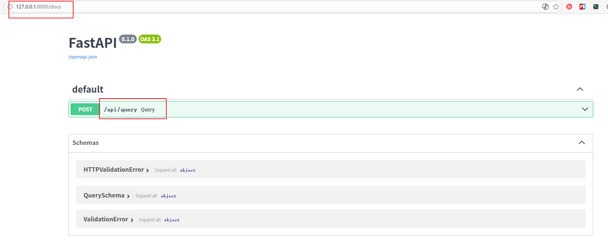
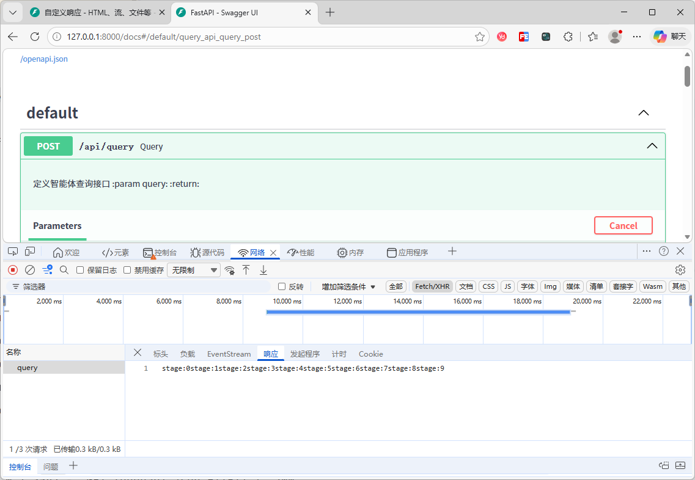
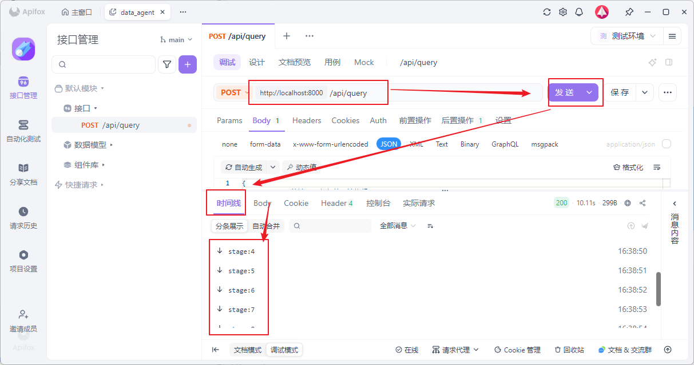
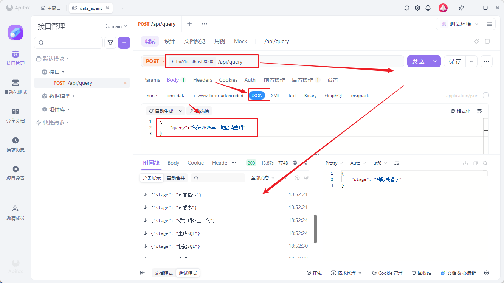

# 7. API接口

## 7.1 需求说明

本章旨在实现一个查询接口，用于接收用户查询，并实时响应工作流执行进度和查询结果。接口使用[FastAPI](https://fastapi.org.cn/)框架编写，涉及到的相关知识点如下：

知识点一：[流式响应](https://fastapi.org.cn/advanced/custom-response/#streamingresponse)

知识点二：[SSE协议](https://www.ruanyifeng.com/blog/2017/05/server-sent_events.html)

知识点三：[生命周期事件](https://fastapi.org.cn/advanced/events/)

知识点四：[中间件](https://fastapi.org.cn/tutorial/middleware/)

知识点五：[依赖注入](https://fastapi.org.cn/tutorial/dependencies/) 

## 7.2 代码组织规划

```bash
data-agent/
├─ main.py # FastAPI入口脚本
└─ app/
   ├─ api/
   │  ├─ routers/
   │  │  └─ query_router.py # 负责定义查询接口
   │  ├─ schemas/ # 请求参数和返回值结果
   │  │  └─ query_schema.py # 负责定义查询接口请求体结构
   │  └─ dependencies.py # 负责定义查询接口依赖项
   │
   ├─ services/
   │  └─ query_service.py # 负责定义查询接口核心业务逻辑
   │
   └─ core/
      ├─ lifespan.py # 负责定义FastAPI生命周期事件
      ├─ context.py # 负责定义异步任务上下文变量
      └─ log.py # 重新定义日志的输出格式
```


#### 7.2.1 入口脚本

在`data-agent/main.py`中编写如下内容：

[创建FastApi实例](https://fastapi.org.cn/tutorial/first-steps/)

```python
# 导入FastAPI核心类
from fastapi import FastAPI

# 创建FastAPI应用实例
app = FastAPI()

```

后续可在终端的main.py所在的目录直接执行fastapi dev命令来启动测试服务器。

#### 7.2.2 接口实现

查询接口的具体实现如下

**1）**QuerySchema

在`data-agent/app/api/schemas/query_schema.py`中编写如下代码：

[查询数据模型](https://fastapi.org.cn/tutorial/body/#import-pydantics-basemodel)

作用：定义接收用户请求问题的实体

```python
#导入pydantic的BaseModel基类，用于定义数据验证模型
from pydantic import BaseModel

# 定义查询请求的数据模型（用于接口入参校验）
class QuerySchema(BaseModel):
    # 接收用户输入的查询字符串，会自动校验字段类型和非空
    query: str
```

**2）**声明query_router路由

[查询路由定义](https://fastapi.org.cn/tutorial/bigger-applications/)

`data-agent/app/api/routers/query_router.py`完成路由声明

~~~PYTHON
# 声明查询的路由
query_router = APIRouter()

~~~

3）注册query_router路由

[注册查询路由](https://fastapi.org.cn/tutorial/bigger-applications/#include-the-apirouters-for-users-and-items)

在`data-agent/main.py`中添加注册路由实现

~~~python
from app.api.router.query_router import query_router

# 声明fastapi对象
app = FastAPI()

# 绑定查询router
app.include_router(query_router)
~~~


## 7.3 Fastapi重点

### 7.3.1自定义流式响应

[响应流](https://fastapi.org.cn/advanced/custom-response/#streamingresponse):接受一个异步生成器或一个普通的生成器/迭代器，并流式传输响应体

**1）**演示案例：请求一个异步生成器，流式实时输出，模拟视频流响应。

~~~python
# 导入FastAPI核心类
from fastapi import FastAPI
# 导入流式响应类，用于返回流式数据
from fastapi.responses import StreamingResponse

# 创建FastAPI应用实例
app = FastAPI()

# 模拟视频流生成器函数（异步）
async def fake_video_streamer():
    # 循环生成10次模拟视频字节数据
    for i in range(10):
        yield b"some fake video bytes"

# 定义根路径GET接口
@app.get("/")
async def main():
    # 返回流式响应，传入视频流生成器
    return StreamingResponse(fake_video_streamer())
~~~

**2）**根据掌柜问数的对接情况，依据官网案例，实现自己的响应流实现

`data-agent/app/api/routers/query_router.py`完成接口调用

~~~pYthon
from fastapi import APIRouter
from fastapi.params import Depends
from starlette.responses import StreamingResponse

from app.api.dependencies import get_query_service
from app.api.schemas.query_schema import QuerySchema
from app.service.query_service import QueryService

# 声明查询的路由
query_router = APIRouter()


async def fake_video_streamer():
    """
    模拟生成器函数
    :return:
    """
    for i in range(10):
        # 添加睡眠，演示延时效果
        await asyncio.sleep(1)
        yield f"stage:{i}"


@query_router.post("/api/query")
async def query(query: QuerySchema):
    """
    定义智能体查询接口
    :param query:
    :return:
    """
    return StreamingResponse(fake_video_streamer())
~~~

`知识点` ： **yield 生成器**

~~~~python
yield:是 Python 里用来把普通函数变成「生成器」的关键字

案例如下：
def test():
    yield 1
    yield 2
    yield 3

# 创建生成器
g = test()

# 每次调用，只走到下一个 yield，然后停住
print(next(g))  # 1
print(next(g))  # 2
print(next(g))  # 3
~~~~


**3）**启动项目

~~~shell
# 命令行终端中，注意需要在data_agent目录下
(data_agent) PS E:\python_workspace\project_demo\data_agent> fastapi dev 
~~~

**4)**访问接口查看结果

地址：http://127.0.0.1:8000/docs




问题：请求接口，查看效果，并未显示流式效果

原因：后端实现流式输出，但是swaggerAPI并未实现流式渲染


**5）**接口响应的 **MIME 类型**

`media_type="text/event-stream"` 是将响应的 **MIME 类型** 明确指定为 Server-Sent Events (SSE) 协议的标准类型，其核心作用是：

1. **协议标识**：告诉客户端（浏览器 / 前端）当前响应遵循 `Server-Sent Events`（SSE）协议，客户端会按照 SSE 的规则解析流式数据，而非普通的文本 / 二进制流；
2. **长连接维持**：SSE 基于 HTTP 长连接实现，`text/event-stream` 作为标准 MIME 类型，会让客户端（浏览器）保持连接不关闭，持续接收服务端推送的分块数据；
3. **格式约束**：SSE 协议要求数据必须按固定格式（`data: 内容\n\n`）返回，指定该 media_type 后，框架 / 客户端会默认按此协议处理数据解析、重连等逻辑。

~~~python
@query_router.post("/api/query")
async def query(query: QuerySchema):
    """
    定义智能体查询接口
    :param query:
    :return:
    """
    return StreamingResponse(fake_video_streamer(),media_type="text/event-stream")
~~~

**6）**浏览器，开发这模式，在网路中选择请求接口，查询响应效果




**7）**[SSE](https://www.ruanyifeng.com/blog/2017/05/server-sent_events.html)协议讲解

​     SSE（Server-Sent Events，服务器发送事件）是一种**基于 HTTP 的单向通信协议**，专为「服务端主动、持续地向客户端推送实时数据」设计，是 Web 端实现实时消息推送的轻量级解决方案。

`问题`：Swagger 为什么无法正常解析 / 展示 SSE 流式接口？

**回答**：因为 SSE 是流式协议，需要持续推送数据，而 Swagger 默认按普通 JSON 接口解析，不支持长连接和实时流展示。

SSE协议本质：简单理解，本质上这种通信就是以流信息的方式，完成一次用时很长的下载。SSE 就是利用这种机制，使用流信息向浏览器推送信息

**使用要求：**

第一：响应头信息设置为text/event-stream

~~~yaml
Content-Type: text/event-stream
Cache-Control: no-cache
Connection: keep-alive
~~~

第二：数据的格式要求

~~~yaml
格式： 
[field]: value\n

例如：
一次发送消息格式：
     data: some text\n\n
二次发送消息格式：
     data: with two lines \n\n

一个发送json的实际案例“如下：

data: {\n
data: "foo": "bar",\n
data: "baz", 555\n
data: }\n\n

~~~

**8）**修改数据响应格式

```python
"""
模拟生成器函数
:return:
"""
for i in range(10):
    # 添加睡眠，演示延时效果
    await asyncio.sleep(1)
    yield f"data: stage:{i}\n\n"
```

Apifox响应格式：




### 7.3.2中间件

​      FastApi中的[中间件](https://fastapi.org.cn/tutorial/middleware/)是一个在任何特定*路径操作*处理之前，与每个请求协同工作的函数。同时，它也是在返回每个响应之前与之协同工作的函数。FastAPI 的中间件（Middleware）和 Spring MVC 的拦截器（Interceptor）核心功能高度相似，都是用于在请求处理的生命周期中插入自定义逻辑。

简单来说：无论是 FastAPI 中间件还是 Spring MVC 拦截器，都是「请求进来先过一遍通用逻辑，响应出去再走一遍通用逻辑」的设计。

官网案例：

~~~python
import time
from fastapi import FastAPI, Request

app = FastAPI()

# 定义HTTP中间件，用于记录请求处理耗时并添加到响应头中
@app.middleware("http")
async def add_process_time_header(request: Request, call_next):
    # 记录请求处理开始时间（使用高精度计时器）
    start_time = time.perf_counter()
    # 调用后续的请求处理逻辑（路由函数/其他中间件），获取响应对象
    response = await call_next(request)
    # 计算请求处理总耗时（结束时间 - 开始时间）
    process_time = time.perf_counter() - start_time
    # 将处理耗时添加到响应头中，键为X-Process-Time，值为耗时字符串
    response.headers["X-Process-Time"] = str(process_time)
    # 返回处理后的响应对象
    return response
~~~

**掌柜问数应用**：异步函数的上下文变量-->request_id,用于日志记录区分请求。

本项目通过中间件为每个请求生成唯一的 request_id，并存储于 contextvar 中；日志系统在输出时自动附带该 request_id，从而在并发场景下实现精准的日志追踪与请求定位。具体实现如下：

在`data-agent/app/core/context.py`中添加如下代码，定义上下文变量：

```python
from contextvars import ContextVar
# 定义异步任务上下文变量
request_id_ctx_var = ContextVar("request_id", default="1")

```

在`data-agent/main.py`中添加如下代码，通过中间件为每个请求创建一个唯一id

```python
from fastapi import FastAPI, Request
from app.api.routers.query_router import query_router
from app.core.context import request_id_ctx_var
from app.core.lifespan import lifespan


# 添加中间件，在每个请求中生成唯一的request_id
@app.middleware("http")
async def add_request_id(request: Request, call_next):
    # 调用路径函数之前
    request_id_ctx_var.set(uuid.uuid4())
    # 调用路径函数
    response = await call_next(request)
    # 调用路径函数之后
    return response
```

修改`data/agent/core/log.py`中日志的格式，修改之后的完整代码如下：

```python
import asyncio
import sys
from pathlib import Path

from loguru import logger

from conf import app_config
from app.core.context import request_id_ctx_var

# 配置日志格式
log_format = (
    "<green>{time:YYYY-MM-DD HH:mm:ss.SSS}</green> | "
    "<level>{level: <8}</level> | "
    "<magenta>request_id - {extra[request_id]}</magenta> | "
    "<cyan>{name}</cyan>:<cyan>{function}</cyan>:<cyan>{line}</cyan> - "
    "<level>{message}</level>"
)


# 注入request_id到日志记录中
def inject_request_id(record):
    request_id = request_id_ctx_var.get()
    record["extra"]["request_id"] = request_id


logger.remove()
# 给日志打补丁，使其支持注入request_id
logger = logger.patch(inject_request_id)
if app_config.logging.console.enable:
    logger.add(sink=sys.stdout, level=app_config.logging.console.level, format=log_format)
if app_config.logging.file.enable:
    path = Path(app_config.logging.file.path)
    path.mkdir(parents=True, exist_ok=True)
    logger.add(
        sink=path / "app.log",
        level=app_config.logging.file.level,
        format=log_format,
        rotation=app_config.logging.file.rotation,
        retention=app_config.logging.file.retention,
        encoding="utf-8"
    )

if __name__ == '__main__':
    async def graph(request: str):
        # 打印日志
        logger.info(request)


    async def test1():
        # 接收到请求
        request_id_ctx_var.set("request-1")

        # 模拟处理
        await asyncio.sleep(1)
        await graph("request-1")


    async def test2():
        # 接收到请求
        request_id_ctx_var.set("request-2")

        # 模拟处理
        await asyncio.sleep(1)
        await graph("request-2")


    async def main():
        await asyncio.gather(test1(), test2())


    asyncio.run(main())
```


### 7.3.3 生命周期事件

​		FastAPI 的[生命周期事件](https://fastapi.org.cn/advanced/events/)（包含应用生命周期、请求生命周期）是框架核心能力之一，其核心作用是在特定阶段插入自定义逻辑，实现「通用逻辑复用、资源统一管理、流程标准化」，避免重复代码，同时保证程序的健壮性和可维护性。

​     **请求生命周期**指单个 HTTP 请求从进入服务器到响应返回的完整流程，通过中间件、依赖项、异常处理器等实现，核心作用是「对所有 / 指定请求的处理流程做统一管控」

​		**应用生命周期指**FastAPI 应用从启动到关闭的完整流程，通过 `lifespan` 函数实现，核心作用是「管理全局资源的创建与销毁」，保证资源的安全使用和释放。

您可以使用 `FastAPI` 应用的 `lifespan` 参数和一个“上下文管理器”（我稍后会告诉您那是什么）来定义这种*启动*和*关闭*逻辑

 `lifespan` 参数:

​			app = FastAPI(**lifespan**=lifespan)

`上下问题管理器`:

​			异步上下文管理器就是用 `@asynccontextmanager` 装饰的函数。

**执行特点**：`lifespan` 函数**仅在 FastAPI 应用的「启动」和「关闭」两个时机执行，全程只执行一次**，而非每次请求都触发。

**掌柜问数场景**： 客户端的init()和close() 实现

官网案例：

~~~python
from contextlib import asynccontextmanager
from fastapi import FastAPI

# 模拟机器学习模型函数
def fake_answer_to_everything_ml_model(x: float):
    return x * 42

# 存储加载的ML模型的全局字典
ml_models = {}

# 定义FastAPI应用生命周期管理函数
@asynccontextmanager
async def lifespan(app: FastAPI):
    # 应用启动：加载ML模型到全局字典
    ml_models["answer_to_everything"] = fake_answer_to_everything_ml_model
    yield  # 应用运行阶段
    # 应用关闭：清理ML模型，释放资源
    ml_models.clear()

# 创建FastAPI应用并绑定生命周期函数
app = FastAPI(lifespan=lifespan)

# 预测接口：调用加载的ML模型计算结果
@app.get("/predict")
async def predict(x: float):
    result = ml_models["answer_to_everything"](x)
    return {"result": result}
~~~


本项目使用生命周期事件实现各外部存储系统客户端的初始化和关闭。具体实现如下：

在`data-agent/app/core/lifespan.py`中编写如下代码：

```python
from contextlib import asynccontextmanager

from fastapi import FastAPI

from app.clients.embedding_client_manager import embedding_client_manager
from app.clients.es_client_manager import es_client_manager
from app.clients.mysql_client_manager import meta_mysql_client_manager, dw_mysql_client_manager
from app.clients.qdrant_client_manager import qdrant_client_manager


@asynccontextmanager
async def lifespan(app: FastAPI):
    # FastAPI 应用启动前执行
    embedding_client_manager.init()
    qdrant_client_manager.init()
    es_client_manager.init()
    meta_mysql_client_manager.init()
    dw_mysql_client_manager.init()
    yield
    # FastAPI 应用结束前执行

    await qdrant_client_manager.close()
    await es_client_manager.close()
    await meta_mysql_client_manager.close()
    await dw_mysql_client_manager.close()

```

除此之外，还需向FastAPI注册该函数，修改`data-agent/main.py`中的如下代码：

```python
from app.core.lifespan import lifespan

# 创建FastAPI应用并绑定生命周期函数
app = FastAPI(lifespan=lifespan) 
```

### 7.3.4 依赖项

在 FastAPI 中，[依赖项](https://fastapi.org.cn/tutorial/dependencies/)（Dependencies） 是框架核心的「模块化逻辑复用机制」，本质是**可被注入、可复用、可组合的通用逻辑单元**—— 它允许你将接口中重复的非业务逻辑（如鉴权、参数校验、资源初始化）抽离成独立组件，在需要的地方通过 `Depends()` 注入使用，既避免代码冗余，又保证逻辑的一致性和可维护性

官网案例：

~~~python
from typing import Annotated
from fastapi import Depends, FastAPI

# 创建FastAPI应用实例
app = FastAPI()

# 通用依赖项：解析接口通用参数（查询关键词、分页跳过数、分页限制数）
async def common_parameters(q: str | None = None, skip: int = 0, limit: int = 100):
    return {"q": q, "skip": skip, "limit": limit}

# 物品接口：注入通用参数依赖项并返回参数
@app.get("/items/")
async def read_items(commons: Annotated[dict, Depends(common_parameters)]):
    return commons

# 用户接口：复用通用参数依赖项并返回参数
@app.get("/users/")
async def read_users(commons: Annotated[dict, Depends(common_parameters]):
    return commons
~~~

注意Python3.10+以上格式有变化：

~~~python
from fastapi import Depends, FastAPI

app = FastAPI()


async def common_parameters(q: str | None = None, skip: int = 0, limit: int = 100):
    return {"q": q, "skip": skip, "limit": limit}


@app.get("/items/")
async def read_items(commons: dict = Depends(common_parameters)):
    return commons


@app.get("/users/")
async def read_users(commons: dict = Depends(common_parameters)):
    return commons
~~~

关键概念：

[子依赖](https://fastapi.org.cn/tutorial/dependencies/sub-dependencies/)

[yield依赖](https://fastapi.org.cn/tutorial/dependencies/dependencies-with-yield/)

**掌柜问数应用**：api-service的依赖管理

`data-agent/app/api/routers/query_router.py` 修改如下：

~~~python
from fastapi import APIRouter, Depends, StreamingResponse
from typing import Annotated
from schemas import QuerySchema
from services import QueryService, get_query_service

# 定义查询接口路由实例（前缀/路由组可根据实际配置）
@query_router.post("/api/query")
async def query(query: QuerySchema,service:Annotated[QueryService,Depends(get_query_service)]):
    # 调用查询服务处理业务逻辑
    service.query(query.query)
    # 返回SSE流式响应（text/event-stream为SSE协议标准媒体类型）
    return StreamingResponse(fake_video_streamer(), media_type="text/event-stream")
~~~

~~~python
from fastapi import APIRouter, Depends, StreamingResponse
from typing import Annotated
from schemas import QuerySchema
from services import QueryService, get_query_service

# 定义查询接口路由实例（前缀/路由组可根据实际配置）
@query_router.post("/api/query")
async def query(query: QuerySchema,service:QueryService=Depends(get_query_service)):
    # 调用查询服务处理业务逻辑
    #service.query(query.query)
    # 返回SSE流式响应（text/event-stream为SSE协议标准媒体类型）
    return StreamingResponse(service.query(query.query), media_type="text/event-stream")
~~~


## 7.4具体实现

### 7.4.1 整和依赖项组件

**1）QueryService 实现业务**

在`data-agent/app/services/query_service.py`中编写如下代码：

 参考：**graph.py**

```python
import json
from langchain_huggingface import HuggingFaceEndpointEmbeddings
from app.agent.context import DataAgentContext
from app.agent.graph import graph
from app.agent.state import DataAgentState
from app.repository.es.value_es_repository import ValueEsRepository
from app.repository.mysql.dw_mysql_repository import DwMysqlRepository
from app.repository.mysql.meta_mysql_repository import MetaMysqlRepository
from app.repository.qdrant.column_qdrant_repository import ColumnQdrantRepository
from app.repository.qdrant.metric_qdrant_repository import MetricQdrantRepository

class QueryService:
    def __init__(self,
                 embedding_client:HuggingFaceEndpointEmbeddings,
                 column_qdrant_repository:ColumnQdrantRepository,
                 value_es_repository:ValueEsRepository,
                 metric_qdrant_repository:MetricQdrantRepository,
                 meta_mysql_repository:MetaMysqlRepository,
                 dw_mysql_repository:DwMysqlRepository):

        self.embedding_client = embedding_client
        self.column_qdrant_repository = column_qdrant_repository
        self.value_es_repository = value_es_repository
        self.metric_qdrant_repository = metric_qdrant_repository
        self.meta_mysql_repository = meta_mysql_repository
        self.dw_mysql_repository = dw_mysql_repository

    async def query(self, query:str):
        """
        用户查询的业务处理
        :param query:
        :return:
        """
        # 创建上下文对象
        context = DataAgentContext(
            embedding_client=self.embedding_client,
            column_qdrant_repository=self.column_qdrant_repository,
            value_es_repository=self.value_es_repository,
            metric_qdrant_repository=self.metric_qdrant_repository,
            meta_mysql_repository=self.meta_mysql_repository,
            dw_mysql_repository=self.dw_mysql_repository
        )
        # 创建状态对象
        state = DataAgentState(query=query)
        try:
            # 调用图流式输出
            async for chunk in graph.astream(input=state, context=context, stream_mode="custom"):
                yield f"data: {json.dumps(chunk,ensure_ascii=False,default=str)}\n\n"

        except Exception as e:
            yield f"data: {json.dumps({"error":str(e)}, ensure_ascii=False, default=str)}\n\n"

```

**json.dumps**：作用是将 Python 对象（如字典、列表）转换为 JSON 格式的字符串（序列化）

参数ensure_ascii=False：保留中文、表情等非 ASCII 字符的原始形态，不转义

参数default=str：如果 `chunk` 中包含 JSON 不支持的类型（如 datetime 时间对象、自定义类实例），会自动调用 `str()` 把该对象转为字符串，避免抛出序列化异常

**2）整合依赖项**

在`data-agent/app/api/dependencies.py`中编写如下内容：

```python
from fastapi.params import Depends
from langchain_huggingface import HuggingFaceEndpointEmbeddings
from sqlalchemy.ext.asyncio import AsyncSession

from app.clients.embedding_client_manager import embedding_client_manager
from app.clients.es_client_manager import es_client_manager
from app.clients.mysql_client_manager import meta_mysql_client_manager, dw_mysql_client_manager
from app.clients.qdrant_client_manager import qdrant_client_manager
from app.repository.es.value_es_repository import ValueEsRepository
from app.repository.mysql.dw_mysql_repository import DwMysqlRepository
from app.repository.mysql.meta_mysql_repository import MetaMysqlRepository
from app.repository.qdrant.column_qdrant_repository import ColumnQdrantRepository
from app.repository.qdrant.metric_qdrant_repository import MetricQdrantRepository
from app.service.query_service import QueryService


async def get_meta_session():
    # https://fastapi.org.cn/tutorial/dependencies/dependencies-with-yield/
    async with meta_mysql_client_manager.session_factory() as session:
        yield session


async def get_dw_session():
    async with dw_mysql_client_manager.session_factory() as session:
        yield session


async def get_embedding_client():
    return embedding_client_manager.client


async def get_column_qdrant_repository():
    return ColumnQdrantRepository(qdrant_client_manager.client)


async def get_value_es_repository():
    return ValueEsRepository(es_client_manager.client)


async def get_metric_qdrant_repository():
    return MetricQdrantRepository(qdrant_client_manager.client)


async def get_meta_mysql_repository(session: AsyncSession = Depends(get_meta_session)):
    return MetaMysqlRepository(session)


async def get_dw_mysql_repository(session: AsyncSession = Depends(get_dw_session)):
    return DwMysqlRepository(session)

# 构建QueryService依赖项
# https://fastapi.org.cn/tutorial/dependencies/sub-dependencies/
async def get_query_service(
        embedding_client: HuggingFaceEndpointEmbeddings = Depends(get_embedding_client),
        column_qdrant_repository: ColumnQdrantRepository = Depends(get_column_qdrant_repository),
        value_es_repository: ValueEsRepository = Depends(get_value_es_repository),
        metric_qdrant_repository: MetricQdrantRepository = Depends(get_metric_qdrant_repository),
        meta_mysql_repository: MetaMysqlRepository = Depends(get_meta_mysql_repository),
        dw_mysql_repository: DwMysqlRepository = Depends(get_dw_mysql_repository),
) -> QueryService:
    return QueryService(
        embedding_client=embedding_client,
        column_qdrant_repository=column_qdrant_repository,
        value_es_repository=value_es_repository,
        metric_qdrant_repository=metric_qdrant_repository,
        meta_mysql_repository=meta_mysql_repository,
        dw_mysql_repository=dw_mysql_repository
    )
```


**3）接口中整合**

`data-agent/app/api/routers/query_router.py` 

~~~python
# 定义POST接口/api/query
@query_router.post("/api/query")
async def query(query: QuerySchema,query_service: QueryService = Depends(get_query_service)):
    # 调用服务处理查询，返回SSE流式响应
    return StreamingResponse(query_service.query(query.query), media_type="text/event-stream")
~~~

### 7.4.2 整合生命周期组件

场景： 使用[生命周期组件](https://fastapi.org.cn/advanced/events/)，应用启动前对依赖项进行初始化

`data-agent/app/core/lifespan`   参考：**graph.py**

~~~python
from contextlib import asynccontextmanager
from fastapi import FastAPI
from app.clients.embedding_client_manager import embedding_client_manager
from app.clients.es_client_manager import es_client_manager
from app.clients.mysql_client_manager import meta_mysql_client_manager, dw_mysql_client_manager
from app.clients.qdrant_client_manager import qdrant_client_manager

@asynccontextmanager
async def lifespan(app: FastAPI):
    # FastApi启动器执行的初始化逻辑
    # 初始化客户端对象
    embedding_client_manager.init()
    qdrant_client_manager.init()
    es_client_manager.init()
    meta_mysql_client_manager.init()
    dw_mysql_client_manager.init()
    yield
    # FastApi结束后执行的释放资源逻辑
    # 关闭客户端
    await qdrant_client_manager.close()
    await es_client_manager.close()
    await meta_mysql_client_manager.close()
    await dw_mysql_client_manager.close()

~~~

在`data-agent/main.py`中编写如下内容：

```python
# 导入FastAPI核心类
from fastapi import FastAPI

# 创建FastAPI应用实例，并注册生命周期组件
app = FastAPI(lifespan=lifespan)

```

后续可在终端的main.py所在的目录直接执行fastapi dev命令来启动测试服务器。

### 7.4.3 整合中间件组件

实现：[中间件组件](https://fastapi.org.cn/tutorial/middleware/#create-a-middleware)中定义异步函数上下文变量，用于日志处理

在`data-agent/main.py`中编写如下内容：

~~~python
import uuid
from fastapi import FastAPI,Request
from app.api.router.query_router import query_router
from app.core.context import request_id_ctx_var
from app.core.lifespan import lifespan

@app.middleware("http")
async def add_process_time_header(request: Request, call_next):
    # 调用路径函数之前进行业务处理
    request_id_ctx_var.set(uuid.uuid4())
    # 调用路径函数
    response = await call_next(request)
    # 调用路径函数之后进行业务处理
    return response
~~~

### 7.5 整合组件测试

**命令行执行**： fastapi dev 

可通过Apifox等接口测试工具进行测试，具体具体效果如下：



