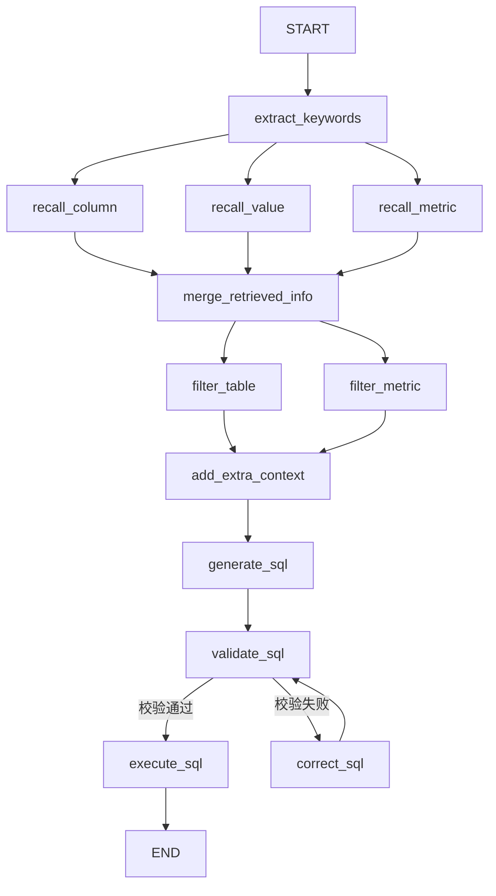

# LangGraph 图编排框架详解

## 1. 什么是 LangGraph？

[LangGraph](https://docs.langchain.com/oss/python/langgraph) 是 LangChain 团队开发的**图编排框架**，专为构建**复杂、有状态、多步骤的 AI Agent 工作流**而设计。

### 1.1 为什么需要 LangGraph？

传统的 LLM 调用是**一次性的**：

```
用户问题 → LLM → 答案
```

但现实中的 AI 应用往往是**多步骤、有分支、有循环**的复杂流程：

```
用户问题 → 理解意图 → 检索信息 → 评估信息 → 需要更多信息？
                                              ├─ 是 → 重新检索
                                              └─ 否 → 生成答案 → 校验 → 正确？
                                                                    ├─ 否 → 修正
                                                                    └─ 是 → 返回
```

**LangGraph 的核心思想**：用"状态机 + 图"的方式编排这些复杂的 Agent 流程。

### 1.2 面试题：为什么选择 LangGraph？

> **NL2SQL 不是"一次调用 LLM 生成 SQL"，而是一套包含理解→检索→生成→校验→安全→执行→反思→修复→多轮交互的完整工作流；LangGraph 用"状态机 + 图 + 循环 + 分支 + 人在环 + 可观测"，正好把这套复杂流程变成可控、可靠、可生产的智能体。**

---

## 2. 核心概念

### 2.1 三大核心要素

```
┌──────────────────────────────────────────────────┐
│              LangGraph 核心架构                    │
├──────────────────────────────────────────────────┤
│                                                  │
│   State（状态）：图中流转的数据，会被节点修改        │
│   Context（上下文）：静态依赖，运行期间不变          │
│   Graph（图）：节点 + 边的集合，定义工作流结构       │
│                                                  │
└──────────────────────────────────────────────────┘
```

### 2.2 State（状态）

State 是图在执行过程中**流转和变化的数据**，是 LangGraph 最核心的概念。

```python
from typing import TypedDict

class DataAgentState(TypedDict):
    """智能体工作流状态——图中的数据载体"""
    user_query: str              # 用户原始问题
    keywords: list[str]          # 提取的关键词
    recalled_tables: list[dict]  # 召回的表信息
    recalled_columns: list[dict] # 召回的字段信息
    recalled_metrics: list[dict] # 召回的指标信息
    filtered_tables: list[dict]  # 过滤后的表信息
    generated_sql: str           # 生成的 SQL
    error: str | None            # 校验错误信息
    query_result: list[dict]     # SQL 执行结果
```

**State 的特点**：

| 特性 | 说明 |
|------|------|
| 可修改 | 每个节点都可以读取和更新 State |
| 可传递 | 从一个节点自动传递到下一个节点 |
| 可持久化 | 支持 checkpoint，中断后可从断点恢复 |
| 有类型 | 使用 TypedDict 定义，IDE 可自动补全 |

### 2.3 Context（上下文）

Context 是图执行期间的**静态依赖**，运行期间不改变。

```python
class DataAgentContext(TypedDict):
    """智能体运行上下文——静态依赖"""
    # 可包含：LLM 模型名称、数据库连接、外部服务配置等
    pass
```

**State vs Context**：

| 维度 | State | Context |
|------|-------|---------|
| 是否变化 | 动态变化 | 静态不变 |
| 角色 | "流动的数据" | "固定的依赖" |
| 类比 | 流水线上的产品 | 流水线上的机器 |
| 定义方式 | `state_schema=...` | `context_schema=...` |
| 传递方式 | 节点间自动传递 | 通过 `runtime.context` 访问 |

**比喻理解**：
- State 就像**快递包裹**，在传送带上流动，每个工作站（节点）都会查看、修改包裹
- Context 就像**传送带机器**本身，固定不变，但每个工作站都需要用它

### 2.4 Node（节点）

节点是图中的**执行单元**，每个节点是一个 Python 函数（可以是同步或异步）。

```python
from langgraph.runtime import Runtime

async def extract_keywords(
    state: DataAgentState,           # 当前状态
    runtime: Runtime[DataAgentContext]  # 运行时上下文
) -> dict:
    """节点函数：提取关键词"""
    # 从 state 读取数据
    user_query = state["user_query"]

    # 执行业务逻辑
    keywords = await llm.extract_keywords(user_query)

    # 返回 state 的更新（增量更新）
    return {"keywords": keywords}
```

**节点函数的参数**：

| 参数 | 类型 | 说明 |
|------|------|------|
| `state` | 自定义 State 类型 | 图的当前状态 |
| `config` | `RunnableConfig` | 配置信息（如 thread_id） |
| `runtime` | `Runtime[ContextT]` | 运行时对象，包含 context、store、stream_writer |

**节点函数的返回值**：返回一个字典，表示对 State 的**增量更新**（而非替换整个 State）。

### 2.5 Edge（边）

边定义了节点之间的**执行顺序**。

```python
# 普通边：固定从 A 到 B
graph_builder.add_edge("node_a", "node_b")

# 起始边：从 START 到第一个节点
from langgraph.graph import START
graph_builder.add_edge(START, "extract_keywords")

# 结束边：从最后一个节点到 END
from langgraph.graph import END
graph_builder.add_edge("execute_sql", END)
```

### 2.6 条件边（Conditional Edge）

根据 State 的值决定下一个节点：

```python
# 条件函数：根据 state 返回下一个节点名称
def decide_next(state: DataAgentState) -> str:
    if state["error"] is None:
        return "execute_sql"    # 校验通过，执行 SQL
    else:
        return "correct_sql"    # 校验失败，修正 SQL

# 添加条件边
graph_builder.add_conditional_edges(
    "validate_sql",     # 源节点
    decide_next,        # 条件函数
    {                   # 可能的目标节点映射
        "execute_sql": "execute_sql",
        "correct_sql": "correct_sql"
    }
)
```

**条件边创建了循环**：

```
generate_sql → validate_sql → correct_sql → validate_sql → execute_sql
                    ↑_______________↓
                  （校验失败，循环修正）
```

---

## 3. 构建一个图

### 3.1 完整示例

```python
from langgraph.graph import StateGraph, START, END

# 1. 创建图构建器
graph_builder = StateGraph(
    state_schema=DataAgentState,      # 状态类型
    context_schema=DataAgentContext   # 上下文类型
)

# 2. 添加节点
graph_builder.add_node("extract_keywords", extract_keywords)
graph_builder.add_node("recall_column", recall_column)
graph_builder.add_node("recall_value", recall_value)
graph_builder.add_node("recall_metric", recall_metric)
graph_builder.add_node("merge_retrieved_info", merge_retrieved_info)
graph_builder.add_node("filter_table", filter_table)
graph_builder.add_node("filter_metric", filter_metric)
graph_builder.add_node("add_extra_context", add_extra_context)
graph_builder.add_node("generate_sql", generate_sql)
graph_builder.add_node("validate_sql", validate_sql)
graph_builder.add_node("correct_sql", correct_sql)
graph_builder.add_node("execute_sql", execute_sql)

# 3. 添加边（定义流程）
graph_builder.add_edge(START, "extract_keywords")

# 并行分支：extract_keywords 后同时执行三个召回
graph_builder.add_edge("extract_keywords", "recall_column")
graph_builder.add_edge("extract_keywords", "recall_value")
graph_builder.add_edge("extract_keywords", "recall_metric")

# 汇聚：三个召回都完成后，合并结果
graph_builder.add_edge("recall_column", "merge_retrieved_info")
graph_builder.add_edge("recall_value", "merge_retrieved_info")
graph_builder.add_edge("recall_metric", "merge_retrieved_info")

# 继续串行流程
graph_builder.add_edge("merge_retrieved_info", "filter_table")
graph_builder.add_edge("merge_retrieved_info", "filter_metric")
graph_builder.add_edge("filter_table", "add_extra_context")
graph_builder.add_edge("filter_metric", "add_extra_context")
graph_builder.add_edge("add_extra_context", "generate_sql")
graph_builder.add_edge("generate_sql", "validate_sql")

# 条件分支（循环）
graph_builder.add_conditional_edges(
    "validate_sql",
    lambda state: "execute_sql" if state["error"] is None else "correct_sql",
    {"execute_sql": "execute_sql", "correct_sql": "correct_sql"}
)

graph_builder.add_edge("correct_sql", "validate_sql")  # 修正后重新校验
graph_builder.add_edge("execute_sql", END)

# 4. 编译图
graph = graph_builder.compile()
```

### 3.2 本项目的完整工作流



### 3.3 12 个节点的职责

| 节点 | 职责 | 输入 | 输出 |
|------|------|------|------|
| `extract_keywords` | 从用户问题中抽取关键词 | user_query | keywords |
| `recall_column` | 向量检索召回相关字段 | keywords | recalled_columns |
| `recall_value` | 全文检索召回字段取值 | keywords | recalled_values |
| `recall_metric` | 召回相关指标定义 | keywords | recalled_metrics |
| `merge_retrieved_info` | 合并三路召回结果 | 三路召回结果 | merged_info |
| `filter_table` | 过滤不相关的表 | merged_info | filtered_tables |
| `filter_metric` | 过滤不相关的指标 | merged_info | filtered_metrics |
| `add_extra_context` | 添加额外上下文辅助信息 | filtered_* | extra_context |
| `generate_sql` | LLM 生成 SQL 语句 | 表结构 + 字段 + 问题 | generated_sql |
| `validate_sql` | 校验 SQL 语法和安全性 | generated_sql | error |
| `correct_sql` | 修正有问题的 SQL | generated_sql + error | corrected_sql |
| `execute_sql` | 执行 SQL 并返回结果 | generated_sql | query_result |

---

## 4. 图的执行方式

### 4.1 invoke — 一次性执行

```python
# 执行整个图，等待全部完成后返回最终状态
result = graph.invoke(
    input={"user_query": "上个月销售额是多少？"},
    context={"llm_provider": "deepseek"}
)
# result 包含完整的最终 State
```

### 4.2 stream — 流式执行

```python
# 流式执行，每完成一个节点就返回该节点的输出
async for chunk in graph.astream(
    input={"user_query": "上个月销售额是多少？"},
    context={"llm_provider": "deepseek"}
):
    # chunk 是每个节点执行后的状态更新
    print(chunk)
    # 实时推送给前端
    yield f"data: {json.dumps(chunk)}\n\n"
```

**invoke vs stream**：

| 方式 | 返回时机 | 适用场景 |
|------|---------|---------|
| `invoke` | 全部完成后一次性返回 | 后台批处理 |
| `stream` | 每完成一个节点就返回 | 需要实时进度的前端交互 ✅ |

**在本项目中的应用**：使用 `stream` 模式，每个节点执行完毕就通过 SSE 推送给前端，用户可以看到实时进度。

### 4.3 Runtime 中的 stream_writer

节点中可以通过 `stream_writer` 自定义流式输出：

```python
async def generate_sql(state: DataAgentState, runtime: Runtime[DataAgentContext]):
    """生成 SQL 节点"""
    # 自定义流式输出当前状态
    runtime.stream_writer({
        "stage": "generate_sql",
        "status": "running",
        "message": "正在生成 SQL 语句..."
    })

    sql = await llm.generate_sql(state["filtered_tables"], state["user_query"])

    runtime.stream_writer({
        "stage": "generate_sql",
        "status": "done",
        "sql": sql
    })

    return {"generated_sql": sql}
```

---

## 5. LangGraph 高级特性

### 5.1 Checkpoint（检查点）

支持**状态持久化**，可以中断后恢复、回溯历史、支持"人在环"。

```python
from langgraph.checkpoint.memory import MemorySaver

# 创建内存检查点存储
checkpointer = MemorySaver()

# 编译时指定检查点
graph = graph_builder.compile(checkpointer=checkpointer)

# 执行时指定 thread_id，状态会按 thread_id 持久化
result = graph.invoke(
    input={"user_query": "..."},
    config={"configurable": {"thread_id": "user-123"}}
)

# 可以从上次中断的地方继续
result = graph.invoke(
    input=None,  # 不传 input，从 checkpoint 恢复
    config={"configurable": {"thread_id": "user-123"}}
)
```

### 5.2 人在环（Human-in-the-Loop）

在关键节点暂停，等待人工确认：

```python
from langgraph.types import interrupt

async def validate_sql(state: DataAgentState, runtime: Runtime):
    """校验 SQL 节点（人在环）"""
    sql = state["generated_sql"]

    # 暂停执行，等待人工确认
    approval = interrupt(f"SQL: {sql}\n是否执行？(yes/no)")

    if approval == "yes":
        return {"error": None}
    else:
        return {"error": "用户拒绝执行"}
```

### 5.3 并行执行

当多个节点没有依赖关系时，LangGraph 自动并行执行：

```python
# 这三个节点没有依赖关系，会并行执行
graph_builder.add_edge("extract_keywords", "recall_column")
graph_builder.add_edge("extract_keywords", "recall_value")
graph_builder.add_edge("extract_keywords", "recall_metric")

# 这三个节点都完成后，才会执行 merge
graph_builder.add_edge("recall_column", "merge_retrieved_info")
graph_builder.add_edge("recall_value", "merge_retrieved_info")
graph_builder.add_edge("recall_metric", "merge_retrieved_info")
```

**并行执行效果**：

```
extract_keywords (100ms)
    ├── recall_column (200ms)  ─┐
    ├── recall_value (150ms)   ─┤ 并行执行
    └── recall_metric (180ms)  ─┘
                                  ↓
                          merge_retrieved_info
总耗时 ≈ 100ms + max(200, 150, 180) = 300ms
而非 100 + 200 + 150 + 180 = 630ms
```

---

## 6. graph.py 完整示例

```python
from langgraph.graph import StateGraph, START, END
from app.agent.state import DataAgentState
from app.agent.context import DataAgentContext
from app.agent.nodes.extract_keywords import extract_keywords
from app.agent.nodes.recall_column import recall_column
from app.agent.nodes.recall_value import recall_value
from app.agent.nodes.recall_metric import recall_metric
from app.agent.nodes.merge_retrieved_info import merge_retrieved_info
from app.agent.nodes.filter_table import filter_table
from app.agent.nodes.filter_metric import filter_metric
from app.agent.nodes.add_extra_context import add_extra_context
from app.agent.nodes.generate_sql import generate_sql
from app.agent.nodes.validate_sql import validate_sql
from app.agent.nodes.correct_sql import correct_sql
from app.agent.nodes.execute_sql import execute_sql

# 构建图
graph_builder = StateGraph(
    state_schema=DataAgentState,
    context_schema=DataAgentContext
)

# 添加节点
graph_builder.add_node("extract_keywords", extract_keywords)
graph_builder.add_node("recall_column", recall_column)
graph_builder.add_node("recall_value", recall_value)
graph_builder.add_node("recall_metric", recall_metric)
graph_builder.add_node("merge_retrieved_info", merge_retrieved_info)
graph_builder.add_node("filter_table", filter_table)
graph_builder.add_node("filter_metric", filter_metric)
graph_builder.add_node("add_extra_context", add_extra_context)
graph_builder.add_node("generate_sql", generate_sql)
graph_builder.add_node("validate_sql", validate_sql)
graph_builder.add_node("correct_sql", correct_sql)
graph_builder.add_node("execute_sql", execute_sql)

# 添加边
graph_builder.add_edge(START, "extract_keywords")
graph_builder.add_edge("extract_keywords", "recall_column")
graph_builder.add_edge("extract_keywords", "recall_value")
graph_builder.add_edge("extract_keywords", "recall_metric")
graph_builder.add_edge("recall_column", "merge_retrieved_info")
graph_builder.add_edge("recall_value", "merge_retrieved_info")
graph_builder.add_edge("recall_metric", "merge_retrieved_info")
graph_builder.add_edge("merge_retrieved_info", "filter_table")
graph_builder.add_edge("merge_retrieved_info", "filter_metric")
graph_builder.add_edge("filter_table", "add_extra_context")
graph_builder.add_edge("filter_metric", "add_extra_context")
graph_builder.add_edge("add_extra_context", "generate_sql")
graph_builder.add_edge("generate_sql", "validate_sql")

# 条件边
graph_builder.add_conditional_edges(
    "validate_sql",
    lambda state: "execute_sql" if state["error"] is None else "correct_sql",
    {"execute_sql": "execute_sql", "correct_sql": "correct_sql"}
)

graph_builder.add_edge("correct_sql", "validate_sql")
graph_builder.add_edge("execute_sql", END)

# 编译
graph = graph_builder.compile()
```

---

## 7. 总结

| 概念 | 一句话解释 |
|------|-----------|
| LangGraph | 用"图"的方式编排 AI Agent 的多步骤工作流 |
| State | 图中流转的动态数据 |
| Context | 图中不变的静态依赖 |
| Node | 执行单元，每个节点是一个 Python 函数 |
| Edge | 节点之间的执行顺序 |
| Conditional Edge | 根据 State 动态决定下一个节点 |
| START / END | 图的入口和出口 |
| invoke | 一次性执行完整图 |
| stream | 流式执行，实时返回每个节点的输出 |
| Checkpoint | 状态持久化，支持中断恢复 |
| 人在环 | 关键节点暂停等待人工确认 |

**在本项目中的核心价值**：LangGraph 是 NL2SQL 智能体的"骨架"，它把 12 个节点（理解→检索→过滤→生成→校验→修正→执行）编排成一个完整的工作流，支持并行检索、条件循环、流式输出，将复杂的 AI 流程变得可控、可观测、可维护。\